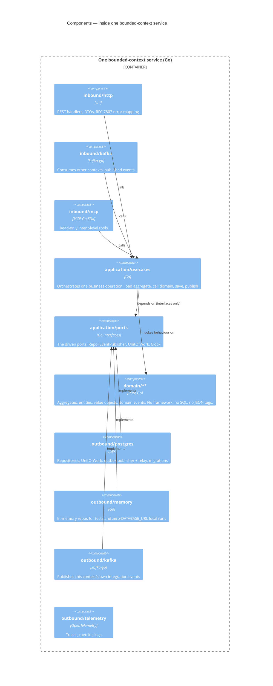
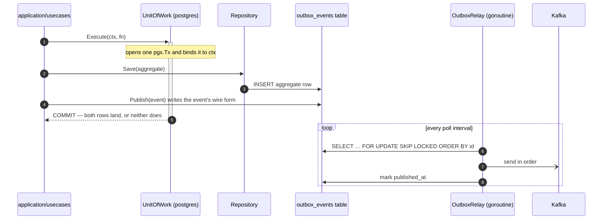

# C4 Level 3 — Components

Zooming inside a single container from [Containers](/architecture/containers).
Every bounded context in the fleet has the **same internal shape**, so this
page describes one structure rather than eight. `wes-work-planning` supplies
the concrete names.

This is where hexagonal architecture (ports and adapters) becomes visible, and
where the platform's single most important structural rule lives: **the domain
depends on nothing.**

## The hexagon



Read the arrows carefully: **every dependency points inward or is an
implementation of an inner interface.** `outbound/postgres` does not sit
"below" the use cases in a layered sense — it *implements a port the
application layer declared*, which is what allows the same use case to run
against Postgres in production and an in-memory adapter in a unit test.

## The dependency rule, and why it is not just convention

| Layer | May depend on |
| --- | --- |
| `internal/domain/**` | **Nothing.** Only other domain packages. |
| `internal/application/**` | domain + application |
| `internal/adapters/inbound/**` | application + domain — **never** an outbound adapter |
| `internal/adapters/outbound/**` | application + domain — **never** an inbound adapter |
| `cmd/**` | everything — it is the composition root, and nothing under `internal/` may import it |

This is enforced by an **arch-go fitness test**
(`internal/architecture/architecture_test.go`) that runs as its own
`arch-test` job in CI, on every pull request, in every context. A violation
fails the build. It is a test, not a style guide.

The practical effect is a hard rule you can rely on when reading any service
in this fleet: there are no `chi`, `pgx`, `kafka-go` or SQL types anywhere
under `internal/domain/`, and no JSON struct tags either — because a JSON tag
would mean the domain model had started serving a transport concern.

## The three inbound adapters, and why there are three

Every context exposes the same three driving surfaces over the same use cases.
They are genuinely different contracts, not three spellings of one:

| Adapter | Contract | Consumer | Writes? |
| --- | --- | --- | --- |
| `inbound/http` | REST, specified in `apis/openapi.yaml`, Spectral-linted in CI | Other contexts, the console, humans | Yes |
| `inbound/kafka` | The upstream context's published language, specified in `apis/asyncapi.yaml` | This context reacting to others' events | Yes |
| `inbound/mcp` | MCP tools over Streamable HTTP | `warehouse-ops-agent` and AI clients | **No — read-only by charter** |

The MCP surface is deliberately curated and intent-level ("get the backlog
telemetry"), never a generic query interface over the database. It runs as its
own `cmd/mcp` binary so that agent traffic cannot destabilise the OLTP
process, and it is additive: it was added to every context without changing a
single existing REST or Kafka contract.

## The outbound ports, and the substitution they enable

The port interfaces are small and declared by the application layer in its own
vocabulary:

```go
type WorkUnitRepo interface { /* FindById, Save … */ }
type EventPublisher interface { /* Publish(ctx, event) */ }
type UnitOfWork    interface { /* Execute(ctx, fn) */ }
type Clock         interface { /* Now() time.Time */ }
```

Because `Clock` is a port, a test can assert a lease expiry without sleeping.
Because `EventPublisher` is a port, the same use case publishes to a log
adapter locally and through the transactional outbox in the cluster. Because
the repositories are ports, **a service with no `DATABASE_URL` still runs
fully over REST on in-memory adapters** — which is how every context's local
development mode works.

## The transactional outbox, in component terms

The most consequential outbound adapter is the outbox, present in
`outbound/postgres` in five of the eight contexts with a Kafka publisher
(`wes-work-planning`, `fulfillment-execution`, `workforce-management`,
`process-path-management`, `labor-performance` — the five that carry an
outbox migration on `origin/develop`):



The reason this matters is not theoretical. `process-path-management`'s
Postgres store and its Kafka topic were once found **diverged in both
directions at once**, while its REST listing looked perfectly healthy — the
exact failure mode the outbox closes. Note also the ordering subtlety visible
in the real `ReleaseNextWork` use case: the aggregate `Save` deliberately
precedes `Publish` *inside* the same scope, because the integration publisher
enriches the event by reading the work unit back, and under the outbox that
read must see this transaction's own row.

`facility-layout` is the one context still genuinely open: it has a Postgres
`EventPublisher` that appends to an `events` table which nothing drains, and
publishes live through a direct Kafka adapter instead. `order-management` and
`inventory-storage` have documented the absent outbox as an accepted, scoped
gap rather than implementing it. See the
[Context Map](/strategic-design/context-map) for the per-context table.

## Where the analytical read side sits

The analytics code is a **separate region of the same repository**, with its
own dependency rule:

```
internal/analytics/report/        read-model types + ports — depends on NOTHING
internal/adapters/inbound/kafka/analytics_consumer.go
internal/adapters/inbound/http/reports_handler.go
internal/adapters/outbound/analyticsstore/
```

`internal/analytics/report` depends on nothing, and — critically — **the OLTP
layers must not import it, and it must not import them.** That, too, is
asserted by the arch-go test rather than left to reviewer discipline. The two
sides meet only through Kafka.

Next: the [Domain Model](/architecture/domain-model) class diagrams show what
actually lives inside `domain/**`.
