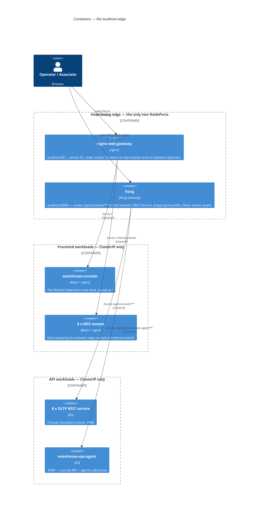
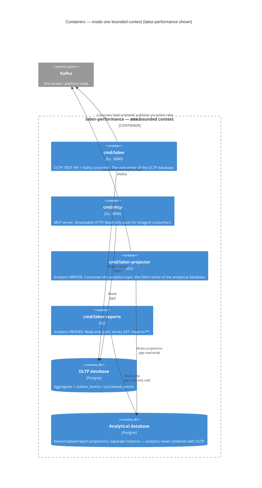

# C4 Level 2 — Containers

Zooming inside the single box from [System Context](/architecture/system-context).
A **container** here is C4's meaning of the word — a separately deployable or
runnable unit, whether that is a Go process, a Postgres database, or the
broker. It is unrelated to Docker specifically.

The fleet is larger than "nine services" suggests. Each bounded context ships
**four Go binaries and two databases**, because the analytical read side is a
separate process family from the operational one.

## The edge: two independent gateways

The most commonly misread part of this architecture, so it is drawn first.
There are exactly two host-facing entrypoints and **no proxy relationship
between them**:

The hard constraint behind this split: **Kong must never serve HTML, CSS,
JavaScript, fonts or images.** Asset delivery is nginx's job. Two designs were
considered and rejected — Kong as the single product edge (it would put asset
traffic through Kong even though nginx still serves the bytes), and nginx on
`:80` proxying `/api/**` to an internal Kong (one origin, no CORS, but an extra
hop and the frontend gateway gains visibility into API traffic).

Three consequences follow, and all three are load-bearing:

1. **CORS is not optional.** Assets come from `http://localhost` and APIs from
   `http://localhost:8000` — genuinely different origins. Kong grants exactly
   the web gateway's origin, never `*`, because these endpoints are
   unauthenticated and a wildcard would let any page on the internet read the
   warehouse's data through the user's own browser.
2. **Frontends cannot bake in their API base URL.** The console fetches
   `/config.json` from a ConfigMap before it mounts and publishes `apiOrigin`
   on `window.__WAREHOUSE_CONFIG__`; every remote reads it from there. A
   production build with no runtime config refuses to start rather than
   silently falling back to a developer port.
3. **"All APIs through Kong" is a north-south rule only.** Service-to-service
   calls stay on direct ClusterIP and Kafka and never hairpin through either
   gateway.

## Inside one bounded context: four binaries, two databases

Every bounded context follows the same internal shape. `labor-performance` is
drawn here as the representative example; substitute the names and the diagram
holds for all eight.

### Why the read side is separate processes

This is the estate-level CQRS split — each context owns its own analytical read
model as a **data product**, built from its own event stream, rather than every
context feeding one central warehouse. The three-process split buys three
specific guarantees:

| Process | Database access | Guarantee it buys |
| --- | --- | --- |
| OLTP binary | Read-write on the OLTP DB | Operational traffic is never slowed by a report query. |
| Projector | Read-write on the analytical DB | Exactly one writer, so the projection can never be corrupted by two racing writers. |
| Reports binary | **Read-only role** on the analytical DB | "Reports can never corrupt the store" is enforced by the database, not by convention. |

The report is rebuilt purely from events — there is no dual-write from the
OLTP side. That makes it clean but **eventually consistent**: the product's
contract is a freshness lag, not real-time, which is why every dashboard card
in `warehouse-console` carries a freshness badge rather than hiding staleness.

## The whole fleet at a glance

| Context | OLTP binary | MCP | Projector | Reports | Databases |
| --- | --- | --- | --- | --- | --- |
| `order-management` | `cmd/order` | `cmd/mcp` | `cmd/order-projector` | `cmd/order-reports` | 2 |
| `inventory-storage` | `cmd/inventory` | `cmd/mcp` | `cmd/inventory-projector` | `cmd/inventory-reports` | 2 |
| `wes-work-planning` | `cmd/wes` | `cmd/mcp` | `cmd/wes-projector` | `cmd/wes-reports` | 2 |
| `fulfillment-execution` | `cmd/execution` | `cmd/mcp` | `cmd/fulfillment-projector` | `cmd/fulfillment-reports` | 2 |
| `workforce-management` | `cmd/workforce` | `cmd/mcp` | `cmd/workforce-projector` | `cmd/workforce-reports` | 2 |
| `facility-layout` | `cmd/facility` | `cmd/mcp` | `cmd/facility-projector` | `cmd/facility-reports` | 2 |
| `process-path-management` | `cmd/pathmgmt` | `cmd/mcp` | `cmd/pathmgmt-projector` | `cmd/pathmgmt-reports` | 2 |
| `labor-performance` | `cmd/labor` | `cmd/mcp` | `cmd/labor-projector` | `cmd/labor-reports` | 2 |
| `warehouse-ops-agent` | `cmd/agent` | *(serves its own MCP on `/mcp` in-process)* | — | — | **0** |

`warehouse-ops-agent` is the deliberate exception on every axis. It has one
binary, **no database at all**, and holds no persisted state — restart it and
it has forgotten nothing, because every fact it reasons over is re-derived from
upstream MCP and REST reads at request time. It is a Customer of the other
eight contexts' Open Host Services, not a bounded context with its own model.

## Kafka: one broker, and what actually flows over it

There is exactly **one Kafka broker platform-wide**. The in-cluster release also
serves host clients on `localhost:9092` via external access; the older
standalone `docker-compose` broker is retired.

Two distinct topic families run over it, and conflating them is a common
misreading:

- **Integration topics** (`warehouse.<context>.events`) — the published language
  between bounded contexts. These are the edges on the
  [Context Map](/strategic-design/context-map).
- **Analytics topics** (`warehouse.<context>.analytics`) — feed only that
  context's own projector. They were deliberately kept off the integration
  topics so that adding a report never changes a contract another context
  depends on.

## What this diagram does not show

- **Replica counts and autoscaling.** Those live in `warehouse-infra`'s Helm
  values; drawing them here would go stale immediately.
- **The observability stack.** Every binary exports OTLP traces and metrics to
  a collector, with Jaeger, Prometheus/Grafana and Loki behind it. It is drawn
  at [level 1](/architecture/system-context) and omitted here to keep the
  product topology readable.
- **Any authentication container**, because there is none in the code. An
  earlier static-bearer layer was rolled out fleet-wide and then fully
  reverted; every REST and MCP endpoint is currently unauthenticated.

Zoom in one more level to see inside a single Go process:
[Components](/architecture/components).
