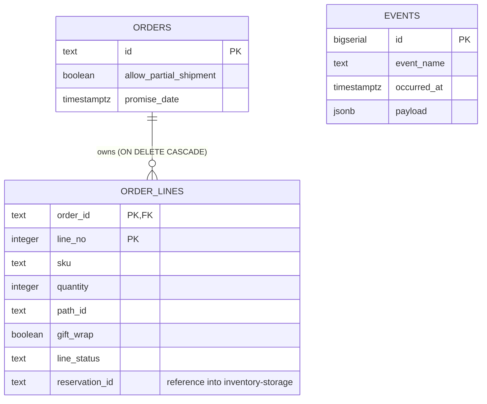
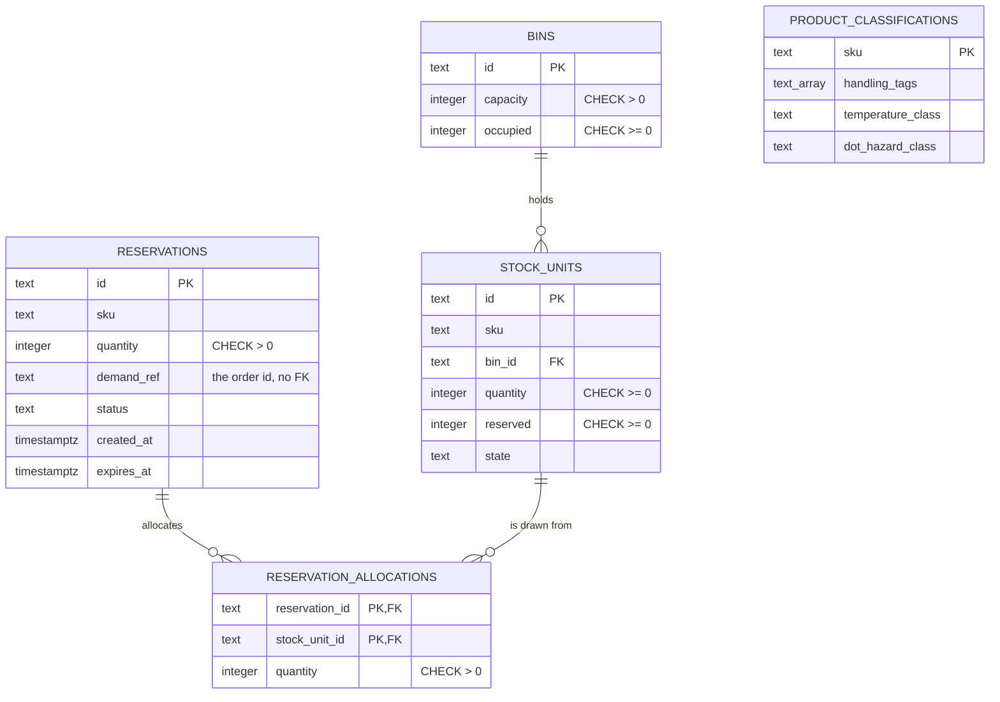
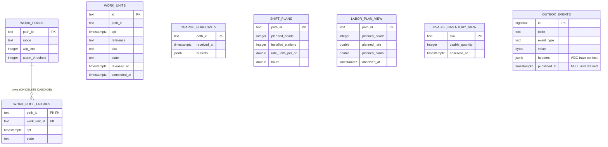
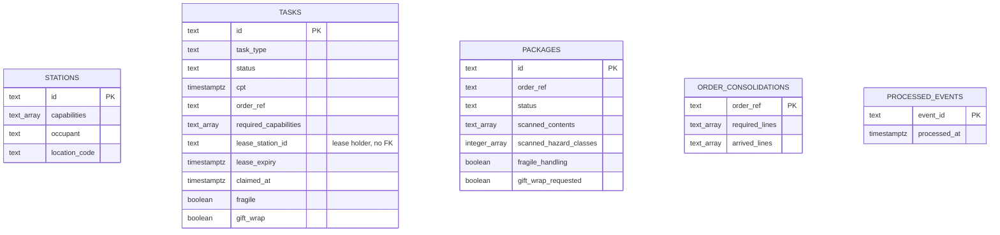
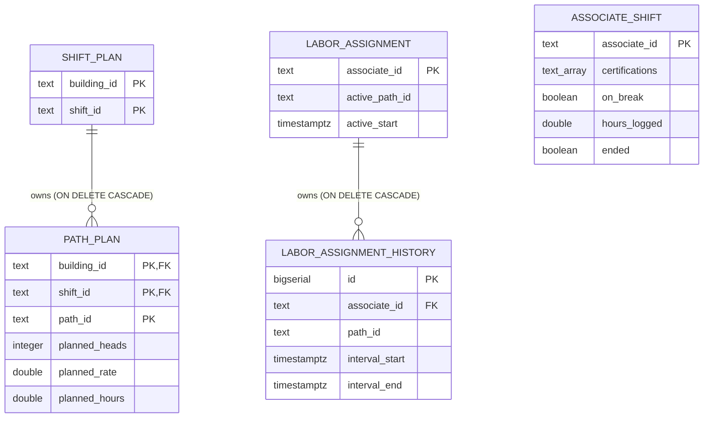
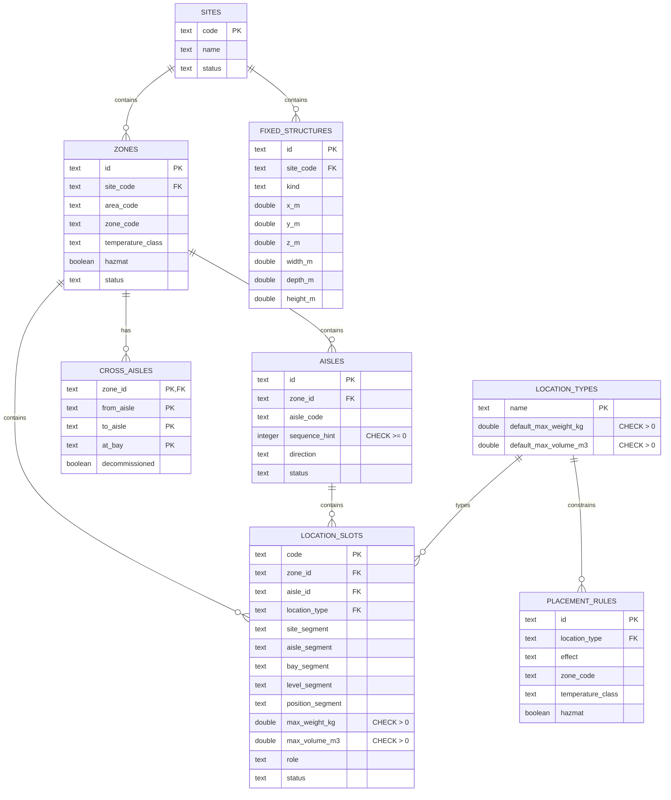
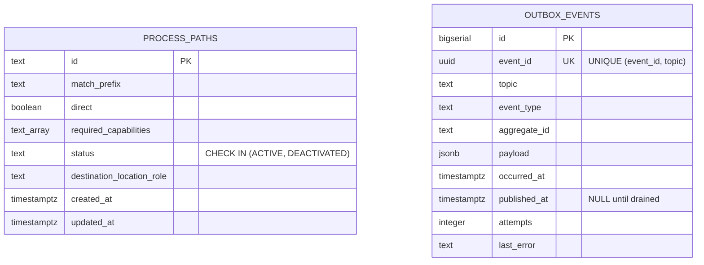
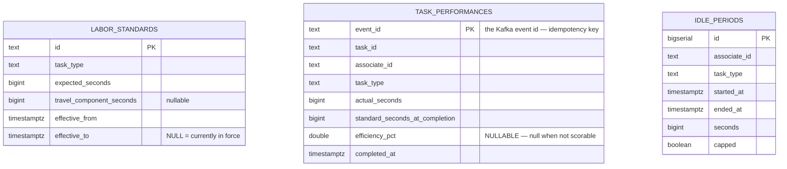
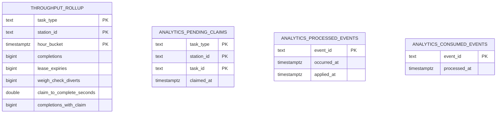

# Data Models

Entity-relationship diagrams for each bounded context's **actual** Postgres
schema, read from the `migrations/*.up.sql` files on each repository's
`origin/develop`. Column names, types, primary keys and foreign keys match the
DDL exactly.

Two conventions are applied consistently, and both are about not overstating
what the schema says:

1. **A relationship line is drawn only where a real `FOREIGN KEY` constraint
   exists.** Several contexts deliberately omit FKs across aggregate
   boundaries; where that is the case the prose says so instead of drawing a
   line that is not in the database.
2. **Infrastructure tables are marked.** `outbox_events`, `processed_events`,
   `analytics_processed_events`, `analytics_consumed_events` and the various
   `events` tables are not domain concepts — they implement the transactional
   outbox, consumer idempotency, and event archival.

Every context has an **OLTP** database and a separate **analytical** database.
The analytical one is written only by that context's projector binary and read
only by its reports binary — see [Containers](/architecture/containers). Both
are shown below.

:::info[A table is not an aggregate]

The [Domain Model](/architecture/domain-model) is the authoritative view of the
domain. This page is the persistence shape it happens to be stored in, and the
two are deliberately not one-to-one — the domain layer has no knowledge of SQL.

:::

## order-management

`Order` is the aggregate root and `OrderLine` is a child entity — the
composite primary key `(order_id, line_no)` plus `ON DELETE CASCADE` is the
aggregate boundary expressed in SQL.

The column worth pausing on is `reservation_id`. It holds an identifier owned
by `inventory-storage` and has **no foreign key**, deliberately: this context
models no local `Reservation` aggregate because inventory-storage remains the
sole owner of reservation state. Referencing another context's aggregate by
bare identity, never by a database relationship, is the rule everywhere in
this fleet.

Note also that `order-management` has **no `outbox_events` table**. Its
absent outbox is a documented, accepted gap (its ADR 0005), not an oversight —
a publish failure after the repository commit still fails the whole request.

## inventory-storage

The `reservation_allocations` join table is what makes a reservation
*revocable*: it records exactly which stock units a reservation drew from, so
revoking it returns precisely that quantity to precisely those units.

`demand_ref` carries the `order-management` order id with **no foreign key** —
the same cross-context identity-reference rule as above, in the opposite
direction.

`product_classifications` is a small, separately-keyed table rather than
columns on `stock_units` because classification is per-SKU, not per-physical-unit.

## wes-work-planning

The key modelling decision is visible here: **`work_pool_entries` and
`work_units` are two separate tables with no foreign key between them.**
`WorkPool` and `WorkUnit` are two distinct aggregates. The pool holds only the
minimum it needs to apply the release policy (an id, a CPT, a state), while the
work unit owns its own full lifecycle. Linking them with an FK would fuse two
aggregates into one transactional boundary, which is exactly what aggregate
design says not to do.

`labor_plan_view` and `usable_inventory_view` are **read models**, not
aggregates — local projections fed by other contexts' Kafka events, carrying
an `observed_at` so staleness is always visible rather than implied.

## fulfillment-execution

**Four independent aggregates, zero foreign keys between them.** `Station`,
`Task`, `Package` and `OrderConsolidation` are each their own consistency
boundary, and they reference each other only by identity (`lease_station_id`,
`order_ref`). This is the most explicit example in the fleet of aggregate
boundaries being honoured in the schema.

The leasing mechanic lives in two nullable columns — `lease_station_id` and
`lease_expiry`. A claim is a *lease*, not an assignment: when it expires the
task returns to the pool, which is why the index
`(task_type, status, cpt)` exists — it is the exact query `ClaimNext` runs to
find the earliest-CPT claimable task of a type.

`processed_events` provides idempotent consumption, which is mandatory because
Kafka delivery is at-least-once.

## workforce-management

`ShiftPlan` uses a **composite key** `(building_id, shift_id)` and owns its
`PathPlan` children through a composite foreign key — a plan is meaningless
outside its building and shift.

`labor_assignment` holds only the *current* assignment while
`labor_assignment_history` holds closed intervals. Splitting current state from
history keeps the hot row small and makes "who is on this path right now" a
single indexed lookup (`idx_labor_assignment_active_path`).

Note `associate_shift` and `labor_assignment` share the same `associate_id` key
but have **no FK between them**: they are two aggregates about the same person
— one owns shift/break state, the other owns path assignment.

## facility-layout

The most relational schema in the fleet, because physical warehouse geography
genuinely is hierarchical.

`location_slots` stores the slot code **both** as a whole (`code`, the primary
key) and pre-split into its segments. The denormalisation is deliberate: it
makes the grid query `(zone_id, aisle_segment, bay_segment, level_segment)`
indexable, which is what the zone-grid visualisation needs.

`cross_aisles` carries `CHECK (from_aisle <> to_aisle)` — a shortcut from an
aisle to itself is not a shortcut. It is soft-deleted via `decommissioned`
rather than removed, because travel-distance history must stay reproducible.

This context is the one still genuinely open on the outbox: its `events` table
is a *table*, not a wired outbox — nothing drains it — and it publishes through
a direct Kafka adapter instead.

## process-path-management

The smallest schema in the fleet: one domain table.

One table, and it is the fleet's **reference implementation of the
transactional outbox** — the richest outbox schema of the eight, with
`attempts` and `last_error` for relay diagnostics and a `UNIQUE (event_id,
topic)` constraint giving publish idempotency per destination.

Status is enforced by a `CHECK` constraint rather than left to application
code, and `idx_process_paths_active` is a **partial index** over active paths
only, since that is the only set consumers ever replay.

## labor-performance

Three things in this schema are worth reading closely.

**The primary key of `task_performances` is the Kafka `event_id`**, not a
generated id. Idempotency is therefore enforced by the database itself: a
redelivered event cannot create a second row, no matter what the application
does.

**`efficiency_pct` is nullable, and that is load-bearing.** The rule across
this context is *never fabricate a number* — when nothing was scorable the
value is `NULL`, never `0`, all the way out through the REST API and the
analytics report. A zero would read as "terrible performance"; null reads as
"we do not know", which is the truth.

**`standard_seconds_at_completion` is copied onto the row.** Standards change
over time (`effective_from`/`effective_to`), so a performance record stores the
standard that applied *at the moment of completion*. Without it, revising a
standard would silently rewrite history.

## The analytical databases

Every context's analytical database follows the same three-part shape, so it
is shown once rather than eight times. `fulfillment-execution`'s is the
example:

| Table kind | Purpose |
| --- | --- |
| `*_rollup` | The report itself — pre-aggregated into time buckets, keyed by the dimensions that context reports on. |
| `analytics_pending_*` | Correlation state for events that must be paired (a claim with its later completion) to compute a duration. |
| `analytics_processed_events` / `analytics_consumed_events` | Idempotent consumption, same at-least-once requirement as the OLTP side. |

Rollups store **sums and counts rather than averages** — `efficiency_pct_sum`
alongside `tasks_scored`, `actual_seconds_sum` alongside `tasks_measured`.
Storing the components keeps the aggregation associative, so hourly buckets can
be combined into a day without the error that averaging averages would
introduce.

The per-context rollup tables are: `funnel_rollup` (order-management),
`flow_accuracy_rollup` (inventory-storage), `throughput_rollup`
(wes-work-planning and fulfillment-execution), `labor_rollup`
(workforce-management), `catalog_growth_rollup` (facility-layout),
`catalogue_growth_rollup` (process-path-management), and
`labor_performance_rollup` (labor-performance).
