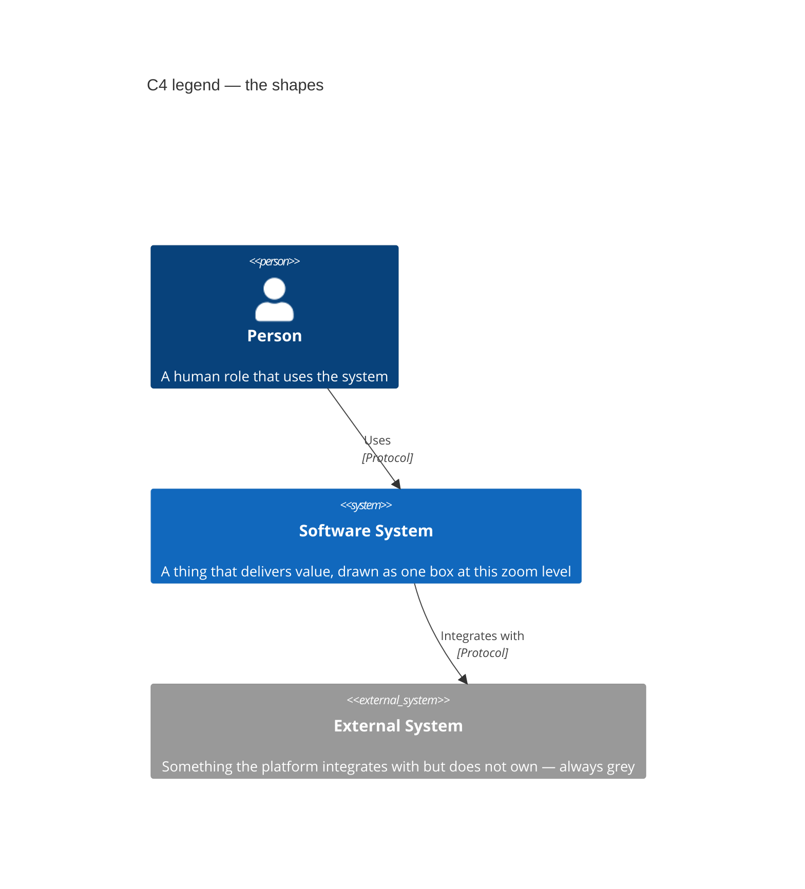
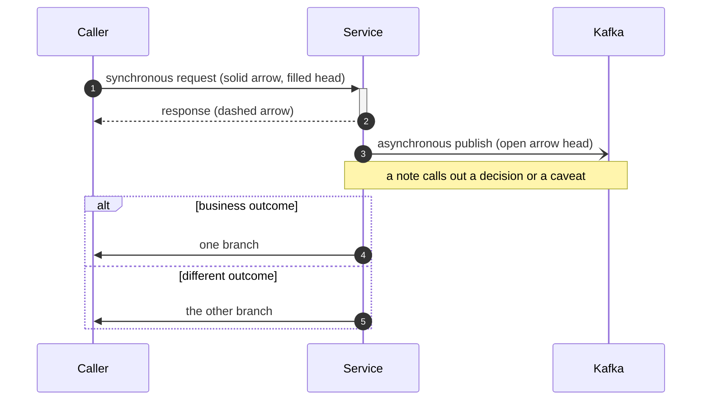
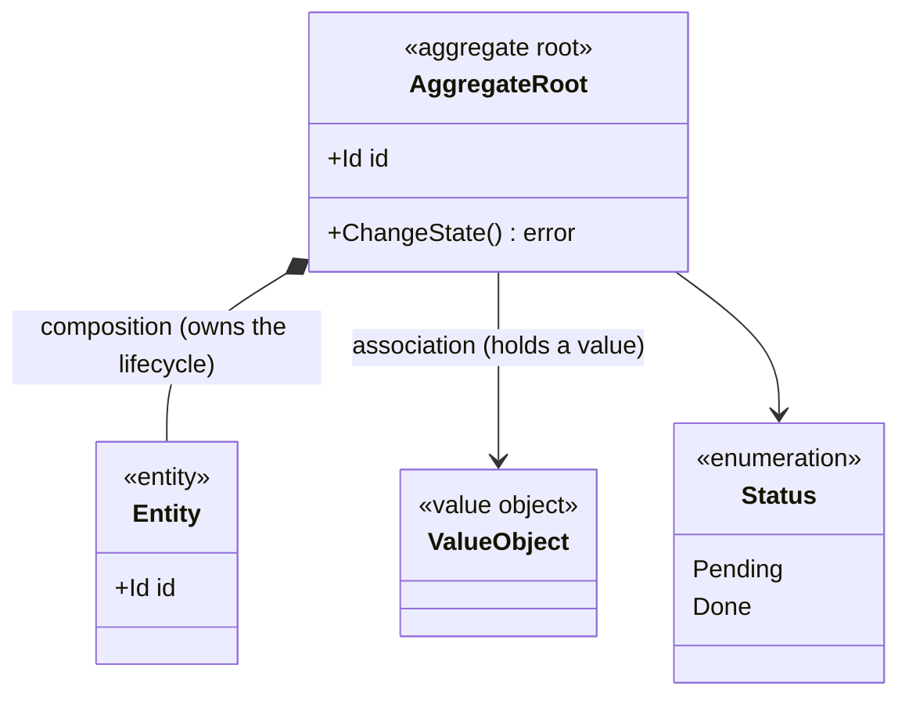
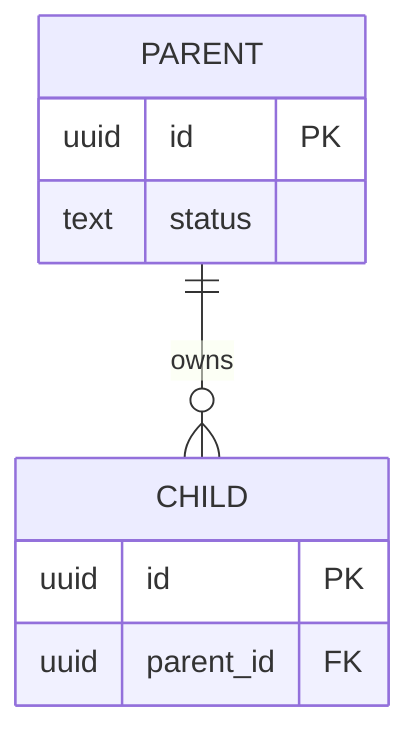

# Diagram Notation

Every diagram on this site is written as [Mermaid](https://mermaid.js.org/)
source inside the Markdown page it illustrates, so it is reviewed in pull
requests as text and can never silently drift from the prose around it the
way an exported PNG does.

This page is the legend. It explains which notation each section of the site
uses, what the shapes and arrows mean, and — most importantly — **what each
notation deliberately does not tell you**, so a reader never over-reads a
diagram.

## The four notations, and which question each answers

| Notation | Where it is used | The question it answers |
| --- | --- | --- |
| **C4 model** | [Architecture](/architecture) | What are the runtime pieces, who talks to whom, and at what zoom level? |
| **DDD strategic & tactical artifacts** | [Strategic Design](/strategic-design), [Bounded Contexts](/contexts) | What are the bounded contexts, how do they relate, and what invariants does each aggregate protect? |
| **UML sequence diagrams** | [Runtime Flows](/architecture/runtime-flows), per-context pages | In what order do messages actually travel for one business scenario, including the failure branches? |
| **UML class & entity-relationship diagrams** | [Domain Model](/architecture/domain-model), [Data Models](/architecture/data-models) | What is the shape of the code's domain types, and the shape of the tables they persist to? |

These are complementary views of the same system, not competing ones. A
single bounded context appears in all four: as a container in C4, as a node
on the context map, as a participant in a sequence diagram, and as a class
plus a set of tables.

## C4 model

The [C4 model](https://c4model.com/) (Context, Containers, Components, Code)
is a zoom-level hierarchy. This site uses the first three levels; level 4
(Code) is deliberately skipped, because for a Go codebase the source itself
is a better and never-stale answer, and the
[Domain Model](/architecture/domain-model) class diagrams already cover the
types that carry business rules.

| Level | Page | Scope |
| --- | --- | --- |
| **1 — System Context** | [System Context](/architecture/system-context) | The platform as one box, its human actors, and the external systems around it. |
| **2 — Containers** | [Containers](/architecture/containers) | Every separately deployable/runnable thing: each Go process, each database, the broker, the edge. |
| **3 — Components** | [Components](/architecture/components) | Inside one container: the hexagonal ports-and-adapters structure shared by every service. |

A **container** in C4 means "a separately deployable or runnable unit" —
a process, a database, a broker. It has nothing to do with Docker
specifically: a Postgres database is a C4 container whether or not it runs
in a Docker image.

Read the labels on every relationship arrow: C4 arrows carry both an intent
("Reserves stock") and a technology ("HTTP POST", "Kafka"). An arrow without
a technology label is an intent that has not yet been wired.

## DDD strategic artifacts

The strategic diagrams follow the open, freely-licensed templates maintained
by [**ddd-crew**](https://github.com/ddd-crew). The one that carries the most
information per pixel is the **context map**, where the label on each edge is
a named strategic relationship pattern:

| Pattern | Abbreviation | Meaning |
| --- | --- | --- |
| Open-Host Service | OHS | Upstream publishes a stable, public contract for many consumers rather than bespoke integrations. |
| Published Language | PL | The shared, documented message schema an OHS publishes in (here: AsyncAPI-specified Kafka events). |
| Customer/Supplier | C/S | Downstream is a customer whose needs the upstream team accommodates in planning. |
| Conformist | CF | Downstream accepts the upstream model exactly as-is, with no translation layer. |
| Partnership | P | Two contexts succeed or fail together and coordinate their changes as one control loop. |
| Anti-Corruption Layer | ACL | Downstream translates the upstream model into its own, protecting its model from foreign concepts. |
| Shared Kernel | SK | Two contexts share a subset of the model as code. **No Shared Kernel exists in this platform** — see [Context Map](/strategic-design/context-map). |

**Direction matters.** An arrow points from upstream to downstream — from the
context whose changes force the other to react, to the one that must react.

## UML sequence diagrams

Sequence diagrams show one scenario over time. Participants are columns, time
runs downward, and each arrow is one message.

The conventions used consistently across this site:

- **Solid arrow (`->>`)** — a synchronous call the sender waits on (HTTP).
- **Dashed arrow (`-->>`)** — the response to a synchronous call.
- **Open arrow (`-)`)** — an asynchronous publish. The sender does not wait
  and does not learn who consumed it.
- **`alt` / `else` blocks** — genuinely different business outcomes, not
  merely error handling. Where this platform distinguishes a *business fact*
  (an HTTP 409 meaning "insufficient stock", which is a real answer) from an
  *ambiguous failure* (a 5xx or timeout, where the upstream effect is
  unknown), the two appear as separate branches, because the code treats
  them as genuinely different things.
- **`autonumber`** — every message is numbered so prose can reference
  "step 4" precisely.

## UML class diagrams

Class diagrams on the [Domain Model](/architecture/domain-model) page show
the tactical DDD building blocks. Because DDD roles matter more here than
language mechanics, every type carries a stereotype:

| Stereotype | Meaning in this codebase |
| --- | --- |
| `<<aggregate root>>` | The consistency boundary. It is the only type a repository loads and saves, and the only place an invariant is enforced. |
| `<<entity>>` | Has identity and a lifecycle, but lives **inside** an aggregate and is never loaded independently. |
| `<<value object>>` | Immutable, compared by value, no identity (`SKU`, `PathId`, `Quantity`). |
| `<<enumeration>>` | A closed set of states, with the real constant values from the Go source. |

- **Composition (`*--`)** — the child's lifecycle is owned by the root.
  Deleting the root deletes the child.
- **Association (`-->`)** — a reference. **Across aggregate boundaries this
  is always a reference by identity, never a pointer** — one aggregate never
  holds a direct object reference to another aggregate root, per Vernon's
  aggregate design rules.

## Entity-relationship diagrams

The [Data Models](/architecture/data-models) page draws each context's real
Postgres schema, generated by reading the actual `migrations/*.up.sql` files
on `origin/develop`.

Crow's-foot cardinality, read left-to-right:

<ul>
  <li><code>{'||--||'}</code> — exactly one to exactly one</li>
  <li><code>{'||--o{'}</code> — one to zero-or-more</li>
  <li><code>{'||--|{'}</code> — one to one-or-more</li>
  <li><code>{'}o--o{'}</code> — zero-or-more to zero-or-more</li>
</ul>

Two honesty rules apply to every ER diagram on this site:

1. **A relationship line is drawn only where a real `FOREIGN KEY` constraint
   exists in the DDL.** Where two tables are logically related but the
   schema has no FK — a deliberate choice in several contexts, so that an
   aggregate boundary is not accidentally enforced by the database — the
   prose says so explicitly instead of drawing a line that does not exist.
2. **Infrastructure tables are labelled as such.** `outbox_events`,
   `processed_events`, and `schema_migrations` are not domain concepts; they
   implement the transactional outbox, consumer idempotency, and migration
   tracking respectively.

## What these diagrams deliberately omit

Being explicit about the blind spots is part of the notation:

- **C4 container diagrams do not show every instance.** Replica counts,
  autoscaling, and pod scheduling are deployment concerns that live in
  `warehouse-infra`'s Helm values, not here.
- **Sequence diagrams show one scenario, not all of them.** A diagram
  showing a successful release does not imply release always succeeds; the
  failure branches that matter are drawn with `alt`, and the rest are
  described in prose.
- **ER diagrams are the persistence shape, not the domain model.** The
  [class diagrams](/architecture/domain-model) are the domain model. A
  table and an aggregate are frequently *not* one-to-one — this is a
  deliberate consequence of hexagonal architecture, where the domain layer
  has no knowledge of SQL.
- **No diagram is the source of truth for an API.** The generated
  [API Reference](/api-reference) is, because it is produced from each
  context's own Spectral-linted `openapi.yaml`/`asyncapi.yaml`.
