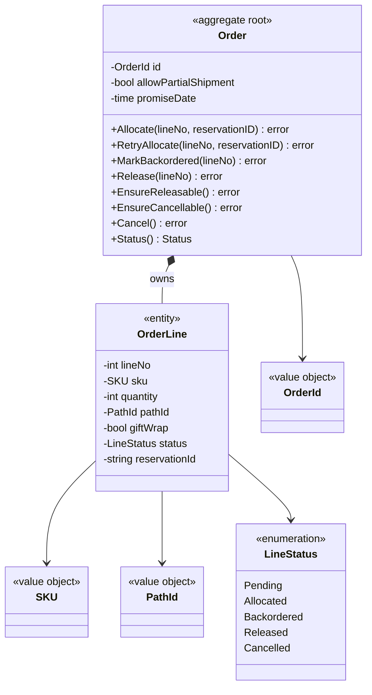
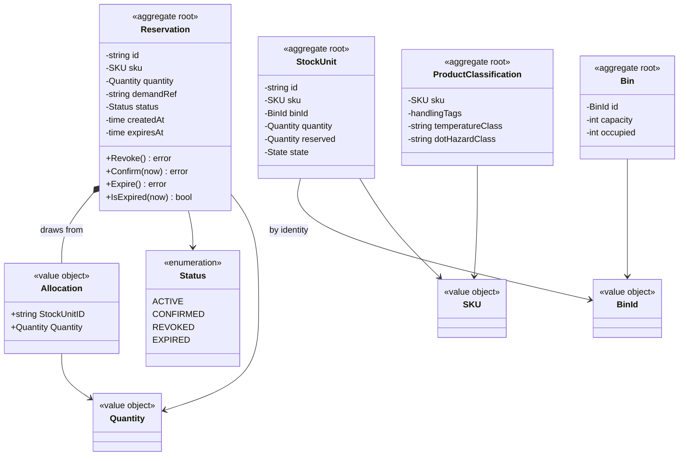
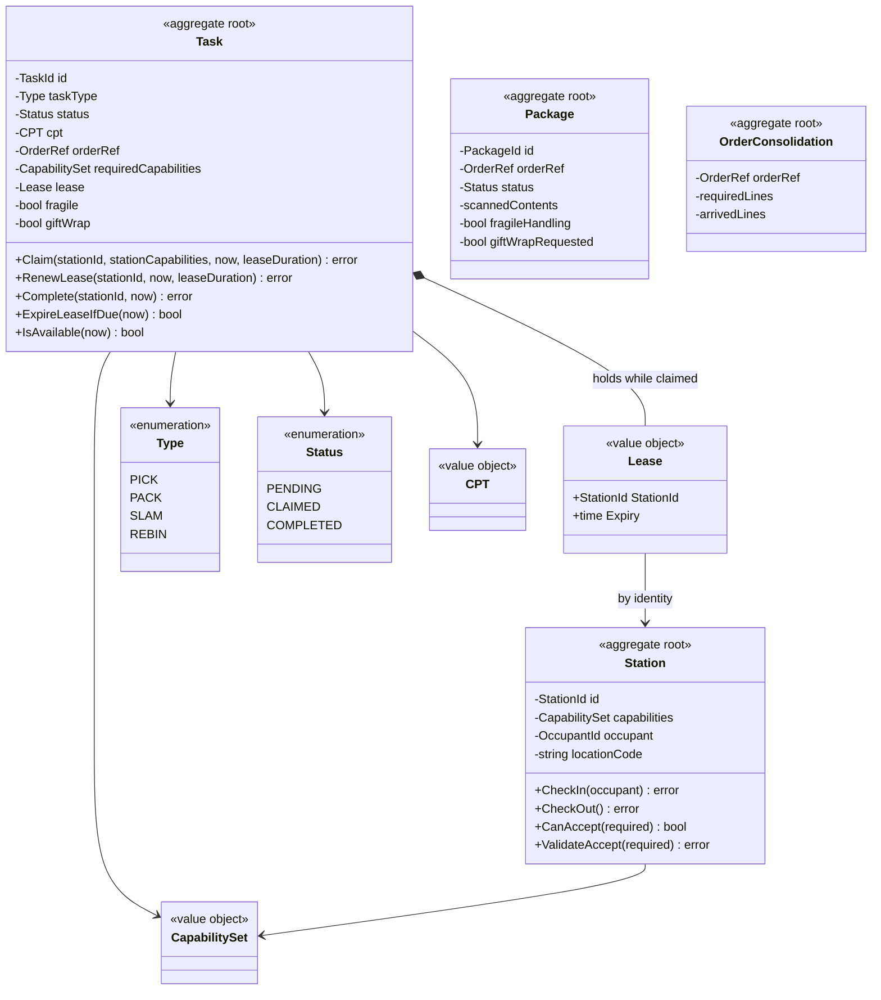
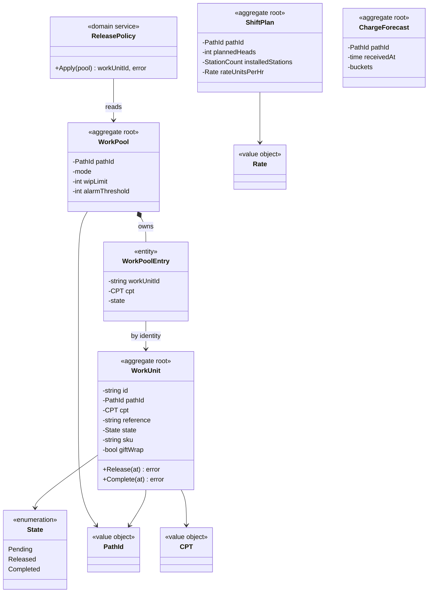
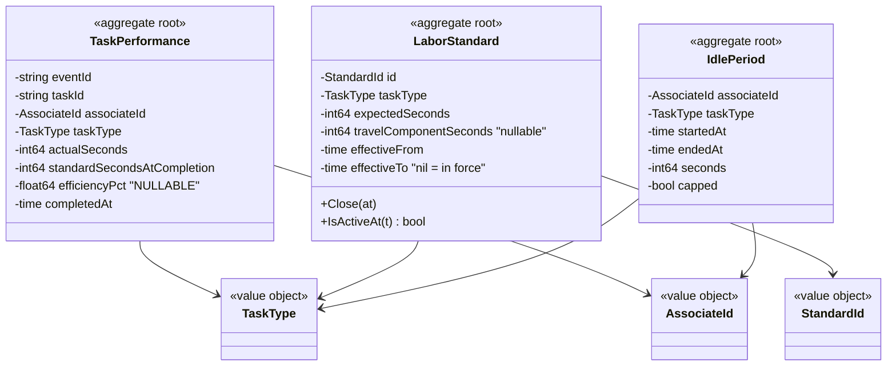

# Domain Model

Class diagrams of what actually lives under `internal/domain/**` in each
context — the aggregates, the entities they own, the value objects they are
built from, and the invariants they exist to protect.

Type names, method names, enum values and error messages on this page are the
real ones from the Go source on `origin/develop`.

:::note[A table is not an aggregate]

This page is the **domain model**. The [Data Models](/architecture/data-models)
page is the *persistence shape* it happens to be stored in, and the two are
deliberately not one-to-one. The domain layer has no knowledge of SQL — no
`pgx` types, no JSON struct tags — so the mapping between them lives entirely
in the outbound Postgres adapter.

:::

## How to read these diagrams

| Stereotype | Meaning |
| --- | --- |
| `<<aggregate root>>` | The consistency boundary. The only type a repository loads and saves, and the only place an invariant is enforced. |
| `<<entity>>` | Has identity and a lifecycle, but lives inside an aggregate and is never loaded on its own. |
| `<<value object>>` | Immutable, compared by value, no identity. |
| `<<enumeration>>` | A closed set of states, with the real Go constant values. |

**Composition (`*--`)** means the root owns the child's lifecycle.
**Association (`-->`)** across an aggregate boundary is always a reference *by
identity* — no aggregate ever holds a pointer to another aggregate root.

## order-management

**Invariants `Order` protects**

- An order must have at least one line — `ErrNoLines`.
- A line can only be allocated from `Pending`; allocating twice is
  `ErrLineAlreadyAllocated`, and allocating from the wrong state is
  `ErrLineNotPending`.
- `RetryAllocate` is the **only** route out of `Backordered` —
  `ErrLineNotBackordered` otherwise.
- A **ship-complete** order (`allowPartialShipment == false`) cannot be
  released while any line is unallocated — `ErrShipCompleteBlocked`. This is
  the invariant that makes partial shipment a real business decision rather
  than an accident of timing.
- An order with released lines can no longer be cancelled —
  `ErrOrderAlreadyReleased`.

`reservationId` is a plain `string`, not a typed reference: it belongs to
`inventory-storage`, and this context deliberately models no local
`Reservation` aggregate.

The order-level `Status()` is **always derived from the line statuses and never
stored**. There is no `status` column on the `orders` table (see
[Data Models](/architecture/data-models)) precisely so that an order-level
status can never drift out of sync with the lines it summarises — a
denormalisation bug this model makes structurally impossible rather than
merely discouraged.

## inventory-storage

**Invariants**

- A reservation requires at least one allocation — `ErrNoAllocations`. A
  reservation that reserved nothing is meaningless.
- A resolved reservation cannot be resolved again —
  `ErrAlreadyResolved` ("already resolved (confirmed, revoked, or expired)").
  This is what makes revocation safely idempotent.
- An expired reservation cannot be confirmed — `ErrExpired`.

The `Allocation` value objects are what make a reservation **revocable with
precision**: each records exactly which stock unit contributed how much, so
revoking returns exactly that quantity to exactly those units rather than
guessing.

`StockUnit` and `Bin` are separate aggregate roots even though a unit sits in
a bin — `binId` is a reference by identity, so moving stock never requires
locking two aggregates.

## fulfillment-execution

The clearest example of aggregate independence in the fleet: four roots, none
of which reference another by pointer.

**Invariants `Task` protects**

- A station may only claim a task whose required capabilities it satisfies —
  `ErrCapabilityMismatch`. This is the rule that makes pull-based dispatch
  safe: a station cannot take work it is not certified for.
- A claimed task cannot be claimed again — `ErrAlreadyClaimed`.
- Only the lease holder may renew or complete — `ErrNotOwner`.
- A completed task is terminal — `ErrAlreadyCompleted`.

`CPT` (Critical Pull Time) is the priority value object: the whole pull model
is "earliest CPT first, among tasks this station can do".

The `Lease` is the heart of the design. `ExpireLeaseIfDue(now)` is what
returns an abandoned task to the pool — a task can be *claimed* but never
*lost*, which is only possible because the claim carries an expiry rather than
being a permanent assignment.

## wes-work-planning

**The key modelling decision.** `WorkPool` and `WorkUnit` are **two separate
aggregates**. The pool holds only what the release policy needs to choose —
an id, a CPT, a state — while the work unit owns its own full lifecycle.
`WorkPoolEntry` references the work unit by identity, never by pointer.

This is why `ReleaseNextWork` saves *both* aggregates inside one
`UnitOfWork`: they are separate consistency boundaries that this particular
operation must move together, and the transaction — not the object graph — is
what makes that atomic.

`ReleasePolicy` is a **domain service**, not a method on either aggregate,
because the decision "which unit next" is about the relationship between them
rather than the internal state of either.

## labor-performance

**Invariants**

- `ErrEmptyEventId` — the Kafka event id is the identity of a performance
  record, so it can never be empty.
- `ErrEmptyTaskId` — a performance record must refer to a real task.

Two design points deserve attention.

**`efficiencyPct` is `*float64`, not `float64`.** The rule in this context is
*never fabricate a number*: when nothing was scorable the value is `nil`, and
it stays `nil` all the way out through the REST API and the analytics report.
A `0` would read as catastrophically bad performance; `nil` reads as "not
measured", which is the truth.

**`standardSecondsAtCompletion` is copied onto the record.** `LaborStandard`
is a temporal aggregate — `effectiveFrom`/`effectiveTo`, with `Close(at)`
ending one version — so a performance row freezes the standard that applied at
the moment of completion. Revising a standard therefore never rewrites
history.

The identity being the Kafka `event_id` is what makes `RecordTaskPerformance`
idempotent: at-least-once delivery cannot double-count, because a redelivery
maps to the same aggregate identity.

## Patterns that hold across every context

Reading all eight domain models together, five conventions are universal:

1. **Private fields, behaviour-bearing methods.** Every field is unexported.
   State changes go through methods that can refuse — there are no public
   setters that would let a caller bypass an invariant.
2. **Errors are named domain vocabulary**, not strings built at the call site.
   `ErrShipCompleteBlocked` *is* the business rule, expressed as a value.
3. **Value objects for every identifier.** `OrderId`, `PathId`, `SKU`,
   `TaskId`, `AssociateId` — never a bare `string` for a domain identity,
   so the compiler prevents passing a SKU where a path id belongs.
4. **Cross-aggregate references are identities.** No aggregate root holds a
   pointer to another root, anywhere in the fleet.
5. **The domain layer imports nothing framework-shaped.** No `chi`, no `pgx`,
   no `kafka-go`, no JSON tags — enforced by the `arch-test` CI job described
   in [Components](/architecture/components), not by convention.
