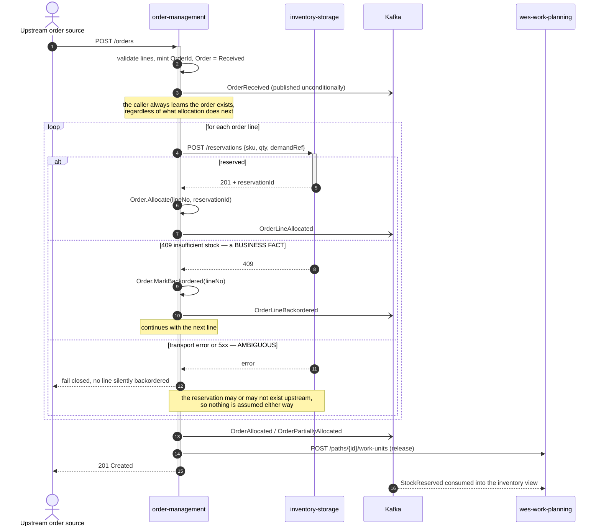
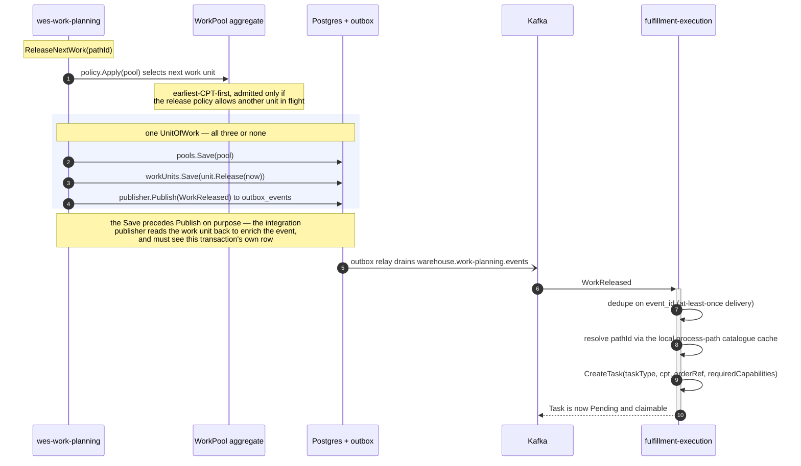
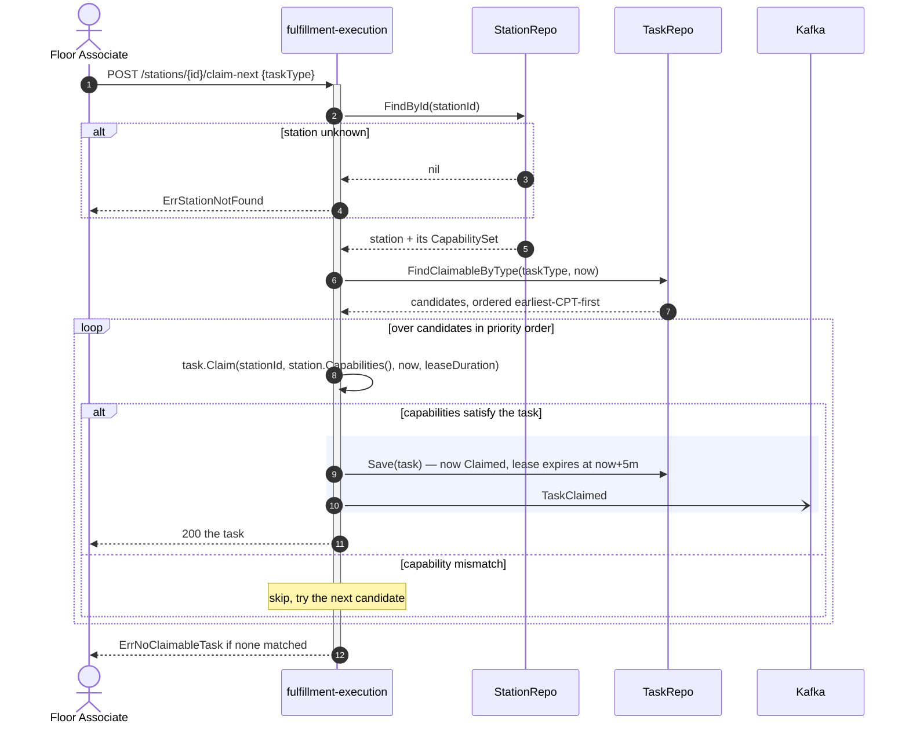
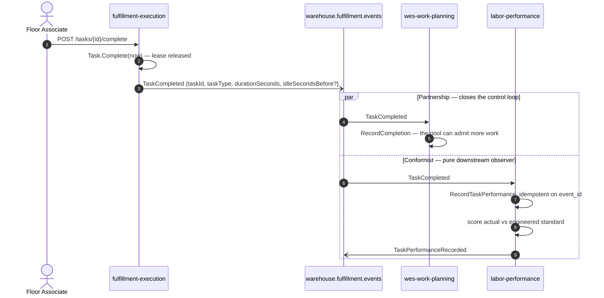
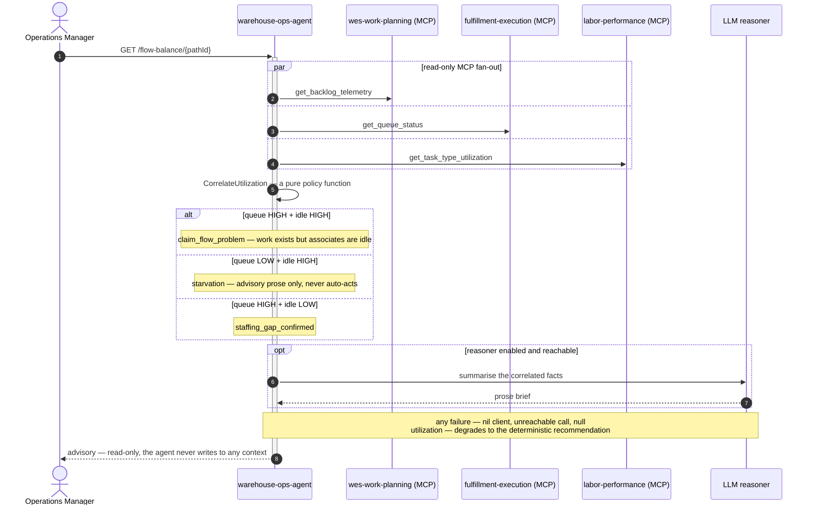
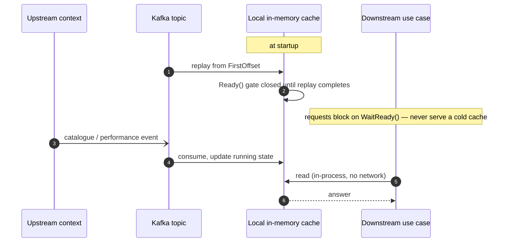

# Runtime Flows

Sequence diagrams for the scenarios that cross bounded-context boundaries.
Each one is drawn from the actual use-case source on `origin/develop`, and
each includes the branches that really exist in the code — a diagram that only
shows the happy path hides exactly the decisions worth documenting.

See [Diagram Notation](/architecture/diagram-notation) for the arrow
conventions. In short: solid arrows are synchronous calls, dashed are their
responses, and open arrows (`-)`) are asynchronous publishes where the sender
neither waits nor learns who consumed the message.

## 1. Order intake, allocation and release

The single most important flow in the platform. One `POST /orders` call
expresses the whole intent; allocation and release are internal saga steps
triggered by that intent, not public commands a caller drives by hand.

**The branch that matters** is the three-way split on the reservation call. An
HTTP 409 is not an error — it is inventory's real answer, "there is not enough
stock", and the line becomes `Backordered` while allocation continues. Anything
else (a timeout, a 5xx) is *ambiguous*: the reservation may or may not have
been created upstream, so the whole call fails rather than marking a line
backordered on a guess. Conflating those two would either strand real
reservations or fabricate business facts out of infrastructure noise.

A fully backordered order emits no order-level event — its per-line
`OrderLineBackordered` facts already carry the whole story.

## 2. Waveless release into execution

How released work becomes a claimable task. This is the spine of the WES tier
and the point where the platform's pull-based philosophy takes over.

Note step 3's grouping: the pool update, the work-unit state change and the
event all commit together or not at all. Before the outbox, a crash between
the save and the publish left the store and the topic permanently diverged —
a failure that was actually observed in this fleet, in both directions at
once, while the REST listing looked perfectly healthy.

## 3. Pull-based claim: a station asks for work

No dispatcher assigns work to a station. The station asks, and the system
answers with the best-fit task it is certified and equipped for. This is the
difference between a pull system and a push system, expressed in one call.

Two properties fall out of this design:

- **The station is never named in advance.** A task does not know which station
  will do it, so a slow station simply claims fewer tasks. Throughput
  self-balances without a scheduler.
- **A claim is a lease, not an assignment.** It expires (default five minutes).
  If an associate walks away mid-task, `ExpireLeases` returns the task to the
  pool rather than stranding it — which is why the task can be claimed, but
  never *lost*.

## 4. Completion, and the two consumers it feeds

`TaskCompleted` is published once onto a fan-out topic and consumed by two
contexts with entirely different relationships to it.

The same message, two different strategic relationships. `wes-work-planning`
is in a **Partnership** with `fulfillment-execution` — the two evolve together
as one control loop, because completion is what lets the conductor release
more work. `labor-performance` is a **Conformist**: it accepts the event shape
exactly as published, has zero write access back, and could be switched off
without execution noticing.

`RecordTaskPerformance` is idempotent on the Kafka message's `event_id`
because delivery is at-least-once. This is not optional anywhere in the fleet:
a duplicated delivery must never double-count a performance row.

## 5. The agentic read path

`warehouse-ops-agent` holds no database and no state. Every fact in a daily
brief is re-derived at request time from upstream MCP tools.

Every degradation path in this flow lands on the same place: the pre-existing
deterministic recommendation, unchanged. A missing binding, an unreachable
MCP server, a `null` utilization percentage, or a disabled LLM all produce a
*less enriched* answer, never a wrong one and never an error. This is what
makes an LLM safe to put in an operations path — it is consulted **behind** a
policy layer, and it has no actuators.

## 6. Event-fed cache replacing a synchronous call

A pattern that recurs three times across the fleet, and is worth reading once
in the abstract. The first version of each of these integrations was a
synchronous HTTP call on the request path; each was replaced by a local cache
fed from the upstream's published topic.

The properties this buys, all verified live in the cluster rather than assumed:

- **The upstream can be down.** `facility-layout` was scaled to **zero
  replicas** and `inventory-storage` still classified stows correctly from its
  cache.
- **Changes propagate with no restart.** A newly defined process path reached
  all three consuming contexts, and a deactivation propagated the same way.
- **The old synchronous client is retained, not deleted.** Each integration
  keeps a configured rollback (`LOCATION_LOOKUP_MODE=http`,
  `LABOR_PERFORMANCE_MODE=http`) so the change is reversible without a code
  change.

The three instances: `process-path-management` → three catalogue consumers,
`facility-layout` → `inventory-storage`, and `labor-performance` →
`workforce-management`.
