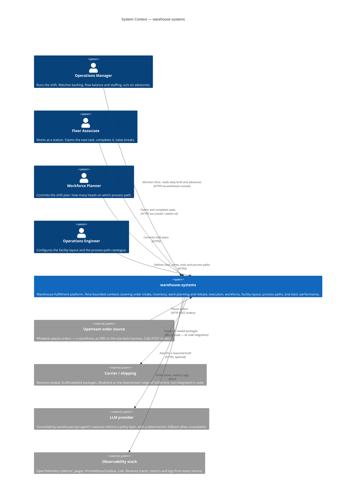

# C4 Level 1 — System Context

The highest zoom level. The whole platform is **one box**, and everything
around it is either a person who uses it or a system it integrates with. No
internal structure is visible here on purpose: this diagram answers "what is
this thing, who uses it, and what does it touch?" and nothing else.

## What the platform is responsible for

`warehouse-systems` takes an order from the moment it is placed to the moment
its contents are picked, packed, labelled and sealed into a package ready for
a carrier. Between those two points it owns four decisions that a warehouse
lives or dies by:

| Decision | Owned by | Why it matters |
| --- | --- | --- |
| Is there stock, and where is it? | `inventory-storage` | A reservation that is not honoured is a promise broken to a customer. |
| What work should start next, and when? | `wes-work-planning` | Release too early and the floor floods; release too late and stations starve. |
| Who does the next piece of work? | `fulfillment-execution` | Pull-based claiming keeps the fastest station busiest without a dispatcher. |
| How many people on which path? | `workforce-management` | Headcount is the main lever an operations manager actually controls mid-shift. |

## The human roles

These are **roles, not job titles** — one person may hold several during a
shift, and the platform does not model them as authenticated users.

- **Operations Manager** — the primary consumer of `warehouse-ops-agent`'s
  daily brief and flow-balance advisories. Reads, decides, and acts through
  other contexts; the advisory surface itself never writes.
- **Floor Associate** — interacts with `fulfillment-execution` (claim a task,
  complete it) and `workforce-management` (start a shift, take a break).
- **Workforce Planner** — commits a shift plan, which becomes a planning input
  to `wes-work-planning` over Kafka.
- **Operations Engineer** — configures the two Generic subdomains,
  `facility-layout` and `process-path-management`, which publish their
  catalogues to the contexts that consume them.

## The external systems, and how real each one is

This platform is a study project, and the honesty convention used throughout
this site applies here too — **not every external system on this diagram is
a wired integration**:

| External system | Status |
| --- | --- |
| Upstream order source | **Real.** Any HTTP client calling `POST /orders`; the `e2e-tests` repo drives exactly this in its godog suite. |
| Observability stack | **Real.** Every service exports OTLP traces and metrics; `warehouse-infra` deploys the collector, Jaeger, Prometheus/Grafana and Loki. |
| LLM provider | **Real but optional.** `warehouse-ops-agent`'s reasoner (its ADR 0004) calls a real LLM behind a policy layer and falls back to a deterministic brief when it is unavailable or disabled. |
| Carrier / shipping | **Not integrated.** `fulfillment-execution` produces a sealed, SLAM-labelled package and the platform's responsibility ends there. The carrier is drawn to show where the boundary is, not to imply a wire. |

## What is deliberately outside the boundary

- **No warehouse control system (WCS).** This platform does not drive
  conveyors, sorters, or robotics. Its lowest level of physical detail is a
  `LocationSlot` and a `Station`.
- **No transportation management.** Route planning, carrier rating and
  manifesting are out of scope.
- **No identity provider.** Every REST and MCP endpoint in the fleet is
  currently unauthenticated by deliberate decision — an earlier static-bearer
  auth layer was rolled out fleet-wide and then fully reverted. There is no
  authentication container in the level-2 diagram because there is none in
  the code.

Zoom in one level to see the deployable pieces: [Containers](/architecture/containers).
