# Aggregate Design Canvas — `Task`

Following the [ddd-crew Aggregate Design Canvas](https://github.com/ddd-crew/aggregate-design-canvas)
template, for the aggregate that is the reason this bounded context exists.

## Name

**Task**

## Description

The unit of physical work. A `Task` is created from a released work unit,
sits `Pending` in a per-type pool (queue), is claimed under a time-boxed
lease by exactly one station at a time, and is either completed or has its
lease lapse and returns to the pool. `Task` and `Package` are linked only
by `OrderRef` — a value, not a reference; neither aggregate holds a pointer
to the other, which is what keeps them separate consistency boundaries.

## State Transitions

```mermaid
stateDiagram-v2
    [*] --> Pending : CreateTask
    Pending --> Claimed : Claim(stationId, capabilities, now)\n[capability match; expiry checked first]
    Claimed --> Completed : Complete(stationId, now)\n[owner only]
    Claimed --> Pending : ExpireLeaseIfDue(now)\n[lease lapsed — lazy or swept]
    Claimed --> Claimed : RenewLease(stationId, now)\n[owner only; extends expiry]
    Completed --> [*]
```

Reverse-order note: inside `Claim`, expiry is evaluated **before** the
already-claimed check. Reversing those two lines would let a stale claim
permanently block the task — the exact failure the lease exists to
prevent. This ordering is pinned by a dedicated failing-path test, not left
to code review.

## Enforced Invariants

| # | Invariant | Typed error | HTTP |
| --- | --- | --- | --- |
| T1 | **At most one active claim, ever.** A task with an unexpired lease cannot be claimed again. | `task.ErrAlreadyClaimed` | `409` |
| T2 | **A claim requires matching capabilities.** The claiming station's capability set must contain every required capability. | `task.ErrCapabilityMismatch` | `422` |
| T3 | **An expired lease frees the task** before any further decision is made on it. | `task.ErrNotClaimed` on renew/complete | `409` |
| T4 | **No double-complete.** A completed task rejects every further operation. | `task.ErrAlreadyCompleted` | `409` |
| T5 | **Only the claim owner may renew or complete.** | `task.ErrNotOwner` | `409` |
| T6 | **Renew/complete require an active claim.** Acting on a `Pending` task is rejected. | `task.ErrNotClaimed` | `409` |

`now` is always a parameter, taken from `ports.Clock` at the application
layer — no domain method calls `time.Now()`. This is what makes lease
expiry deterministic and testable with a fixed clock instead of
`time.Sleep`.

## Corrective Policies

- **Lazy expiry at the point of use.** `Claim` calls `ExpireLeaseIfDue(now)`
  before checking whether the task is already claimed; `RenewLease` and
  `Complete` check `lease.expired(now)` and reject with `ErrNotClaimed`. A
  stale claim therefore cannot block a fresh claim even if no sweep has
  run.
- **Eager expiry via a sweep.** `POST /tasks/expire-leases` runs the
  `ExpireLeases` use case over every `Claimed` task, frees the lapsed ones,
  publishes `LeaseExpired` for each, and returns the count freed. This is
  what makes freed work *visible* in the queue-depth read model rather than
  only becoming visible the next time somebody happens to pull. Nothing
  inside this service schedules the sweep — an external scheduler (cron, a
  Kubernetes `CronJob`) must invoke it; correctness does not depend on the
  sweep running, but timely visibility does.
- **Renewal, not a longer timeout, absorbs legitimately long work.** Rather
  than picking one lease duration long enough for the worst-case task, the
  owning station renews (`POST /tasks/{id}/renew-lease`), extending expiry
  from *now*. This keeps the default timeout tuned for abandonment-detection
  latency, not for the longest conceivable task.

## Handled Commands

| Command | Use case | Effect |
| --- | --- | --- |
| `CreateTask(type, cpt, ref, requiredCapabilities, fragile, giftWrap)` | `usecases.CreateTask` | Puts a new unit of work in the pool, `Pending` |
| `claimNext(stationId, capabilities)` | `usecases.ClaimNext` | Selects the earliest-CPT pending task the station qualifies for and leases it |
| `RenewLease(taskId, stationId)` | `usecases.RenewLease` | Extends the current lease's expiry from now — owner only |
| `CompleteTask(taskId, stationId)` | `usecases.CompleteTask` | Transitions to `Completed` — owner only, validated |
| `ExpireLeases(now)` | `usecases.ExpireLeases` | Sweeps every `Claimed` task, frees any past its lease expiry |

## Created Events

| Event | Raised when | Payload |
| --- | --- | --- |
| `TaskCreated` | `CreateTask` puts a new unit of work in the pool | `TaskId` |
| `TaskClaimed` | `ClaimNext` leases a task to a station | `TaskId`, `StationId` |
| `LeaseExpired` | `ExpireLeases` frees a task whose lease lapsed | `TaskId` |
| `TaskCompleted` | `CompleteTask` succeeds | `TaskId`, `StationId` (enriched off-aggregate with `WorkUnitId`, `AssociateId`, `DurationSeconds` at publish time) |
| `ItemPicked` | *(defined in the catalogue; not raised by any use case today — the Pick path is modelled at task granularity, not item granularity)* | `TaskId` |

Events are deliberately thin — every one carries only identifiers.
Enrichment for the wire (`work_unit_id`, `associate_id`, `duration_seconds`)
happens in the outbound Kafka adapter via repository lookups, never on the
event itself, so a downstream consumer's correlation need never reshapes
the domain model.

## Throughput

- **Read-heavy on the hot path.** Every `claimNext` call issues a
  `TaskRepo.FindClaimableByType` query ordered earliest-CPT-first — this
  *is* the dispatch policy, so it runs once per claim attempt across every
  station on the floor.
- **Queue depth is a projection, computed on demand** via
  `TaskRepo.CountByTypeAndStatus`, never a stored counter — there is
  nothing to keep in sync, at the cost of a full scan per read.
- **`ExpireLeases` scans all claimed tasks** (`FindAllClaimed`), an
  unindexed-by-expiry full scan. Documented as fine at current scale; it
  would need an expiry index to scale further.
- Concurrent `claimNext` calls **race by design** — two stations may select
  the same earliest-CPT candidate simultaneously. Correctness under
  concurrency depends entirely on the at-most-once guarantee inside
  `Task.Claim`, not on any external locking.

## Size

- A `Task` is small and flat: an id, a type, a status, a CPT, an order
  reference, a capability set, an optional `*Lease` (station id + expiry),
  an optional `claimedAt` timestamp, and two boolean packing hints
  (`fragile`, `giftWrap`).
- One aggregate instance per unit of released work — disposable once
  completed, per the reference model's own framing of a WES-tier `Task` as
  "largely disposable" once its lifecycle ends, unlike a WMS-tier demand
  signal that persists with its own SLA.
- No collection fields grow unboundedly on `Task` itself; the one true
  fan-in collection (an order's arrived Rebin lines) lives on the separate
  `OrderConsolidation` aggregate, not on `Task`.
