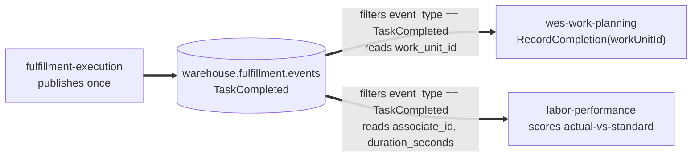

# Async API

This page is the narrative companion to the
[generated AsyncAPI reference](/api-reference/async/fulfillment-execution) —
what this context actually does with Kafka, in prose, including the gaps
between the published contract and the live wire format.

## Topics

| Direction | Topic | Event(s) | Adapter |
| --- | --- | --- | --- |
| Consume | `warehouse.work-planning.events` | `WorkReleased` | `internal/adapters/inbound/kafka/consumer.go` |
| Publish | `warehouse.fulfillment.events` | `TaskCompleted` | `internal/adapters/outbound/kafka/publisher.go` |

Client library on both sides: `github.com/segmentio/kafka-go` (pure Go, no
cgo). Broker list comes from `KAFKA_BROKERS`, default `localhost:9092`, a
shared broker for the whole platform running from
`~/warehouse-systems/docker-compose.kafka.yml`. This repository's own
`docker-compose.yml` deliberately defines only Postgres.

## Consuming: `WorkReleased`

The flat platform envelope, identical across the four integrating services:

```json
{
  "event_id": "uuid-v4",
  "event_type": "WorkReleased",
  "occurred_at": "2026-08-21T22:00:00Z",
  "source": "wes-work-planning",
  "data": {
    "path_id": "pick-zone-a",
    "work_unit_id": "wu-8a1f",
    "cpt": "2026-08-23T18:00:00Z",
    "ref": "order-4471"
  }
}
```

The consumer filters on `event_type == "WorkReleased"` and silently ignores
everything else on the topic, then translates at the boundary (the
Anti-Corruption Layer) rather than deserialising into a shared type:

| From `WorkReleased.data` | Becomes | Via |
| --- | --- | --- |
| `path_id` | `task.Type` | prefix convention: `pick-*`→`PICK`, `pack-*`→`PACK`, `slam-*`→`SLAM`, defaulting to `PICK` |
| `work_unit_id` | `shared.OrderRef` | direct |
| `cpt` | `shared.CPT` | RFC 3339 timestamp |
| *(derived from type)* | `shared.CapabilitySet` | `PICK`→`{pick}`, `PACK`→`{pack}`, `SLAM`→`{slam}` |
| `ref` | *(unused)* | decoded but not mapped — `work_unit_id` is the correlation key |

The consumer then calls the **existing** `CreateTask` use case — no
parallel code path exists for the Kafka-originated flow. Idempotency:
`ProcessedEvents.MarkProcessed(ctx, event_id)` runs before task creation,
returning `true` only if this call newly recorded the id, so redelivery
(Kafka is at-least-once) produces no duplicate task. A handling error is
logged and the loop continues — there is no dead-letter queue today, a
deliberate simplicity trade at this stage.

## Publishing: `TaskCompleted`

```json
{
  "event_id": "uuid-v4",
  "event_type": "TaskCompleted",
  "occurred_at": "2026-08-22T14:04:00Z",
  "source": "fulfillment-execution",
  "data": {
    "task_id": "task-8a1f",
    "station_id": "station-03",
    "work_unit_id": "wu-8a1f",
    "associate_id": "assoc-42",
    "duration_seconds": 187
  }
}
```

The domain event carries only `TaskId` and `StationId`; the Kafka publisher
enriches the wire payload at publish time via repository lookups —
`work_unit_id` from `TaskRepo.FindById(...).OrderRef()`, `associate_id` from
`StationRepo.FindById(...).Occupant()`, and `duration_seconds` computed
from the same `Task`'s `ClaimedAt()`. Message key is the task id, so all
events for one task land on the same partition and preserve order.
`associate_id` is omitted when the station has no checked-in occupant;
`duration_seconds` is `0` when `ClaimedAt()` is `nil` (a pre-migration
task) — both degrade gracefully rather than failing the publish.

## A shared fan-out topic, two independent consumers

`warehouse.fulfillment.events` is published to **once**, but read by **two
different bounded contexts**, each subscribing independently and each
filtering by `event_type`:



- **`wes-work-planning`** consumes it to close the drum-buffer-rope feedback
  loop: Execution → Orchestration. It reads `work_unit_id` and calls its
  own `RecordCompletion(workUnitId)`.
- **`labor-performance`** consumes the *same* event from the *same* topic,
  independently, as a pure Conformist downstream reader with zero write
  access back to this service. It reads `associate_id` and
  `duration_seconds` to score actual-vs-standard task performance.

This is a deliberate choice, not an accident: `labor-performance` could
instead poll a new `GET /tasks/{id}/completion-details`-style endpoint, but
that would duplicate the completion signal across two mechanisms that could
disagree, and would add a new synchronous inbound dependency onto this
service's completion path. Enriching the one existing event both consumers
already have to read keeps the coupling one-way and event-driven — this
service publishes what it knows, once, at the moment it knows it, and each
downstream reader takes only the fields it needs.

## CloudEvents target contract vs. the live wire format

:::warning Contract vs. current wire format
`apis/asyncapi.yaml` specifies the CloudEvents 1.0 structured envelope
(`specversion` / `id` / `source` / `type` / `subject` / `time` /
`datacontenttype` / `data`) on channel
`warehouse.fulfillment-execution.events`, with `type` following:

```
com.warehouse.<subdomain>.<bounded-context>.<entity>.<EventName>
```

e.g. `com.warehouse.wes.fulfillment-execution.task.TaskCompleted`.

The Kafka publisher in `internal/adapters/outbound/kafka/publisher.go`
today writes the **older flat platform envelope** shown above to topic
**`warehouse.fulfillment.events`** — and that is what both
`wes-work-planning` and `labor-performance` actually read. The AsyncAPI
document describes the target contract; the code has not migrated to it
yet. Both the channel name and the envelope shape differ. This is stated
plainly rather than papered over.
:::

## See also

For the exact generated schema, message examples, and channel bindings,
see the [Generated API Reference](/api-reference/async/fulfillment-execution),
built directly from this context's own `apis/asyncapi.yaml`.
