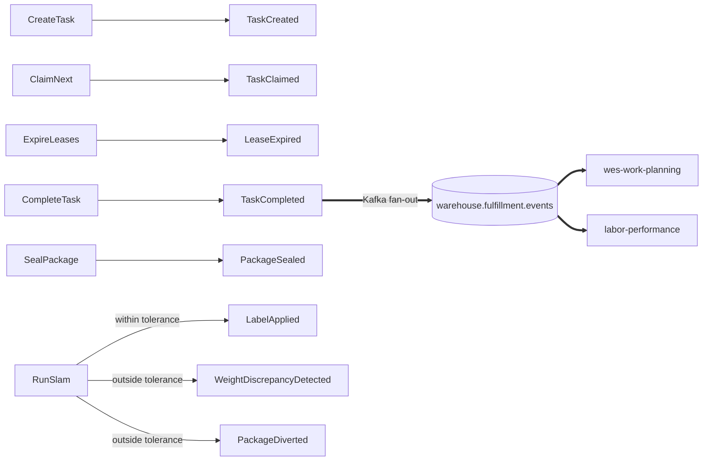

# Domain Events

Nine past-tense facts, all satisfying the same tiny interface:

```go
type DomainEvent interface {
    EventName() string
    OccurredAt() time.Time
}
```

Events are **deliberately thin** — most carry only the aggregate id.
Enrichment for the wire happens in the outbound adapter, never on the event
itself.

## The catalogue

| Event | Aggregate | When published | Consumed by | Published externally? |
| --- | --- | --- | --- | --- |
| `TaskCreated` | Task | `CreateTask` puts a new unit of work in the pool | — | No — in-process only |
| `TaskClaimed` | Task | `ClaimNext` leases a task to a station | — | No — in-process only |
| `LeaseExpired` | Task | `ExpireLeases` frees a task whose lease lapsed | — | No — in-process only |
| **`TaskCompleted`** | Task | `CompleteTask` succeeds | **`wes-work-planning`** (calls `RecordCompletion(workUnitId)`) **and `labor-performance`** (scores actual-vs-standard task performance using `associate_id`/`duration_seconds`) — both read the **same** `warehouse.fulfillment.events` fan-out topic and each filters independently by `event_type` | **Yes** — Kafka, `warehouse.fulfillment.events` |
| `ItemPicked` | Task | *(defined; not raised today — the Pick path is modelled at task granularity, not item granularity)* | — | No |
| `PackageSealed` | Package | `SealPackage` seals a carton | — | No — in-process only |
| `WeightDiscrepancyDetected` | Package | SLAM finds actual weight outside tolerance | — | No — in-process only |
| `LabelApplied` | Package | SLAM passes and the shipping label is applied | — | No — in-process only |
| `PackageDiverted` | Package | SLAM fails and the package is routed off the standard path | — | No — in-process only |

:::caution Published ≠ defined
Only **`TaskCompleted`** is currently carried outside the process. The
other eight go to `ports.EventPublisher`, which by default is the log
publisher — they are real domain events with real subscribers *in process*,
but they are not part of the integration contract yet. `apis/asyncapi.yaml`
documents all nine as the full catalogue and says so per message.

`ItemPicked` is the one event that is defined and tested but never raised
by any use case. It stays in the catalogue because it is part of the
intended model, and removing it would lose that intent.
:::

## `TaskCompleted` is read by two different consumers off one topic

This is the one event this context actually publishes externally, and it is
read by **two independent downstream contexts off the same Kafka topic**:

- **`wes-work-planning`** — the closed drum-buffer-rope feedback loop.
  Without this edge the conductor would be releasing work into a void with
  no confirmation any of it landed.
- **`labor-performance`** — a pure Conformist downstream reader, scoring
  actual-vs-standard task performance. It consumes the enriched
  `AssociateId` and `DurationSeconds` fields, both resolved by the Kafka
  publisher at publish time (never stored on the domain event itself):
  `AssociateId` via a `StationRepo` lookup of whichever occupant is checked
  in, and `DurationSeconds` from the already-loaded `Task`'s `ClaimedAt()`.

Both consumers subscribe to the identical `warehouse.fulfillment.events`
topic and each filters on `event_type == "TaskCompleted"` independently —
there is one publisher, one topic, one event, and two unrelated readers.
Neither downstream context's needs reshaped the domain event itself; both
enrichment fields are additive, resolved in the adapter, and both degrade
gracefully (`AssociateId` omitted when the station has no occupant,
`DurationSeconds` zero when `ClaimedAt()` predates the migration that added
it).

## Which use case raises what



`RegisterStation` and `GetQueueDepth` raise **nothing** — registering a
station is an operational action with no fact in the existing nine that
fits it, and the deliberate choice was not to invent a tenth event just for
symmetry. `GetQueueDepth` is a pure read.

## The one event with two facts

`RunSlam` publishes **two** events on the failure branch, in a single call:
`WeightDiscrepancyDetected` (the **measurement** — carries both weights, for
a quality/loss-prevention consumer) and `PackageDiverted` (the **routing
decision** — for a materials-handling consumer). They are kept separate
deliberately so no consumer is forced to care about both concerns.

## Naming convention on the wire

Externally published events use the CloudEvents `type` convention shared
across the platform:

```
com.warehouse.<subdomain>.<bounded-context>.<entity>.<EventName>
```

```
com.warehouse.wes.fulfillment-execution.task.TaskCompleted
com.warehouse.wes.fulfillment-execution.package.PackageDiverted
```

See [Async API](./async-api) for the full envelope and the documented
divergence between this naming convention (the target AsyncAPI contract)
and what the live Kafka publisher writes today.

## Why the events stay thin

`TaskCompleted` carries only `TaskId` and `StationId`. The wire format needs
`work_unit_id` (for `wes-work-planning`'s correlation) plus, more recently,
`associate_id` and `duration_seconds` (for `labor-performance`). None of
these are added to the domain event. Instead the Kafka publisher looks the
`Task` and `Station` back up through their repositories at publish time.
The reasoning: these fields are *integration* concerns, existing because
particular downstream consumers need particular facts. Pushing them into
the domain event would make the domain model shaped by a consumer's needs —
the tail wagging the dog. The same repo-lookup-enrichment pattern is used by
`inventory-storage`'s publisher for `ReservationRevoked`, so it is a
platform convention, not a local hack.

The identical discipline held when `Task.Fragile`, `Package.FragileHandling`,
and `Package.SortLane()` were added: none of them extended any event
payload, because each is already fully visible on its owning aggregate's own
REST response, and no in-process consumer of the existing events needed the
value pushed onto the wire.
