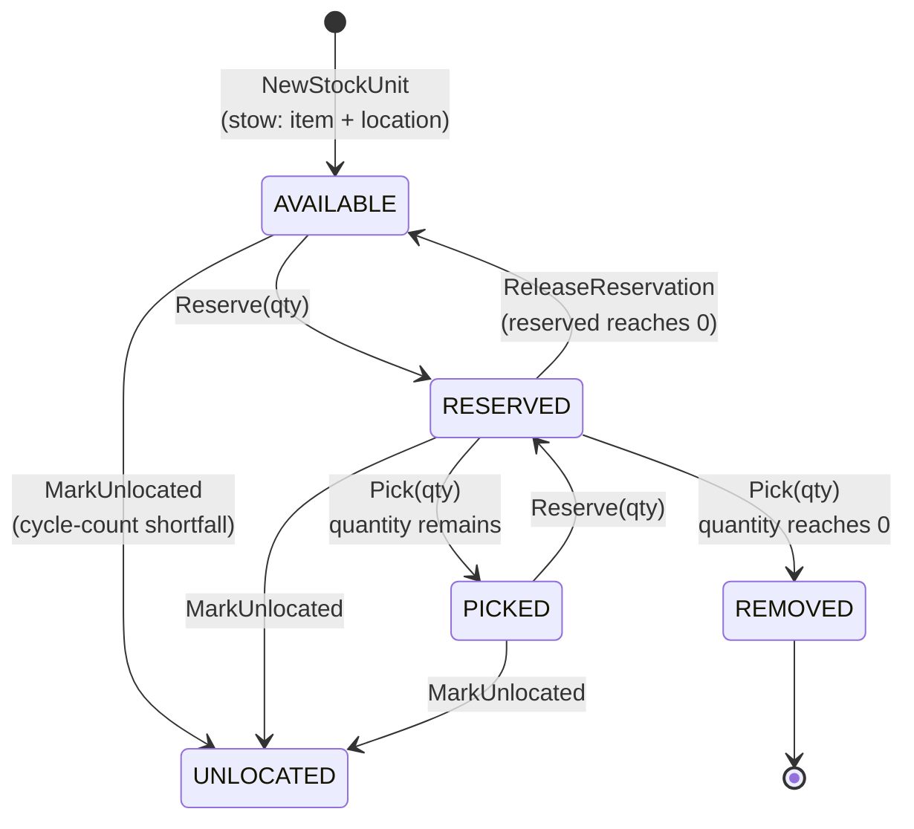
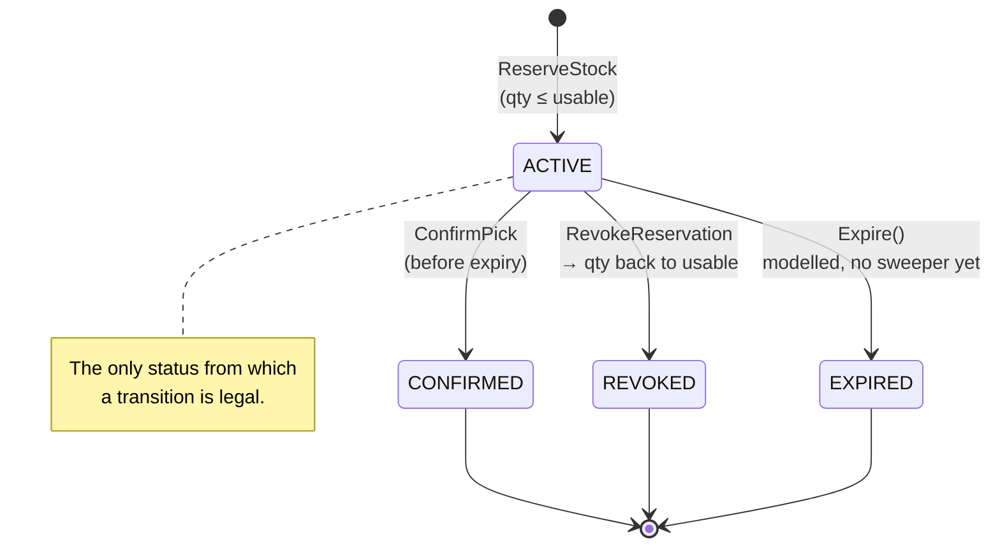

# Aggregate Design Canvas

Following the [ddd-crew Aggregate Design Canvas](https://github.com/ddd-crew/aggregate-design-canvas)
template. This context has **three** aggregate roots — `StockUnit`, `Bin`,
and `Reservation` — each loaded, changed, and saved through its own
repository port, referencing each other **by identity, not by pointer** (a
`Reservation` never holds a `*StockUnit`, and a `StockUnit` never holds a
`*Bin`). The two canvases below cover the aggregate at the centre of the
domain (`StockUnit`) and the aggregate that carries the context's central
consistency decision (`Reservation`).

## Aggregate: StockUnit

### Name

`StockUnit`

### Description

A quantity of a SKU at a **specific bin** — the core aggregate of the
context. Every physical item has exactly one known bin, or is flagged
`Unlocated`. Total stock for a SKU is a *sum across* `StockUnit`s; there is
deliberately no single "SKU balance" aggregate to contend on, so a SKU's
stock is naturally partitioned across many `StockUnit`s with no single hot
row.

| Field | Meaning |
| --- | --- |
| `id` | Identity, minted by `StockRepo.NextID` |
| `sku` | Item scan |
| `binID` | Location scan |
| `quantity` | On-hand at this bin |
| `reserved` | Portion bound to demand |
| `state` | `AVAILABLE` / `RESERVED` / `PICKED` / `REMOVED` / `UNLOCATED` |

### State Transitions

`MarkUnlocated` is deliberately unconditional — it takes no error return. A
cycle count that finds stock missing must always be able to say so; refusing
the transition because the unit happened to be reserved would leave the
system claiming stock it cannot produce.

### Enforced Invariants

| # | Invariant | Enforcement |
| --- | --- | --- |
| S1 | A stow requires both an item-scan and a location-scan. | `NewStockUnit` returns `ErrStowRequiresItemAndLocation` when `sku == ""` or `binID == ""`. |
| S2 | Quantity is never negative. | `Quantity` refuses negative construction and negative arithmetic results. |
| S3 | A stow of zero or fewer units is invalid. | `NewStockUnit` returns `ErrZeroQuantity`. |
| S4 | Reserved never exceeds usable — no negative usable. | `Reserve` returns `ErrInsufficientUsable` when `qty > Usable()`. |
| S5 | Unlocated or removed stock is never reservable. | `Reserve` returns `ErrUnitUnlocated`; `Usable()` returns 0 for those states. |
| S6 | A pick cannot exceed what was reserved, nor what is on hand. | `Pick` returns `ErrInsufficientReserved`. |
| S7 | Release cannot return more than was reserved. | `ReleaseReservation` returns `ErrInsufficientReserved`. |

### Corrective Policies

- A **cycle-count shortfall** (counted < system) is the only corrective path
  that moves a `StockUnit` sideways rather than forward: `MarkUnlocated` is
  unconditional and marks the *whole* unit `UNLOCATED` rather than splitting
  located from lost portions — a deliberate, conservative simplification that
  under-reports usable rather than over-reporting it.
- A **cycle-count overage** (counted > system) is never auto-reconciled
  against this aggregate — inventing a `StockUnit` to match would corrupt the
  ledger, so it is raised as `DiscrepancyDetected` for a separate
  receiving/audit process instead.
- There is **no compensating transaction inside this aggregate for a failed
  pick** — that correction happens one level up, on `Reservation` (see
  below): a revoke calls `ReleaseReservation` on every `StockUnit` a
  reservation drew from.

### Handled Commands

| Command | Result |
| --- | --- |
| `NewStockUnit(id, sku, binId, qty)` | Brings the aggregate into existence (via `StowStock`) |
| `Reserve(qty)` | Increases `reserved`, may transition `AVAILABLE → RESERVED` |
| `ReleaseReservation(qty)` | Decreases `reserved` (via `RevokeReservation`), may transition back to `AVAILABLE` |
| `Pick(qty)` | Decrements both `reserved` and `quantity` (via `ConfirmPick`), transitions to `PICKED` or `REMOVED` |
| `MarkUnlocated()` | Unconditional transition to `UNLOCATED` (via `RunCycleCount`) |

### Created Events

`ItemStowed`, `LocationRecorded` (both from `StowStock`), `ItemUnlocated`
(from `RunCycleCount`'s shortfall path). `StockReceived` is raised
pre-location by `ReceiveStock`, before any `StockUnit` exists.

### Throughput

Read-heavy relative to writes: every `GetUsable` and every `ReserveStock`
fans out to `StockRepo.FindBySKU` and sums `Usable()` across every
`StockUnit` for that SKU — "how much SKU-1 do we have" means summing every
unit rather than reading one row. Writes happen once per stow, once per
reserve/revoke/pick touching that unit, and once per cycle count of its bin.
A single `ReserveStock` call may write to several `StockUnit`s at once (see
`Reservation`, below), since a reservation may span multiple bins.

### Size

Small and deliberately narrow — five fields, five behavioural methods
(`Usable`, `Reserve`, `ReleaseReservation`, `Pick`, `MarkUnlocated`). Kept
small so it stays fully unit-testable and so the aggregate boundary matches
exactly the invariant it protects (one bin's holding of one SKU), rather than
growing into a "SKU balance" god-object.

---

## Aggregate: Reservation

### Name

`Reservation`

### Description

A **revocable** binding of a quantity to demand, with a timeout — the
central storage/consistency decision of the context. Physical delivery can
fail (pod blocked, tote lost, chute jam, short pick), so a reservation must
be releasable and re-allocatable against a different holding. SKU-scoped, not
bin-scoped: a single reservation may span several `StockUnit`s across several
bins, recorded as `Allocation`s so a revoke is exact.

| Field | Meaning |
| --- | --- |
| `id` | Identity, minted by `ReservationRepo.NextID` |
| `sku`, `quantity` | What is claimed |
| `demandRef` | Opaque upstream reference (order id, work-unit ref) |
| `allocations` | Which `StockUnit`s it drew from, and how much from each |
| `status` | `ACTIVE` / `CONFIRMED` / `REVOKED` / `EXPIRED` |
| `createdAt`, `expiresAt` | `expiresAt = createdAt + timeout` (default 30 minutes) |

### State Transitions

### Enforced Invariants

| # | Invariant | Enforcement |
| --- | --- | --- |
| R1 | Reserved quantity ≤ usable quantity at reserve time. | `ReserveStock` sums usable across the SKU and returns `ErrInsufficientUsable`; `StockUnit.Reserve` re-checks per unit. |
| R2 | Revoke returns quantity to usable. | `RevokeReservation` walks `allocations` and calls `ReleaseReservation` on each unit. |
| R3 | No double-consume. | `Revoke`/`Confirm`/`Expire` return `ErrAlreadyResolved` unless status is `ACTIVE`. |
| R4 | Expires after a timeout. | `IsExpired(now)`; `Confirm` returns `ErrExpired` past `expiresAt`. Time is supplied by the `Clock` port, never read inside the aggregate, so this is deterministic under test. |
| R5 | A reservation must allocate against something. | `New` returns `ErrNoAllocations` for an empty allocation list. |

### Corrective Policies

- **Revoke is the compensation.** There is no distributed transaction and no
  lock held across the physical pick/pack operation — `Revoke()` is the one
  and only corrective action, and it is exact: it walks the reservation's own
  recorded `Allocation`s and returns precisely what was taken to precisely
  the units it came from.
- **No automatic re-allocation on failure.** This aggregate/use-case makes
  recovery *possible* (the quantity becomes usable again); it does not decide
  what happens next. Re-releasing the work against a different holding,
  re-prioritising, or splitting the order is a WES-tier decision that belongs
  to `wes-work-planning`.
- **Known gap — no scheduled corrective sweep.** `Expire()` exists as a
  corrective transition but nothing calls it on a timer; the only corrective
  path exercised in production today is an explicit `DELETE
  /reservations/{id}` (revoke), even for reservations that are, in effect,
  timed out.

### Handled Commands

| Command | Result |
| --- | --- |
| `New(sku, quantity, demandRef, allocations, createdAt, timeout)` | Constructs the aggregate in `ACTIVE` status (via `ReserveStock`) |
| `Revoke()` | `ACTIVE → REVOKED` (via `RevokeReservation`) |
| `Confirm(now)` | `ACTIVE → CONFIRMED`, refuses if expired (via `ConfirmPick`) |
| `Expire()` | `ACTIVE → EXPIRED` — modelled and unit-tested, **never invoked by any use case today** |

### Created Events

`StockReserved` (on successful `New`/reserve), `ReservationRevoked` (on
`Revoke`), `StockPicked` (on `Confirm`, raised by `ConfirmPick`),
`ReservationExpired` (modelled on `Expire()` — **defined but never raised in
practice**, since nothing calls `Expire()`).

### Throughput

Low-to-moderate write volume relative to `StockUnit`: one reservation per
demand, but each reservation write fans out into writes on every `StockUnit`
it allocated from (`ConfirmPick` touches three aggregates — `Reservation`,
`StockUnit`, and `Bin` — through three separate repositories). Reads are
dominated by the demand-lookup path, `GET /reservations?demandRef=`, added
for the fleet's console.

### Size

Small: five scalar/value fields plus an append-only list of `Allocation`
value objects (one per `StockUnit` it drew from). A reservation is expected
to hold at most a handful of allocations in practice, since chaotic storage
means a SKU's stock is rarely fragmented across more than a few bins for any
single reasonable demand quantity.
