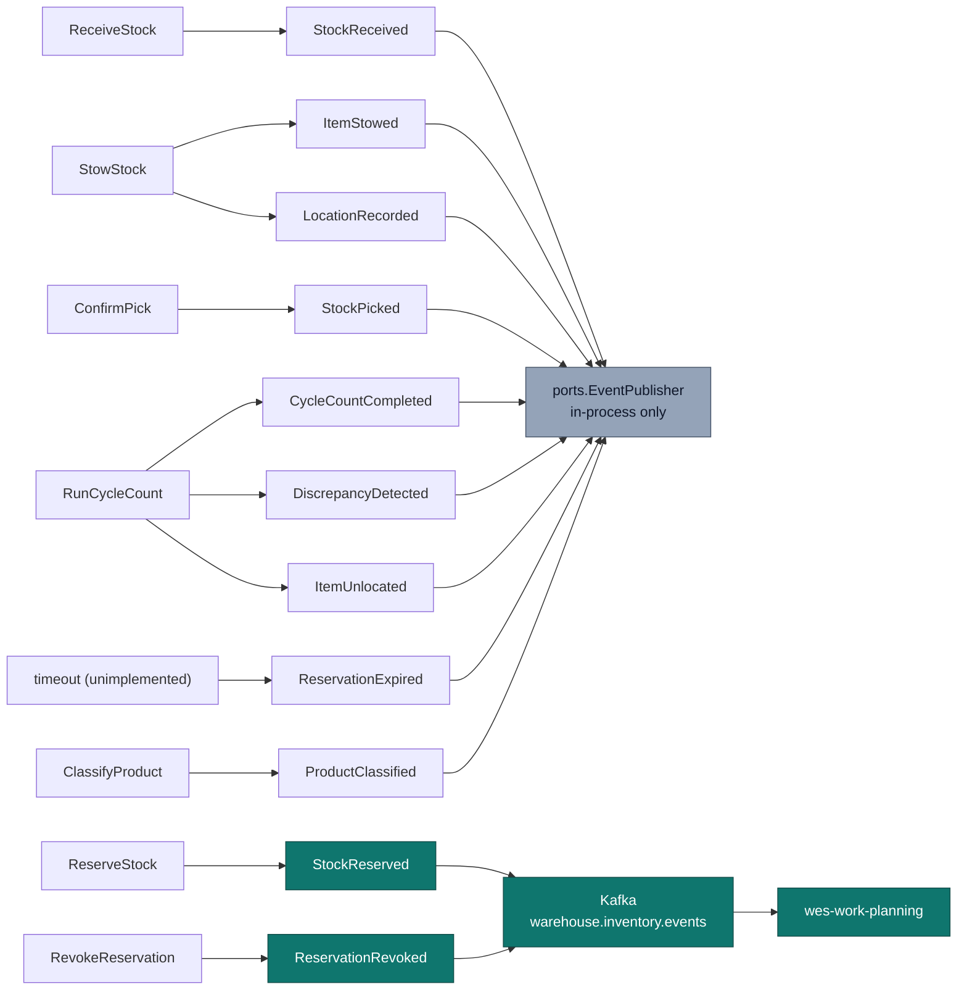

# Domain Events

Eleven past-tense events, raised by four aggregates. Every event carries an
`occurredAt` taken from the injected `Clock` port — never wall-clock time at
publish — so ordering is a domain fact rather than an infrastructure
artefact. The domain never depends on the publishing mechanism: use cases
hand events to `ports.EventPublisher`, and which adapter is behind it (log,
buffered, Postgres table, Kafka) is a composition-root decision.

**Only two of the eleven actually cross the service boundary today** —
`StockReserved` and `ReservationRevoked`, published to Kafka topic
`warehouse.inventory.events`. The rest are raised in-process and delivered to
whichever `ports.EventPublisher` is configured (the log publisher by
default); the Kafka adapter's `switch` has a `default: return nil` branch
that silently drops everything else. That is deliberate, not an
oversight — the other nine are local concerns, and `apis/asyncapi.yaml`
documents the full catalog while marking each catalog-only message as such,
so a downstream team cannot mistake a documented event for a wired one.

## The catalog

| Event | Raised by | When published | Consumed by |
| --- | --- | --- | --- |
| `StockReceived` | `StockUnit` *(pre-location)* | `ReceiveStock` acknowledges inbound goods, before anything is located | In-process only — no external consumer |
| `ItemStowed` | `StockUnit` | `StowStock` succeeds — item-scan + location-scan both present | In-process only — no external consumer |
| `LocationRecorded` | `StockUnit` | Immediately after `ItemStowed`; the bin now authoritatively holds this unit | In-process only — no external consumer |
| `StockReserved` | `Reservation` | `ReserveStock` succeeds, against usable inventory | **`wes-work-planning`** — decrements `UsableInventoryObserved[sku]`. Published to `warehouse.inventory.events`. |
| `ReservationExpired` | `Reservation` | Modelled for when a reservation's timeout elapses before confirmation — **defined, not yet raised**; no use case calls `Expire()` | None — not raised in practice; see the honest gap below |
| `ReservationRevoked` | `Reservation` | `RevokeReservation` succeeds | **`wes-work-planning`** — increments `UsableInventoryObserved[sku]` back. Published to `warehouse.inventory.events`. |
| `StockPicked` | `Reservation` | `ConfirmPick` consumes a reservation | In-process only — no external consumer |
| `ItemUnlocated` | `StockUnit` | A cycle-count shortfall cannot account for stock | In-process only — no external consumer |
| `CycleCountCompleted` | `Bin` | Any cycle count finishes, clean or not | In-process only — no external consumer |
| `DiscrepancyDetected` | `Bin` | A cycle count finds counted ≠ system | In-process only — no external consumer |
| `ProductClassified` | `ProductClassification` | `ClassifyProduct` registers or replaces a SKU's classification | In-process only — no external consumer |

*"In-process only" events, and `StockReserved`/`ReservationRevoked`, are also
fanned out on the separate `warehouse.inventory.analytics` topic (see
[ADR-0011](https://github.com/claudioed/inventory-storage/blob/develop/docs/docs/adr/0011-analytical-data-product.md)),
consumed exclusively by this service's own `cmd/inventory-projector` — an
internal data-mesh detail, not a cross-context integration, and distinct from
the "consumed by" column above.*

## Which events flow where



## StockReserved — in full

Raised by `ReserveStock` when a reservation is successfully created against
*usable* inventory. The binding is revocable and carries a timeout, so a
physical failure downstream never strands the demand.

**Payload:** `sku` (string), `quantity` (int), `demand_ref` (string). The
reservation id is carried as the CloudEvents `subject`, not inside `data`.

**Downstream effect:** `wes-work-planning` *decrements* its observed usable
count for that SKU, in its own `UsableInventoryObserved` read model.

## ReservationRevoked — in full

Raised by `RevokeReservation`. Revocation is the mechanism that keeps a
physical failure — a blocked pod, a lost tote, a chute jam, a short pick —
from stranding an order.

**Payload:** the domain event itself carries only a reservation id; the
Kafka adapter **enriches** it by looking the reservation up through
`ports.ReservationRepo` and emitting the same `sku` / `quantity` /
`demand_ref` shape as `StockReserved`. If the lookup finds nothing, the
publish fails rather than emitting a partial payload.

**Downstream effect:** `wes-work-planning` *increments* its observed usable
count for that SKU back. The symmetry is the whole point — the downstream
read model is built on the assumption that reservations come back.

## One honest gap: nothing sweeps expirations yet

`ReservationExpired` and `Reservation.Expire()` exist in the domain and are
unit-tested, but **no use case calls `Expire()` and nothing publishes
`ReservationExpired` today** — there is no background sweeper. The timeout is
still enforced, just lazily and at a different point:

- `Reservation.Confirm(now)` returns `ErrExpired` past `expiresAt`, so a
  timed-out reservation can never be confirmed into a pick;
- a timed-out reservation's status remains `ACTIVE` in storage, so
  `RevokeReservation` still accepts it and returns its quantity to usable.

The practical consequence is that a reservation nobody revokes keeps holding
quantity out of usable until someone calls `DELETE /reservations/{id}`. A
sweeper that periodically expires and releases them is a real gap, recorded
here rather than papered over.

## Naming conventions

**In-process:** bare past-tense names — `"StockReserved"`, `"ItemStowed"` —
the domain's own vocabulary, carrying no transport or platform naming.

**On the wire:** reverse-DNS CloudEvents `type`, identical across all five
services:

```text
com.warehouse.<subdomain>.<bounded-context>.<entity>.<EventName>
```

For this context, `<subdomain>` = `wms`, `<bounded-context>` =
`inventory-storage`, and `<entity>` groups by the aggregate that raises the
event: `stock`, `reservation`, or `bin`. For example:
`com.warehouse.wms.inventory-storage.reservation.StockReserved`.

## Read models are projections, not events

`GetUsable` projects from `StockUnit`s at read time inside this service.
Across the boundary, `wes-work-planning` projects `StockReserved` /
`ReservationRevoked` into its own `UsableInventoryObserved` read model keyed
by SKU. Same discipline, two scopes — read models (usable-by-SKU, bin
occupancy) are always projections, never separately-maintained aggregates.

See [Async API — Narrative](./async-api) for the wire-level envelope detail,
and the generated reference at
[`/api-reference/async/inventory-storage`](/api-reference/async/inventory-storage)
for the complete, linted AsyncAPI document.
