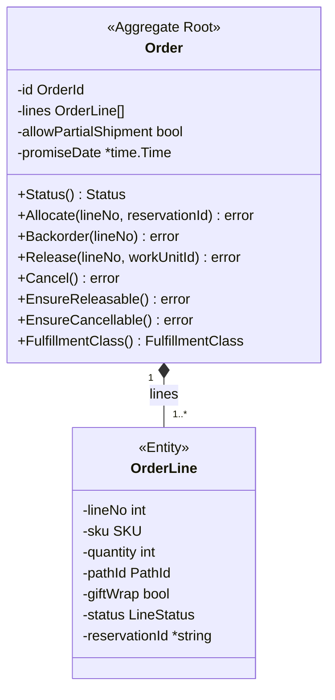
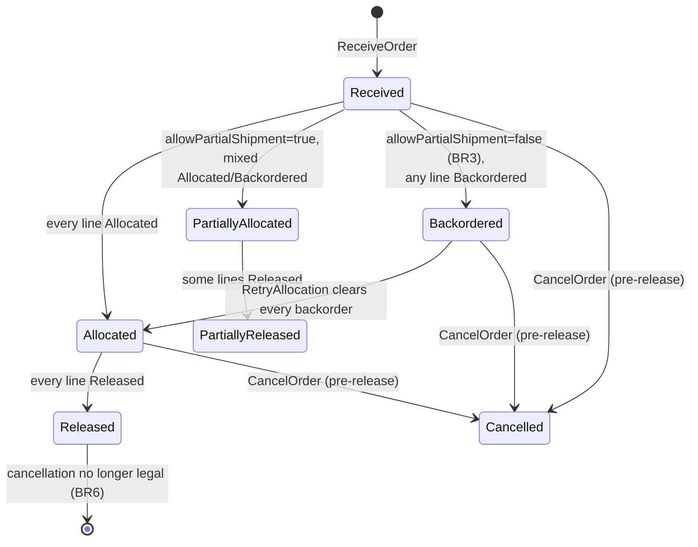

# Aggregate Design Canvas

The full [ddd-crew Aggregate Design Canvas](https://github.com/ddd-crew/aggregate-design-canvas)
for this context's one aggregate root, `Order`.

## Name

**Order**

## Description

The aggregate root of the `order-management` bounded context. Owns
`OrderId`, an `OrderLine[]` collection (one entity per requested item),
`AllowPartialShipment bool`, a `Status` that is always derived rather than
stored, and `PromiseDate *time.Time`. It is the single consistency
boundary across which allocation, release, and cancellation are enforced —
one aggregate root, one entity type (`OrderLine`), one value-object
package (`internal/domain/shared`).

## State Transitions

`Order.Status()` is computed fresh from line statuses on every call —
never stored on the aggregate or in the `orders` table.

`OrderLine.LineStatus` moves `Pending` → `Allocated` | `Backordered` →
`Released` | `Cancelled`, with `Backordered` → `Allocated` reachable
**only** via `RetryAllocation` — no other use case touches a
`Backordered` line's status.

## Enforced Invariants

| Invariant | Enforcement |
| --- | --- |
| Cannot allocate the same line twice. | `Allocate` rejects a line not in `Pending` or `Backordered`. |
| Cannot release a line that isn't `Allocated`. | `Release` rejects any other line status. |
| Cannot cancel once ANY line is `Released` (BR6). | `EnsureCancellable` returns `ErrOrderAlreadyReleased`. |
| Order-level `Status` is always computed from line statuses, never stored redundantly. | `Status()` derives the value on every call; there is no backing field. |
| `Quantity` must be > 0. | Rejected at construction (`ReceiveOrder`). |
| `SKU` must be non-empty. | Rejected at construction. |
| A `Backordered` line may transition back to `Allocated` ONLY via `RetryAllocation`. | No other use case touches a `Backordered` line's status. |
| BR3 — a ship-complete order releases nothing while any line is unallocated. | Checked on the aggregate itself, `Order.EnsureReleasable()` → `ErrShipCompleteBlocked`; there is no route to release that can skip it. |

## Corrective Policies

**None.** This context does not run a scheduler, sweeper, or automated
retry over stuck aggregates. A `Backordered` order stays backordered until
a human or caller explicitly issues `RetryAllocation` — that is the
honest v1 position, documented as such rather than an oversight (per
ADR-0003's Consequences: "a stuck backorder needs a human or a scheduler
... nothing in v1 retries automatically"). Likewise, a hard failure
mid-allocation persists whatever genuinely succeeded rather than being
auto-compensated: deleting/compensating partial reservations was
considered and rejected, because it would move the failure risk to a
second, itself-fallible `DELETE` call and discard state a retry could use.

## Handled Commands

| Command | Effect |
| --- | --- |
| `ReceiveOrder(lines[], allowPartialShipment)` | Validates every line, mints an `OrderId`, persists the order in `Received` status, publishes `OrderReceived` unconditionally, then attempts `allocateAndRelease` best-effort in the same call. A hard failure in that best-effort step never fails `ReceiveOrder` itself. |
| `AllocateOrder`/`RetryAllocation` (shared `allocateAndRelease`) | Calls `inventory-storage`'s `POST /reservations` per eligible line. A `409` marks that line `Backordered` (business fact) and continues; anything else hard-fails the whole pass. On success, checks `EnsureReleasable()` (BR3) and releases every currently-`Allocated` line via the pure domain transition. `RetryAllocation` re-attempts only `Backordered` lines and is the sole sanctioned route back to `Allocated`; unlike `ReceiveOrder`, a hard failure here DOES propagate to the caller. |
| `ReleaseOrder` (as a domain transition, `Order.Release`) | No longer a standalone public use case (ADR-0005) — folded into `allocateAndRelease`, run automatically right after a successful allocation pass. |
| `CancelOrder(orderId)` | Rejects with `ErrOrderAlreadyReleased` if any line is already `Released`, checked BEFORE any reservation is revoked. A legal cancellation revokes every allocated line's reservation via `DELETE /reservations/{id}`, then cancels every line. A failed revoke fails the whole cancellation; nothing is marked cancelled. |
| `GetOrder(orderId)` | Read-only. Returns current `Order` state with `status` computed at read time. |

## Created Events

Eight domain events, all raised by the `Order` aggregate — see the
dedicated [Domain Events](./domain-events) page for the full catalog,
timing, and Kafka-forwarding detail:

`OrderReceived`, `OrderLineAllocated`, `OrderLineBackordered`,
`OrderAllocated`, `OrderPartiallyAllocated`, `OrderLineReleased`,
`OrderReleased`, `OrderCancelled` — plus one operational-visibility event
beyond the named eight, `OrderAllocationPartiallyFailed`, raised when a
hard failure hits partway through an allocation pass that already
succeeded on at least one line.

## Throughput

`Order` is a **single-writer aggregate scoped per order** — every command
above (`ReceiveOrder`, `allocateAndRelease`, `CancelOrder`) loads, mutates,
and saves exactly one `Order` instance identified by its own `OrderId`.
There is no cross-order locking and no shared mutable state between
aggregate instances, so throughput scales horizontally with the number of
concurrent distinct orders rather than being bottlenecked by a single
hot aggregate. The per-instance ceiling is set by the two outbound
Supplier calls, not by the aggregate itself: `allocateAndRelease` issues
one `POST /reservations` call to `inventory-storage` per line
sequentially, so an N-line order's allocation latency is dominated by N
sequential HTTP round-trips (bounded timeouts per ADR-0002, no
parallelization documented). A single order's own commands are
effectively serialized in practice (one write path, one HTTP conversation
at a time) — this is by design, not a documented performance target, and
the docs make no throughput claim beyond "orders having thousands of
lines" being the point at which deriving `Status()` on every read would
start to matter enough to add a projection alongside the derivation.

## Size

Per instance, the event count scales with the order's own line count and
how many allocation/retry passes it takes to clear:

- **Minimum (happy path, all lines allocate first try):** 1 `OrderReceived`
  + 1 `OrderLineAllocated` per line + 1 `OrderAllocated` + 1
  `OrderLineReleased` per line + 1 `OrderReleased` — for a 2-line order,
  that is 7 events.
- **With a backorder and one retry:** add 1 `OrderLineBackordered` per
  backordered line, plus another `OrderLineAllocated`/`OrderAllocated`
  pass from `RetryAllocation`.
- **With a hard mid-pass failure:** add 1 `OrderAllocationPartiallyFailed`.
- **If cancelled pre-release:** replace the release-side events with a
  single `OrderCancelled`.

There is no fixed cap — a ship-complete order can accumulate a
`RetryAllocation` pass's worth of events every time it is retried — but
the *state* held per instance stays small and bounded: one `Order` with a
handful of `OrderLine` entities, no growing collection, no unbounded
history kept on the aggregate itself (event history lives in the
publisher/log, not on `Order`).
