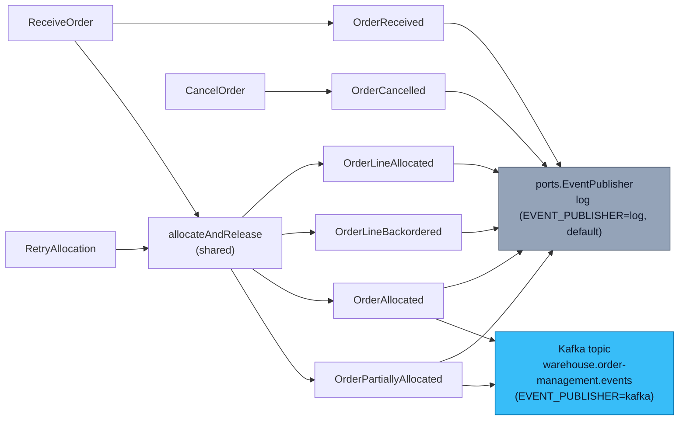

# Domain Events

Eight past-tense events, raised by the `Order` aggregate and published
through `ports.EventPublisher`. Since
[ADR-0005](https://github.com/claudioed/order-management/blob/develop/docs/docs/adr/0005-choreographed-release-via-kafka.md),
that port has TWO real implementations, selected by the `EVENT_PUBLISHER`
env var:

- **`log`** (default): every event is logged as JSON, in-process only.
- **`kafka`**: the SAME events are logged/persisted locally as before, but
  `OrderAllocated` and `OrderPartiallyAllocated` are ADDITIONALLY
  forwarded to the shared Kafka broker, topic
  `warehouse.order-management.events`, for `wes-work-planning` (or any
  other subscriber) to consume.

Every event embeds an `occurredAt` from the injected `Clock` port — never
wall-clock time read directly — so ordering is a domain fact, not an
infrastructure artefact.

## The catalog

| Event | When published | Consumed by |
| --- | --- | --- |
| `OrderReceived` | `ReceiveOrder` accepts a new order into `Received` status | No Kafka consumer in v1 — log publisher only |
| `OrderLineAllocated` | `inventory-storage`'s `POST /reservations` succeeds for a line | No Kafka consumer in v1 — log publisher only |
| `OrderLineBackordered` | `inventory-storage` returns `409` for a line (a business fact) | No Kafka consumer in v1 — log publisher only |
| `OrderAllocated` | Every line on the order is `Allocated`, and the lines eligible for release in this pass WERE released | **Forwarded to Kafka** (`warehouse.order-management.events`) — intended for `wes-work-planning`'s own consumer, which reacts to the released `lines[]` payload to enqueue its own work independently. Fire-and-forget: no confirmation reply event exists in v1. |
| `OrderPartiallyAllocated` | Some lines allocated, some backordered, on an order that allows partial shipment; the eligible lines WERE released | **Forwarded to Kafka**, same contract and same fire-and-forget caveat as `OrderAllocated` |
| `OrderLineReleased` | A line transitioned to `Released` (a pure domain fact — no longer tied to a synchronous `wes-work-planning` call) | No Kafka consumer in v1 — log publisher only |
| `OrderReleased` | Every line on the order has been released | No Kafka consumer in v1 — log publisher only |
| `OrderCancelled` | `CancelOrder` succeeds, revoking every allocated line's reservation | No Kafka consumer in v1 — log publisher only |

Only two of the eight are integration events — mirroring
`inventory-storage`'s own precedent of forwarding only two of its several
domain events (`StockReserved`, `ReservationRevoked`). The other six stay
local: `OrderReceived` through `OrderLineBackordered` are intake/allocation
progress this service's own callers already see synchronously in the HTTP
response; `OrderLineReleased`/`OrderReleased`/`OrderCancelled` are equally
local concerns with no cross-context subscriber today.

## An operational-visibility event beyond the named eight

[ADR-0003](https://github.com/claudioed/order-management/blob/develop/docs/docs/adr/0003-ship-complete-default-and-fail-closed-allocation.md)
documents one further event, **`OrderAllocationPartiallyFailed`**: raised
when the shared allocation pass hits a hard, non-business (non-409)
failure partway through. The lines that genuinely succeeded before the
failure are kept `Allocated` — discarding them would strand real
reservations inside `inventory-storage` — and the event exists purely so
that partial-progress outcome is operationally visible rather than only
discoverable by reading a source comment. Carries `AllocatedLines`,
`RemainingLines`, and a truncated `Cause`. Publishing it is best-effort:
if the publish itself fails, that failure is joined onto the original
allocation error rather than replacing it. It is never forwarded to
Kafka — no Kafka consumer in v1 for this event either.

## The Kafka integration contract (the two forwarded events)

- **Topic:** `warehouse.order-management.events`
- **Envelope:** `{event_id, event_type, occurred_at, source, data}` —
  matches the platform-wide shape used by `inventory-storage`
- **`data` shape** (frozen — shared verbatim with `wes-work-planning`'s
  Kafka consumer):

  ```json
  {
    "order_id": "ord-a1b2c3d4-0000-0000-0000-000000000001",
    "promise_date": "2026-08-27T09:00:00Z",
    "lines": [
      {"line_no": 1, "sku": "SKU-1", "path_id": "pick", "gift_wrap": false, "fulfillment_class": "MULTI_LINE_MULTI"}
    ]
  }
  ```

- **The deterministic work-unit id.** `wes-work-planning`'s consumer
  independently reconstructs `{order_id}-line-{line_no}` from the payload
  above (`usecases.WorkUnitID` in this repo) — this id is never
  transmitted on the wire; both sides derive it the same way, and it MUST
  match byte-for-byte or idempotent redelivery breaks.
- **Fire-and-forget, deliberately.** v1 has NO release-confirmation reply
  event from `wes-work-planning` back to this service — a documented gap,
  not an oversight.
- **No ordering guarantee across events on the topic** (no partition
  key), matching `inventory-storage`'s own documented limitation for the
  identical reason.

## A separate, additive analytics topic

[ADR-0006](https://github.com/claudioed/order-management/blob/develop/docs/docs/adr/0006-analytical-data-product.md)
adds a second, wider event fan-out on **`warehouse.order-management.analytics`**,
carrying a broader set of the same domain events (all nine, including
`OrderAllocationPartiallyFailed`) under the shared Envelope v1 wrapper for
the [Order Funnel & Allocation Health report](https://github.com/claudioed/order-management/blob/develop/docs/docs/analytics/order-funnel-report.md),
consumed only by this context's own `cmd/order-projector`. This topic is
untouched by, and does not widen, the integration contract above.

## Which use case emits what


