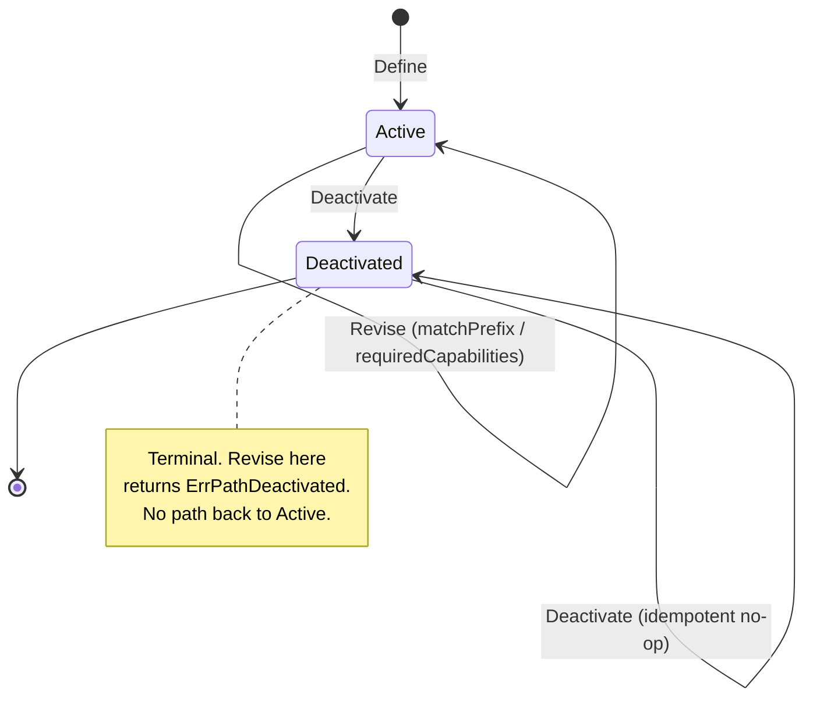

# Aggregate Design Canvas — ProcessPath

Following the [ddd-crew Aggregate Design Canvas](https://github.com/ddd-crew/aggregate-design-canvas).
`ProcessPath` is the single aggregate root in this domain.

## Name

**ProcessPath**

## Description

The operator-configurable definition of one process path. Fields:
`PathId` (immutable identity), `MatchPrefix` (revisable), `Direct`
(immutable), `RequiredCapabilities` (revisable), `Status`
(`Active`/`Deactivated`), `CreatedAt`/`UpdatedAt`. Identity is permanent
once constructed — a deactivated id is never re-issued.

## State Transitions

There is no "draft" state: a `ProcessPath` is `Active` the instant it is
defined. The only transition is one-way and terminal.



## Enforced Invariants

Verbatim from the source domain code's own documentation:

1. **Non-empty, lower-case `MatchPrefix`.** Enforced identically at
   `Define` and at `Revise` time (`validate` is a single shared function,
   not duplicated logic that could drift). Rejected with a typed sentinel
   (`ErrEmptyMatchPrefix` / `ErrMatchPrefixNotLowercase`) rather than
   silently coerced — persisted data is exactly what was validated, never
   a silently-lower-cased value the caller didn't actually send.

   ```go
   if matchPrefix == "" {
       return ErrEmptyMatchPrefix
   }
   if matchPrefix != strings.ToLower(matchPrefix) {
       return ErrMatchPrefixNotLowercase
   }
   ```

2. **Non-empty `RequiredCapabilities`.** Must contain at least one
   capability. A process path with zero required capabilities is not a
   meaningful business fact — every real path (`PICK`, `PACK`, `SLAM`,
   `REBIN`) requires at least the capability named after itself. Enforced
   by the same shared `validate` function, at both `Define` and `Revise`
   time.

3. **Deactivation is terminal and idempotent.** Once a `ProcessPath`
   transitions to `Deactivated`, it is a closed historical record:
   - **Terminal.** `Revise` on a Deactivated path returns
     `ErrPathDeactivated` — there is no path back to `Active`. Re-using a
     deactivated id is refused (`ErrPathAlreadyExists`), never silently
     reopened.
   - **Idempotent.** Calling `Deactivate` on an already-deactivated path is
     a no-op success, not an error — matching this fleet's established
     "duplicate/redelivered command is a no-op, not an error" convention.
     Enforced one layer up, in the `DeactivatePath` use case, this also
     means `ProcessPathDeactivated` is never republished a second time.

   ```go
   func (p *ProcessPath) Deactivate(now time.Time) {
       if p.status == StatusDeactivated {
           return
       }
       p.status = StatusDeactivated
       p.updatedAt = now
   }
   ```

## Corrective Policies

- **Deactivation carries no position on in-flight work.** This aggregate
  takes no stance on work already assigned to a path in a downstream
  context at the moment it is deactivated — that is each consumer's own
  operational concern. `ProcessPathDeactivated` tells consumers to stop
  accepting NEW work against this path; it is not a command to cancel
  anything already in flight.
- **Revision is a real no-op, not a spurious event.** `Revise` returns a
  `changed` boolean. When the caller's request is byte-for-byte identical
  to the path's current `MatchPrefix` and `RequiredCapabilities`, `changed`
  is `false` and the `RevisePath` use case does not republish
  `ProcessPathUpdated` — consumers never have to diff two identical
  payloads to notice nothing changed.

## Handled Commands

| Command | Precondition | Result |
| --- | --- | --- |
| **Define** | `PathId` not already in use (active or deactivated) | New `ProcessPath`, `Status = Active`; publishes `ProcessPathCreated` |
| **Revise** | Path exists and is `Active` | `MatchPrefix`/`RequiredCapabilities` updated if changed; publishes `ProcessPathUpdated` only when `changed = true` |
| **Deactivate** | Path exists | `Status = Deactivated`; idempotent — a no-op, not an error, if already deactivated; publishes `ProcessPathDeactivated` only on the actual transition |

## Created Events

| Event | Published when |
| --- | --- |
| `ProcessPathCreated` | A new path is successfully defined |
| `ProcessPathUpdated` | A `Revise` call actually changes `MatchPrefix` or `RequiredCapabilities` |
| `ProcessPathDeactivated` | A path transitions from `Active` to `Deactivated` (never republished on a redundant deactivate call) |

See [Domain Events](./domain-events) for the full consumer picture (today:
none).

## Throughput

**Low-frequency, operator-driven.** Path definitions change rarely relative
to how often they would be read by a wired consumer — an operator revises
or deactivates a path perhaps a few times a day, not per-request. This is
the load-bearing argument for Kafka-event propagation over synchronous
read-through: a local, event-maintained cache in each consumer is the
natural fit for data that is written this infrequently but would otherwise
need to be read on every high-frequency dispatch decision
(`claimNext`/dispatch in `fulfillment-execution`, in particular). There is
no burst-write scenario this aggregate needs to withstand — command volume
is bounded by how often a human operator acts.

## Size

**Small.** Five scalar/short-list fields (`PathId`, `MatchPrefix`,
`Direct`, `RequiredCapabilities`, `Status`) plus two timestamps. No child
entities, no internal collection beyond the flat `RequiredCapabilities`
list, and no nested aggregates — the entire domain model is this one
aggregate root. This matches the earlier YAML file it replaces: a
like-for-like schema migration, not a redesign.
