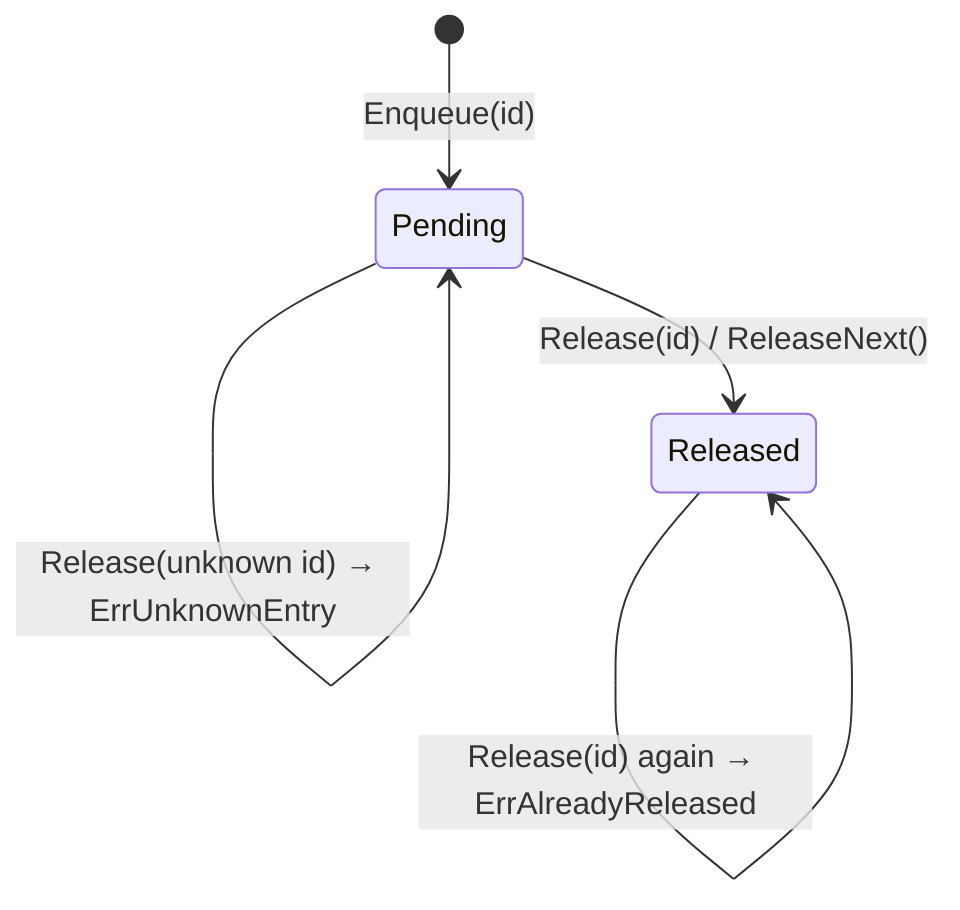
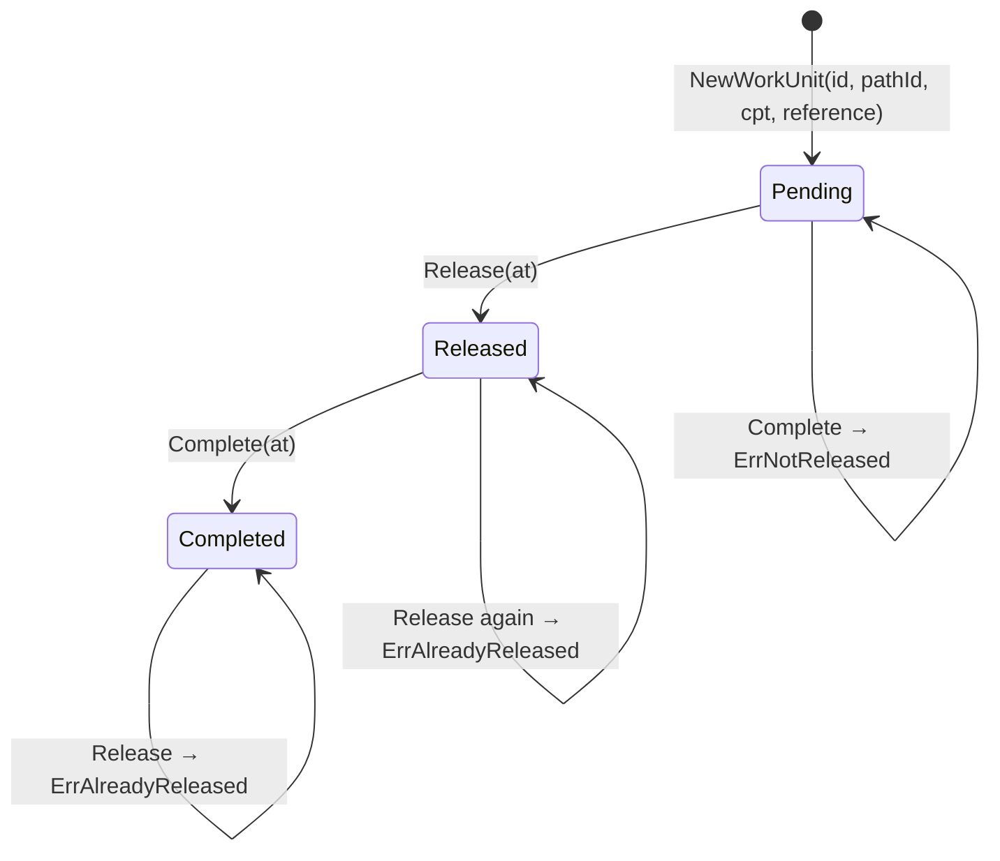

# Aggregate Design Canvas — `WorkPool`

Following the [ddd-crew Aggregate Design Canvas](https://github.com/ddd-crew/aggregate-design-canvas)
template. `WorkPool` is the aggregate documented here because it is where
this context's defining decisions live: priority, WIP backpressure, and
feed-mode-dependent enforceability. `WorkUnit` is its sibling aggregate — a
separate consistency boundary referenced by identity, not a child entity —
and is covered in its own short section at the end of this page.

## Name

**`WorkPool`** (`internal/domain/release`)

## Description

The queue for exactly one process path: backlog depth, arrival rate,
service rate, and the admission bookkeeping that hands entries out **at
most once**, in **earliest-CPT** order. A `WorkPool` holds entry records
keyed by work-unit id — never `WorkUnit` objects — because the pool's
release bookkeeping and a unit's lifecycle are different consistency
boundaries that happen to be updated in the same use case.

```go
type WorkPool struct {   // aggregate root
    pathId         shared.PathId
    mode           FeedMode  // ReleaseFed | FlowFed
    wipLimit       int       // enforced only when mode == ReleaseFed
    alarmThreshold int       // informative only, when mode == FlowFed
    entries        []poolEntry
}
```

## State Transitions

A pool entry moves through a small, one-way lifecycle, mirrored by (but
distinct from) the `WorkUnit` state machine it references:



`nextPendingIndex()` selects the pending entry with the **earliest CPT** on
every call — priority is never fixed at enqueue time, it is recomputed on
every release. That single rule is the entire priority function: the drum,
expressed in code.

## Enforced Invariants

| # | Invariant | Failing path |
|---|---|---|
| W1 | **At-most-once handout.** An entry is released at most once. | `Release(id)` on an already-released entry → `ErrAlreadyReleased` |
| W2 | **WIP limit is enforceable on release-fed pools.** | `ReleaseNext()` / `Release()` when `WIP() ≥ wipLimit` and `mode == ReleaseFed` → `ErrWIPLimitReached` |
| W3 | **No duplicate entries.** | `Enqueue(id)` for an id already in the pool → `ErrDuplicateEntry` |
| W4 | Releasing from an empty pool is an error. | `ReleaseNext()` with no pending entries → `ErrEmptyPool` |
| W5 | Releasing an unknown id is an error. | `Release(unknownId)` → `ErrUnknownEntry` |

**W2 is conditional by design.** On a **flow-fed** pool the WIP limit is
*not* enforced and `alarmThreshold` is used instead, exposed as
`IsOverAlarmThreshold()`. You can only enforce a limit on an input you
control; a conveyor does not ask permission.

`BacklogDepth()` (pending count) and `WIP()` (released count) are
**computed on demand from `entries`**, never stored — see
[Read models](https://github.com/claudioed/wes-work-planning/blob/develop/docs/docs/ddd/read-models.md)
in the source repository.

## Corrective Policies

Two domain services act on a `WorkPool`, and neither is a method on the
aggregate itself — both need context beyond what a single `WorkPool`
instance can compute about itself.

- **`ReleasePolicy`** — `Apply(pool) (string, error)` calls
  `pool.ReleaseNext()`. Deliberately thin today and deliberately a
  **separate object**: admission is the rule most likely to change
  (customer tiering, cold-chain handling, aisle batching), and naming it
  separately means changing it is replacing one object, not editing the
  aggregate.
- **`RebalanceDecision`** — a synchronous decision evaluated on read over a
  pool snapshot (feed mode, backlog depth, WIP, WIP limit, alarm
  threshold). It **recommends**, never acts:

  | Feed mode | Condition | Recommendation | Event |
  |---|---|---|---|
  | Flow-fed | `backlogDepth > alarmThreshold` | `ThrottleUpstream` | `PathThrottled` |
  | Release-fed | `WIP ≥ wipLimit` **and** `backlogDepth > 0` | `ReassignLabor` | `LaborReassignmentFlagged` |
  | either | otherwise | `NoActionNeeded` | — |

  A release-fed pool at its WIP limit is *already* exercising its lever
  fully — further throttling would push on a control already fully
  pressed, so the constraint named is capacity, not admission.

## Handled Commands

| Command | Effect |
|---|---|
| `EnqueueWorkUnit(pathId, cpt, ref)` | Creates a `WorkUnit` (see below) and adds a `Pending` entry to this path's `WorkPool`, keyed by the unit's id. |
| `ReleaseNextWork(pathId)` | Applies `ReleasePolicy` to the pool: hands out the pending entry with the earliest CPT, subject to W1–W5. |
| `RecordCompletion(workUnitId)` | Transitions the referenced `WorkUnit` to `Completed`; the pool's `WIP()` projection drops accordingly on the next read (no counter is decremented on the pool itself — see Read models). |
| `SampleBacklog(pathId)` | Not a mutation — computes the telemetry read model from `entries` and may raise `BacklogThresholdBreached`. |
| `RebalanceDecision(pathId)` | Not a mutation — computes the flow-balancing recommendation from the same snapshot. |

## Created Events

| Event | Raised by | Payload fields |
|---|---|---|
| `WorkUnitCreated` | `EnqueueWorkUnit` | `PathId`, `WorkUnitId` |
| **`WorkReleased`** | `ReleaseNextWork` | `PathId`, `WorkUnitId` (enriched at the outbound adapter with `cpt`, `ref`) |
| `WorkUnitCompleted` | `RecordCompletion` | `PathId`, `WorkUnitId` |
| `BacklogThresholdBreached` | `SampleBacklog` (flow-fed pool over threshold) | `PathId` |
| `PathThrottled` | `RebalanceDecision` (flow-fed, over alarm threshold) | `PathId` |
| `LaborReassignmentFlagged` | `RebalanceDecision` (release-fed, saturated with backlog remaining) | `PathId` |

`WorkReleased` is the only event any sibling service consumes today —
`fulfillment-execution` turns it into a `Task`. The rest are published for
observability and future subscribers.

## Throughput

This is a Core aggregate with real concurrency and throughput discussion in
its own right, because it sits directly on the admission path:

- **`ReleaseNext` is called once per unit, not once per wave** — a direct,
  deliberate trade against wave-based release's lower call volume, accepted
  because each call is pure in-memory domain logic over a pool snapshot
  with no I/O and no clock, so the per-call cost is small.
- **The WIP limit is the throughput governor for a release-fed pool.**
  `PathPlan.PlannedThroughput()` (`rate × plannedHeads × hours`) sets the
  target; the WIP limit is the enforceable ceiling on outstanding work that
  keeps the floor from being flooded beyond what that planned throughput
  can actually clear.
- **The control loop closes through `TaskCompleted`.** Without the feedback
  edge from `fulfillment-execution`, WIP would only ever grow and a
  release-fed pool would deadlock at its limit after `wipLimit` releases —
  the loop, not the pool alone, is what makes the WIP limit a meaningful
  throughput control rather than a one-way valve.
- **Kafka redelivery does not distort throughput accounting.** Every
  consumer path is idempotent by `event_id` (`processed_events` primary-key
  check), so a redelivered `TaskCompleted` does not free WIP twice, and a
  redelivered `StockReserved` does not double-decrement usable inventory.
  Using the primary-key violation *as* the check — rather than
  read-then-write — removes the race between two consumers processing the
  same redelivery concurrently.
- **The Release Throughput & Backlog Health analytical report** (per
  path × hour: `workReleased`, `workUnitCompleted`,
  `backlogThresholdBreached`, `pathThrottled`, `rateDeviationDetected`) is
  the operational lens onto this aggregate's actual behaviour over time,
  built from its own domain events on a separate topic
  (`warehouse.wes.analytics`) so a runaway analytical query can never
  contend with the transactional release path.

## Size

- **Small, deliberately.** Four fields on the aggregate root
  (`pathId`, `mode`, `wipLimit`/`alarmThreshold`, `entries`), one value
  type per entry (`poolEntry`), and no nested aggregates.
- **One pool per process path, always** — not a global task list. Size
  scales with backlog depth on a single path's queue, not with the whole
  floor's work, which is why computing `BacklogDepth()`/`WIP()` as a slice
  scan on read is the right trade at this size (see
  [Read models](https://github.com/claudioed/wes-work-planning/blob/develop/docs/docs/ddd/read-models.md)
  for the explicit reasoning against a stored counter).
- Collection getters (`entries`) are never handed out directly; callers get
  copies, so an external caller cannot mutate the pool's admission
  bookkeeping behind its own back.

---

## Sibling aggregate: `WorkUnit`

`WorkUnit` (`internal/domain/workunit`) is a **separate aggregate root**,
not an entity inside `WorkPool` — the pool references it only by id.

```go
type State int
const (
    Pending State = iota
    Released
    Completed
)
```



**Invariants:** at most one active assignment (`U1`), no double-complete
(`U2`), must be released before completing (`U3`), non-empty id (`U4`),
non-empty reference (`U5`). **`U2` matters beyond tidiness**: completion
arrives over Kafka from `fulfillment-execution` as `TaskCompleted`, and
Kafka is at-least-once — the inbound adapter deduplicates by `event_id`
*and* the aggregate independently rejects the second completion, defence in
depth by deliberate design.

Why two aggregates and not one: a pool's admission bookkeeping and a unit's
lifecycle are updated in the same use case but are not one
transaction-shaped object. Merging them would couple a queueing concern
(where is this unit in the release order) to a lifecycle concern (has this
unit been completed) that genuinely change for different reasons and at
different rates.
