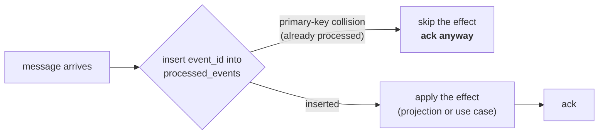

# Async API

All five (now six) warehouse-systems services share **one Kafka broker**
(`localhost:9092` locally). This service does not run its own broker — it
connects to the shared one via `github.com/segmentio/kafka-go` (pure Go, no
cgo).

## The shared envelope

Every service exchanges the same outer shape:

```json
{
  "event_id": "uuid-v4",
  "event_type": "WorkReleased",
  "occurred_at": "2026-08-21T22:00:00Z",
  "source": "wes-work-planning",
  "data": { }
}
```

`event_id` is a UUID v4 generated at publish time and is also the Kafka
**message key**. `occurred_at` comes from the **domain clock**, not from
publish time. `source` is always the publishing service's own name. `data`
is event-type-specific.

The envelope struct lives in each service's own
`internal/adapters/kafka/envelope` package and is **duplicated by
agreement** rather than extracted into a shared library — a shared library
would make the envelope a versioned dependency, and bumping it would force
coordinated redeploys, reintroducing exactly the coupling the async
boundary exists to avoid. The cost is that the definition is copied across
services and could drift; the mitigation is that it is tiny, stable, and
each service's contract is published and linted.

:::note Envelope vs. the published AsyncAPI spec
`apis/asyncapi.yaml` documents a **CloudEvents 1.0 structured-mode**
envelope as the platform's published target contract — reverse-DNS `type`
naming (`com.warehouse.wes.work-planning.workunit.WorkReleased`), `id`,
`source`, `subject`, `time`. The **running adapters still write the simpler
envelope above**, and the sibling consumers expect that simpler shape. Both
are recorded, and this gap is stated rather than papered over: code against
the JSON block above if you are writing a consumer today. See the
[generated reference](/api-reference/async/wes-work-planning) for the full
CloudEvents-shaped spec document.
:::

## Published

### Topic `warehouse.work-planning.events`

| `event_type` | `data` | Published when | Consumed by |
|---|---|---|---|
| `WorkReleased` | `{"path_id","work_unit_id","cpt","ref"}` (+ optional `required_capabilities`, `fragile`, `gift_wrap`) | `ReleaseNextWork` releases a unit | **`fulfillment-execution`** → creates a `Task` |

```json
{
  "event_id": "1d7e4b90-3c58-4d22-9a6f-8b1c0e5d7a23",
  "event_type": "WorkReleased",
  "occurred_at": "2026-08-21T22:12:30Z",
  "source": "wes-work-planning",
  "data": {
    "path_id": "pick-to-tote",
    "work_unit_id": "wu-10231",
    "cpt": "2026-08-22T02:00:00Z",
    "ref": "order-88421-line-3"
  }
}
```

The other eight domain events are also written to this topic by the
outbound adapter with a `{"path_id": ...}`-shaped payload, but nothing
consumes them today — see [Domain Events](./domain-events).

Set `EVENT_PUBLISHER=kafka` (with `KAFKA_BROKERS`) to publish here; the
default `log` publisher writes the same events to the log instead. Both
implement the same `ports.EventPublisher` interface, so the use cases
cannot tell which is wired.

## Consumed

Setting `KAFKA_BROKERS` starts the inbound consumer automatically,
**independent of `EVENT_PUBLISHER`**. It reads four topics concurrently,
one goroutine each.

### `warehouse.workforce.events` — `ShiftPlanCommitted`, from `workforce-management`

```json
{
  "event_id": "...", "event_type": "ShiftPlanCommitted",
  "occurred_at": "...", "source": "workforce-management",
  "data": {
    "building_id": "BLD1", "shift_id": "S1", "path_id": "pick-a",
    "planned_heads": 7, "planned_rate": 95.5, "planned_hours": 8
  }
}
```

Projected into `LaborPlanObserved`, keyed by `path_id`, read at
`GET /paths/{pathId}/labor-plan-view`. Workforce publishes **one message
per path line** of its own shift plan, which is why the projection keys on
`path_id` with one row per path. **It is not fed into this service's own
`ShiftPlan` aggregate or `CommitShiftPlan` use case** — same word,
different bounded context.

### `warehouse.inventory.events` — `StockReserved`, `ReservationRevoked`, from `inventory-storage`

```json
{
  "event_id": "...", "event_type": "StockReserved",
  "occurred_at": "...", "source": "inventory-storage",
  "data": {"sku": "SKU-8891", "quantity": 4, "demand_ref": "order-88421"}
}
```

Both event types carry the same `data` shape. `StockReserved`
**decrements** the observed usable count for that SKU; `ReservationRevoked`
**increments** it back. Projected into `UsableInventoryObserved`, keyed by
**SKU** — deliberately not by path, because inventory reservations are
SKU-scoped and a SKU-to-path mapping does not exist in the domain. Read at
`GET /inventory-view/{sku}`.

### `warehouse.fulfillment.events` — `TaskCompleted`, from `fulfillment-execution`

```json
{
  "event_id": "...", "event_type": "TaskCompleted",
  "occurred_at": "...", "source": "fulfillment-execution",
  "data": {"task_id": "t-551", "station_id": "pack-3", "work_unit_id": "wu-10231"}
}
```

`data.work_unit_id` maps to `RecordCompletionRequest.WorkUnitId` and calls
the **existing** `RecordCompletion` use case — the exact code path
`POST /work-units/{id}/complete` uses. This closes the control loop's
feedback edge: WIP drops, and the next release call can proceed.

### `warehouse.order-management.events` — `OrderAllocated`, `OrderPartiallyAllocated`, from `order-management`

```json
{
  "event_id": "...", "event_type": "OrderAllocated",
  "occurred_at": "...", "source": "order-management",
  "data": {
    "order_id": "order-1", "promise_date": "2026-08-22T02:00:00Z",
    "lines": [{"line_no": 1, "sku": "SKU-1", "path_id": "pick-a", "gift_wrap": false}]
  }
}
```

Both event types share this identical `data` shape and are handled
identically — both mean "these lines are ready to enqueue." For each entry
in `lines`, the handler calls the **existing** `EnqueueWorkUnit` use case
directly, deriving a **deterministic** `work_unit_id` as
`"{order_id}-line-{line_no}"` — so the same order line always maps to the
same work unit, a second line of defense against duplicate enqueues on top
of the `processed_events` idempotency guard. This integration is
deliberately **fire-and-forget**: there is no reply event back to
order-management.

## Idempotency

Kafka is at-least-once, so redelivery is normal, not exceptional. Every
consumer path is idempotent by construction:



- **Postgres**: table `processed_events (event_id TEXT PRIMARY KEY,
  processed_at TIMESTAMPTZ)`. The primary-key violation *is* the duplicate
  check — no read-then-write race between two consumers processing the same
  redelivery.
- **In-memory**: a mutex-guarded `map[string]struct{}` with identical
  semantics.

Both sit behind one port, `ProcessedEventRepo.TryMarkProcessed(ctx, eventId,
at) (alreadyProcessed bool, err error)`.

| Redelivered event | Effect |
|---|---|
| `StockReserved` | usable quantity is **not** double-decremented |
| `ReservationRevoked` | usable quantity is **not** double-incremented |
| `ShiftPlanCommitted` | the labour projection is **not** re-written |
| `TaskCompleted` | `RecordCompletion` is **not** called a second time |
| `OrderAllocated` / `OrderPartiallyAllocated` | `EnqueueWorkUnit` is **not** called a second time per line |

The `TaskCompleted` case matters operationally beyond the dedup table
itself: `WorkUnit.Complete` already rejects double-completion with
`ErrAlreadyCompleted`, so the aggregate would be safe regardless. But
without the `event_id` check, every redelivery would surface a domain error
from a perfectly normal Kafka behaviour — deduplicating first keeps
`ErrAlreadyCompleted` meaning what it says, rather than becoming an error
nobody reads.

## Configuration

| Env var | Default | Effect |
|---|---|---|
| `KAFKA_BROKERS` | *(unset)* | Comma-separated brokers. **Setting it starts the inbound consumer.** |
| `EVENT_PUBLISHER` | `log` | `kafka` switches the outbound publisher; requires `KAFKA_BROKERS`. |

## Generated reference

For the full AsyncAPI 2.6.0 document — every channel, every message schema,
linted in CI by Spectral — see the
[generated Async API reference](/api-reference/async/wes-work-planning),
built directly from `apis/asyncapi.yaml` in the source repository.
