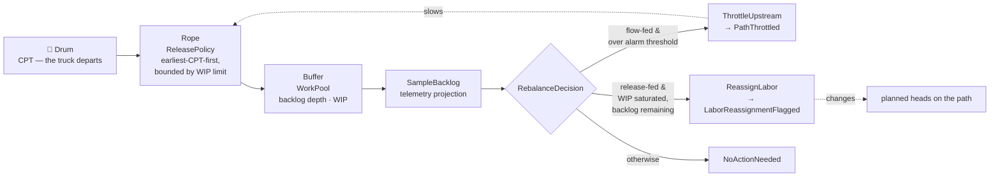

# Business Context

## The problem

A distribution centre has one hard, recurring problem: **a fixed amount of
volume must physically clear the building before a set of truck
departures.** Missing a departure is not a delay — it is a missed delivery
promise for every parcel that should have been on that trailer.

Two things make that problem non-trivial:

1. **The deadline is not a single number.** Different parcels have different
   trucks, so the building faces a *staircase* of deadlines through the
   shift, not one end-of-day target. That staircase is the **charge**.
2. **Capacity is not a single number either.** The floor is a set of
   *process paths*, each a queue with its own service rate and its own
   staffed capacity. Volume clears only as fast as the slowest path that
   touches it.

This bounded context exists to reconcile those two staircases in real time.
It is the only place in the platform that holds both at once.

## The vision

> **Turn a shift's charge into a committed plan, then admit work onto the
> floor continuously in deadline order, correcting the flow from live buffer
> telemetry — so that every parcel makes its truck without the floor ever
> being starved or flooded.**

The phrase that matters is **"continuously re-optimising physical work in
real time"** — the platform's reference model names this the heartbeat of
the core domain, and it is exactly the slice this service owns.

## The conductor metaphor

The industry framing this platform follows describes a WES as the
*conductor* that decides which activities happen when, while the WCS is the
*specialist* that ensures the equipment performs them, and the WMS is the
system of record that says what must happen and why.

Concretely for this service:

- **WMS says**: "900 units for the 18:00 truck, 500 more for the 21:00
  truck, all on the pick path." → arrives here as a **charge forecast**.
- **This service decides**: 6 heads on `pick-a` at 95 units/hour for 8
  hours; release `wu-2` next because its CPT is 18:00 and `wu-1`'s is 21:00;
  the pool is at its WIP limit with backlog remaining, so flag a headcount
  move.
- **Downstream execution does**: turn the released unit into a claimable
  task and put it in front of an associate or a machine.

## Why "charge", not "demand"

The word is chosen deliberately. **Charge** is the volume that must *clear*,
bucketed by CPT. "Demand" or "orders due today" flattens the staircase into
a single number, and the moment you flatten it you can no longer tell
whether you are on track: a path that has cleared 60% of the day's volume
may be perfectly on plan or may have already missed the 18:00 truck, and
only the CPT bucketing distinguishes those two worlds.

## Why a process path is a queue, not a step

A **process path** in this model is *a named station that owns a queue* —
unit-in → unit-out, a service rate, a staffed capacity — not a stage in a
workflow. This matters because the interesting questions are queueing
questions: how deep is the backlog, is arrival rate above service rate, is
this buffer starving or flooding? A workflow-step model cannot express any
of those; a queue model expresses all of them, which is what makes flow
balancing possible at all.

## Why waveless release beats wave-based batching

**Wave-based** release composes work into discrete groups, opens a wave,
and does not open the next until the current one closes. It has real
properties — it batches work that shares travel, and gives operations a
natural unit to talk about ("we're on wave 3") — but it carries structural
problems this domain cannot tolerate:

1. **Priority freezes at composition.** Ordering is fixed when the wave is
   built. This context's entire priority function is CPT — a *physical
   truck departure*. If a truck is re-timed, a path goes down, or hot volume
   arrives, a composed wave cannot re-sort.
2. **The wave boundary is an unasked-for synchronisation barrier.** A
   wave-based system closes the whole wave before opening packing — *"slow
   and bursty."* That barrier couples parcels that share nothing except
   having been batched together.
3. **Burst-then-starve loading.** A wave floods the floor at open and
   starves it at close. Average utilisation looks acceptable while
   instantaneous utilisation oscillates between congestion and idle.
4. **Wave size is a poor backpressure signal.** It is chosen ahead of time,
   from an estimate, and cannot respond to what the floor is actually doing.

**Waveless** release admits one unit at a time, continuously, in priority
order, whenever there is room:

1. **No schedule.** Release happens when the floor asks
   (`POST /paths/{pathId}/release`). There is no timer, batch window, wave
   identifier, or cron entry anywhere in the service.
2. **Priority is re-evaluated at every call.** `WorkPool.nextPendingIndex()`
   scans pending entries for the earliest CPT each time. A CPT that changes
   affects the very next handout.
3. **CPT is the only sort key.** No age factor, no weighting, no secondary
   sort. CPT is the deadline that physically exists; any other key would be
   a proxy for it.
4. **Backpressure replaces batch size.** On a **release-fed** pool,
   `ReleaseNext` refuses with `ErrWIPLimitReached` when `WIP ≥ wipLimit`.
   "How much work should be on the floor" becomes an enforceable invariant
   rather than an estimate.
5. **The release decision is a policy object**, `release.ReleasePolicy`, not
   a method buried in a handler or a `SORT BY` in a repository.

The trade accepted knowingly: no natural travel batching (a wave can group
picks sharing an aisle; pure CPT ordering cannot — that optimisation moves
downstream to `fulfillment-execution`), single-dimensional priority (adding
customer tiering or cold-chain handling means changing the release policy),
and operations loses the "wave" vocabulary in favour of backlog depth, WIP,
and CPT burn-down.

## Flow balancing: Drum-Buffer-Rope with CPT as the drum

Releasing work in the right order is not enough. Once work is on the floor,
paths drift: a path staffed for 95 units/hour actually runs 70, a buffer
that should hold 20 totes holds 200, an upstream path outruns a downstream
one. The job of flow balancing is to **detect the drift and name the
correction**.

The model is Theory-of-Constraints Drum-Buffer-Rope, mapped onto this
domain:

| DBR concept | Here |
|---|---|
| **Drum** — the constraint that sets the pace | **CPT**. The truck departs when it departs; every other rate is negotiable, that one is not. |
| **Buffer** — protective inventory in front of the constraint | The **work pool** backlog on each path. |
| **Rope** — the signal that ties release to the drum | The **release policy**: admission is pulled by the drum, not pushed by whatever arrived. |

### Two pool types, two levers

The single most important design point: **the corrective lever depends on
which input you actually control.**

- **Flow-fed pool → `ThrottleUpstream`.** Work arrives by physical
  conveyance. You cannot refuse it — the tote is already on the belt. The
  only lever is *upstream*: slow the admission that feeds this path.
  Trigger: `backlogDepth > alarmThreshold`. Raises `PathThrottled`.
- **Release-fed pool → `ReassignLabor`.** Here WES *does* control
  admission, and it is already exercising that control — the WIP limit is
  holding, which is why WIP has hit the ceiling. Throttling further would
  push on a lever already fully pressed. Backlog is still growing, so the
  constraint is not admission, it is **capacity**: the path needs more
  heads. Trigger: `WIP ≥ wipLimit` **and** `backlogDepth > 0`. Raises
  `LaborReassignmentFlagged`.
- **Otherwise → `NoActionNeeded`.** Silence is a legitimate output. A
  recommendation engine that always recommends something trains people to
  ignore it.

### The recommendation is advice, not an action

`RebalanceDecision` returns a recommendation and raises an event. It does
**not** move headcount and does not stop the release policy. Moving
headcount belongs to `workforce-management`, which owns associates, skills
and shifts — this context stops at the path boundary. Throttling is a
policy change, and policy changes made automatically from a single
telemetry sample are how control loops start oscillating.

### Why a domain service, not a scheduled sweep

The obvious alternative is a batch job that sweeps every path every minute
and emits alerts. That was rejected for two reasons: the decision needs a
cross-aggregate, near-real-time view (pool state, feed mode, WIP limit,
alarm threshold) held simultaneously, which does not belong on a single
`WorkPool` any more than an optimal assignment belongs to a single
`Assignment`; and a sampled sweep has a staleness window equal to its
period, while a decision evaluated on read has none. As a synchronous, pure
decision over a pool snapshot, every branch is a two-line unit test — a
scheduled job would instead test the scheduler. See
[ADR-0003](https://github.com/claudioed/wes-work-planning/blob/develop/docs/docs/adr/0003-flow-balancing-as-domain-service.md).

The genuine gap accepted knowingly: **nothing is detected unless someone
asks.** A path can sit over its alarm threshold indefinitely with no
recommendation computed, because the trigger is a request. Continuous
monitoring has to come from *outside* — a poller, a dashboard, an operator.

## Three boundaries this context refuses to cross

The value of the boundary is what it *keeps out*. Each of these is a
decision, not an omission.

- **It does not own inventory truth.** Whether a SKU is physically available
  is `inventory-storage`'s job. This context keeps a read-only, SKU-keyed
  projection of what Inventory last reported and nothing more.
- **It does not assign individual people to individual tasks.** Headcount
  *planning* per process path lives in `workforce-management`; individual
  *task dispatch* lives in `fulfillment-execution`. This service stops at
  the **path boundary**: it says "this path needs more heads," never "Maria
  goes to station 3."
- **It does not talk to equipment.** No PLC, no conveyor, no robot.
  Releasing work is an *admission decision*, made in units of work, not
  actuator commands.

See [Ubiquitous Language](./ubiquitous-language) for the exact vocabulary
and the traps that come with sitting at the intersection of three other
contexts.
