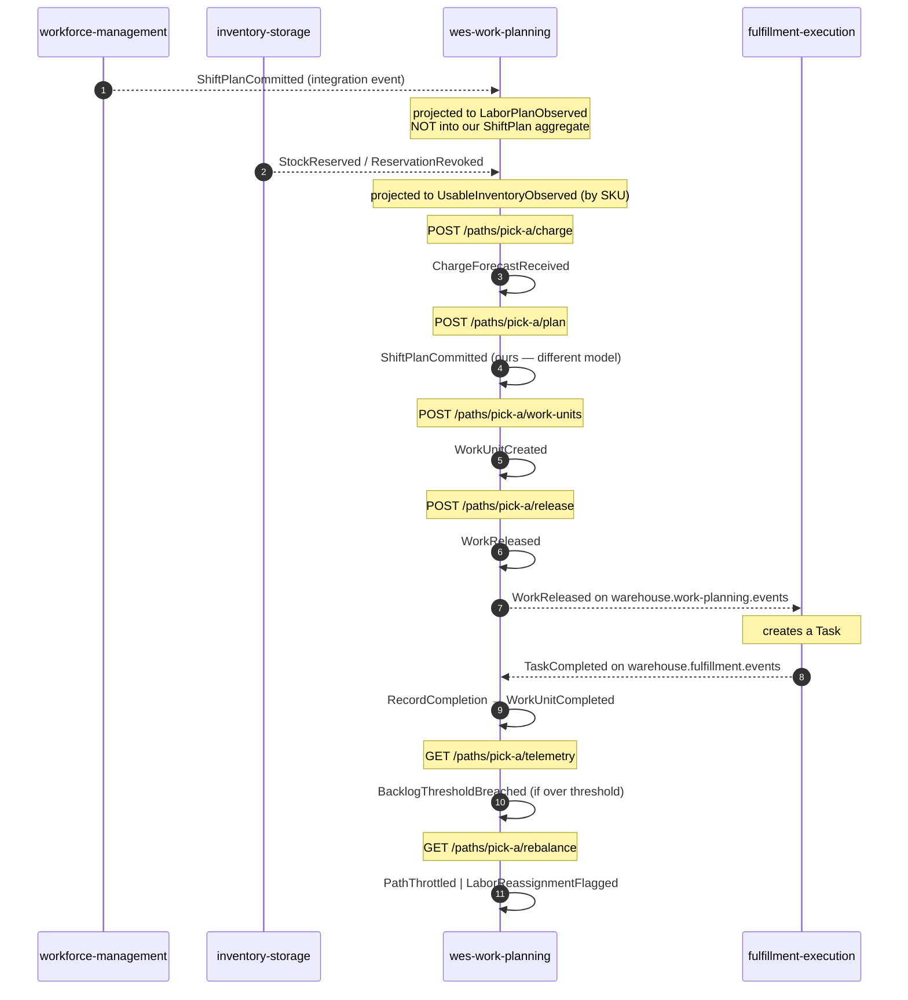

# Domain Events

Nine past-tense domain events are declared in
`internal/domain/shared/events.go`. All nine implement one interface:

```go
type DomainEvent interface {
    EventName() string
    OccurredAt() time.Time
}
```

`OccurredAt` comes from the injected `Clock` port, never from `time.Now()`
inside the domain — which is why every event assertion in the source
repository's test suite is exact rather than approximate.

## The catalogue

| Event | When published | Consumed by |
|---|---|---|
| `ChargeForecastReceived` | `ReceiveChargeForecast` records a charge forecast for a path | *(none today — published for observability)* |
| `ShiftPlanCommitted` | `CommitShiftPlan` commits **this context's own** rate × heads × hours plan for a path | *(none today — see the note below on the same-named event from `workforce-management`)* |
| `WorkUnitCreated` | `EnqueueWorkUnit` enqueues a unit into a path's `WorkPool` | *(none today)* |
| **`WorkReleased`** | `ReleaseNextWork` admits the earliest-CPT pending unit | **`fulfillment-execution`** — turns it into a claimable `Task` |
| `WorkUnitCompleted` | `RecordCompletion` transitions a unit to `Completed` | *(none today)* |
| `BacklogThresholdBreached` | `SampleBacklog` finds a flow-fed pool's backlog over its alarm threshold | *(none today)* |
| `RateDeviationDetected` | *(declared; no use case raises it today — see the gap below)* | *(none — never raised)* |
| `PathThrottled` | `RebalanceDecision` recommends `ThrottleUpstream` (flow-fed, over alarm threshold) | *(none today)* |
| `LaborReassignmentFlagged` | `RebalanceDecision` recommends `ReassignLabor` (release-fed, saturated with backlog remaining) | *(none today)* |

**`WorkReleased` is the only event any other service consumes today.**
Every other event is published for observability and future subscribers;
nothing in the platform reads them yet. Saying so plainly is more useful
than implying a richer event mesh than exists.

:::caution `RateDeviationDetected` is declared, not raised
It appears in the domain event catalogue and in `apis/asyncapi.yaml`, but no
use case raises it today: computing rate deviation needs a time-windowed
actual-rate projection that has not been built. It is documented rather
than quietly dropped, because it is part of the declared model.
:::

:::note Two `ShiftPlanCommitted` events, two different contexts
The inbound `ShiftPlanCommitted` this service *consumes* from
`workforce-management` and the outbound `ShiftPlanCommitted` this service
*raises* about its own plan share a name and nothing else. The inbound one
is projected into `LaborPlanObserved`, a plain read-model value; it is
never fed into this context's own `ShiftPlan` aggregate. See
[Ubiquitous Language](./ubiquitous-language) Trap 1.
:::

Kafka publication is **opt-in at runtime** via `EVENT_PUBLISHER=kafka`. With
the default `EVENT_PUBLISHER=log`, every event above is written to the log
publisher instead. "Published" in this catalogue means "the outbound Kafka
adapter has a payload mapping for it and a use case hands it to
`EventPublisher.Publish`," not "it is flowing in your environment right
now."

## Event flow through a shift



## Why events carry so little

Most events carry only a `PathId`. That is intentional: a domain event is a
*fact that something happened*, and the smallest payload that identifies
the subject keeps consumers from treating the event stream as a
data-replication channel.

The one exception is the published `WorkReleased` **integration** payload,
which the outbound adapter enriches with `cpt` and `ref` by reading the
work unit — because a downstream service creating a `Task` genuinely needs
the deadline and the source reference, and forcing it to call back would
make the release path synchronous across a service boundary. That
enrichment happens in the **adapter**, not the domain event, so the domain
stays ignorant of what downstream consumers want. `WorkReleased.data` also
carries two OPTIONAL fields, present only when there is a hint to give:
`required_capabilities` (containing `"hazmat"` when the SKU is classified
`Hazmat`) and `fragile` (`true` when the SKU is classified `Fragile`), plus
`gift_wrap` (caller-supplied — see [Ubiquitous Language](./ubiquitous-language)
Trap 5).

See [Async API](./async-api) for the wire format and every consumed topic.
