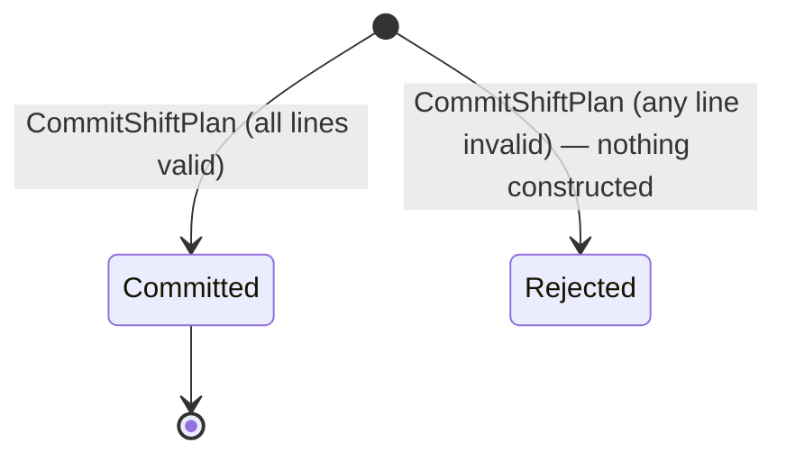
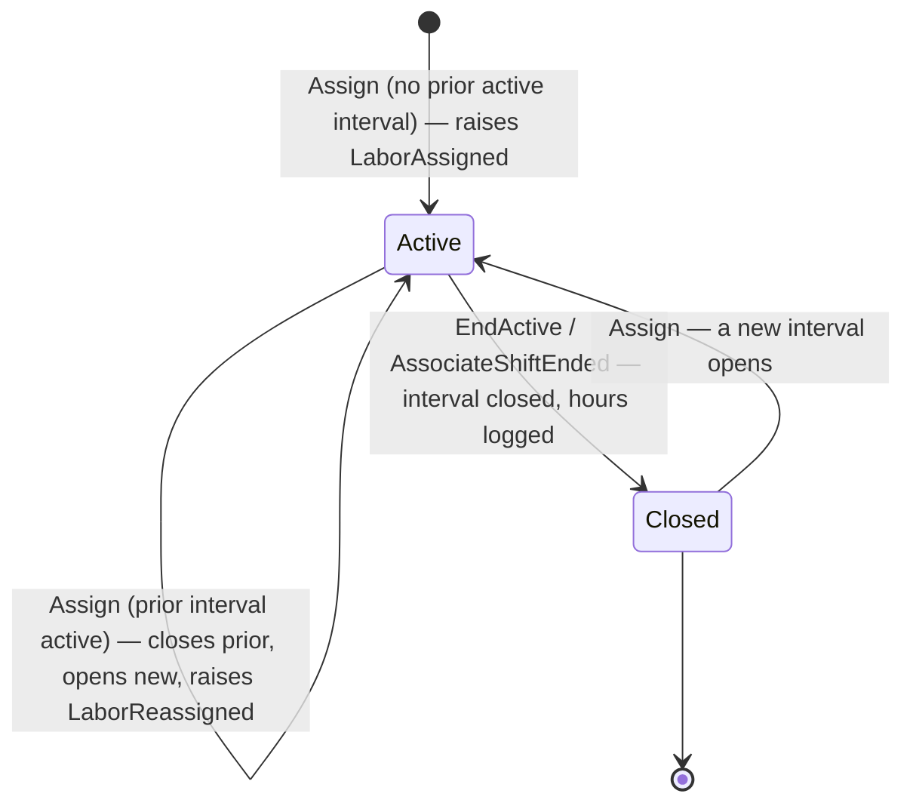

# Aggregate Design Canvas

Following the [ddd-crew Aggregate Design Canvas](https://github.com/ddd-crew/aggregate-design-canvas)
template. `workforce-management` has **three** aggregate roots
(`AssociateShift`, `ShiftPlan`, `LaborAssignment`), each in its own package
under `internal/domain/`. The two canvases below cover `ShiftPlan` and
`LaborAssignment` — the two aggregates that carry this context's
headline invariants and that `wes-work-planning` and `fulfillment-execution`
each care about, directly or by design-contrast. `AssociateShift` is
documented alongside them where its state gates the other two (the break and
shift-ended checks `AssignLabor` depends on).

## Aggregate: ShiftPlan

### Name

**ShiftPlan** — package `internal/domain/shiftplan`, identity
`(buildingId, shiftId)`.

### Description

The committed split of headcount across process paths for one building's
shift, made of `PathPlan` lines (`pathId`, `plannedHeads`, `plannedRate`,
`plannedHours`). Exactly one `ShiftPlan` exists per building per shift.
`PathPlan` is a value object with no identity or lifecycle of its own — you
do not update a line, you commit a new plan. `ProposedHeads` is a free
function, not a method on this aggregate, because a proposal
(`ceil(charge ÷ plannedRate)`) has no aggregate identity — it commits
nothing.

### State Transitions

There is no "draft" or "revise" state. `CommitShiftPlan` either succeeds and
produces a complete, immutable `ShiftPlan` for that `(buildingId, shiftId)`,
or fails and produces nothing — there is no partially committed plan.
`ProposePathPlan` (the pre-commit arithmetic) is not a state on this
aggregate at all; it is advisory and stateless.

### Enforced Invariants

| Invariant | Enforcement | Error → HTTP |
| --- | --- | --- |
| `plannedHeads(path) ≤ installedStations(path)` for every line | Checked before construction, in the domain | `ErrPlannedHeadsExceedInstalled` → `409` |
| `plannedHours ≤ plannedHeads × maxHoursPerShift` for every line | Checked before construction, in the domain | `ErrPlannedHoursExceedCapacity` → `409` |
| At least one `PathPlan` line must be present | Checked before construction | `ErrNoPathPlans` → `400` |
| Every line needs an installed-station count | Checked before construction | `ErrMissingInstalledStations` → `400` |
| Validation is all-or-nothing | `CommitShiftPlan` validates every line before constructing anything | (no partial commit possible) |

The `plannedHeads ≤ installedStations` rule is enforced **independently** of
the identical rule `wes-work-planning` enforces on its own `PathPlan` — this
is the aggregate that actually commits headcount, so it validates its own
commitment rather than trusting an upstream check it does not control.

### Corrective Policies

There is no automated corrective policy on this aggregate. A rejected
`CommitShiftPlan` call simply fails with a typed domain error mapped to an
HTTP status; the caller (a human, via the HTTP or MCP adapter) corrects the
input and resubmits. No retry, no compensation, no saga — a shift plan is a
single atomic human decision, not a long-running process.

### Handled Commands

| Command | Preconditions | Result |
| --- | --- | --- |
| `ProposePathPlan(buildingId, charge, plannedRate)` | None — pure computation | Returns proposed heads; persists nothing; raises `ShiftPlanProposed` |
| `CommitShiftPlan(buildingId, shiftId, lines[], installedStations[])` | Every line passes both invariants above; at least one line present | Constructs and persists a new `ShiftPlan`; raises `ShiftPlanCommitted` |

### Created Events

| Event | Raised when |
| --- | --- |
| `ShiftPlanProposed` | `ProposePathPlan` computes heads for a path, ahead of any commit (constructed in the application layer — a proposal has no aggregate instance) |
| `ShiftPlanCommitted` | A human successfully commits a headcount split |
| `PathUnderstaffed` | Derived, not raised by this aggregate directly — `GetStaffingGap` compares this aggregate's committed plan against live `LaborAssignment` counts and raises the flag when active heads fall short. Attributed to `ShiftPlan` in the AsyncAPI catalog because that is the aggregate whose commitment it is measured against. |

### Throughput

Low-frequency, human-cadence writes: one `CommitShiftPlan` per building per
shift (typically once or a handful of times per shift if a plan is
re-committed). `ProposePathPlan` is called more often — it is advisory and
free of side effects — but persists nothing and has no throughput cost on
the write model.

### Size

Small and bounded: one `ShiftPlan` holds a handful of `PathPlan` lines
(one per active process path in a building, typically single digits). It
does not grow over time — a new shift produces a new `ShiftPlan` instance,
not an append to an existing one.

---

## Aggregate: LaborAssignment

### Name

**LaborAssignment** — package `internal/domain/assignment`, identity
`AssociateId`.

### Description

One associate's current path assignment plus their assignment history for
the shift. The identity choice **is** the invariant: keying the root by
`AssociateId` and holding a single optional `active *Interval` field (plus a
`history []Interval` slice) makes "exactly one ACTIVE assignment per
associate" structural rather than checked — there is no second field to put
a second active assignment in, so no code path, race, or repair script can
produce a double-booking. There is deliberately no way to address an
assignment by its own identity; assignments are addressed via the
associate.

### State Transitions

Calling `Assign` while an interval is already active does not error — it
**supersedes**: the old interval closes (its hours logged against
`AssociateShift`) and a new one opens, raising `LaborReassigned` instead of
`LaborAssigned`. This matches the floor, where a supervisor moves someone
without first "unassigning" them.

### Enforced Invariants

| Invariant | Enforcement | Error → HTTP |
| --- | --- | --- |
| Exactly one ACTIVE assignment per associate | **Structural** — a single `active *Interval` field; unrepresentable if violated, not merely checked | (no error path — expressed as supersede behaviour instead) |
| Assignment requires the path's certification | Checked in the domain before any state change (`hasCertification bool` passed in — the aggregate depends on the answer, not on how it was obtained) | `ErrCertificationRequired` → `409` |
| Associate must not be on a logged break or shift-ended | Delegated to `AssociateShift.CanBeAssigned()`, checked by the application layer before calling `Assign` | `ErrOnBreak` / `ErrShiftEnded` → `409` |

A path's required certification is, by convention, the `Certification` with
the same name as the `PathId` — `pack` requires `pack`. This is a documented
naming convention, not a modelled relationship or a cross-aggregate lookup.

### Corrective Policies

None automated. A rejected `Assign` (missing certification, on break, shift
ended) fails with a typed domain error; a human corrects the situation (adds
the certification, ends the break) and retries. Supersede is itself the
"correction" for the double-booking case — there is no reject-then-retry
cycle for it, because the second call succeeds by design and closes the
first interval automatically.

### Handled Commands

| Command | Preconditions | Result |
| --- | --- | --- |
| `AssignLabor(associateId, pathId)` | Associate holds `pathId`'s required certification; associate is not on a logged break and their shift has not ended | If no active interval: opens one, raises `LaborAssigned`. If an active interval exists: closes it (logs hours), opens the new one, raises `LaborReassigned` |
| `EndActive(at)` (via `EndAssociateShift`) | An active interval exists | Closes the interval, logs its hours against `AssociateShift` |

### Created Events

| Event | Raised when |
| --- | --- |
| `LaborAssigned` | An associate is placed on a path for the first time (no prior active interval) |
| `LaborReassigned` | An active assignment is closed in favour of a new path (`fromPathId`, `toPathId` both carried — a move is one event, not a close/open pair a consumer has to correlate) |

Both events are raised **in-process only** — neither is published to Kafka.
Publishing individual assignment moves would let a downstream context
reconstruct a per-associate location picture, exactly what the path
boundary exists to withhold. See [Domain Events](./domain-events).

### Throughput

Higher-frequency than `ShiftPlan`: every intra-shift rebalance (a supervisor
moving an associate) is one `AssignLabor` call. Volume scales with headcount
and shift volatility — potentially several calls per associate per shift on
a disrupted day, versus one `CommitShiftPlan` per shift.

### Size

Bounded per associate per shift: one active interval plus a `history` slice
that grows for the life of the shift record. Explicitly acceptable at
shift scope; the aggregate's own package documentation flags that this
would need revisiting if `LaborAssignment` ever spanned weeks rather than a
single shift.
