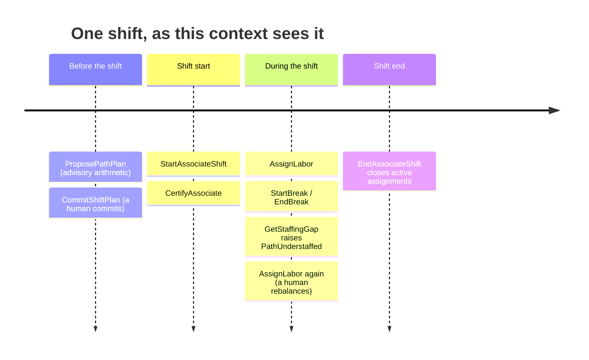

# Business Context

A fulfillment centre's throughput on any given day is a product of two
things it can actually control: **how much work is released**, and **how
many trained people are standing at each process path**. The first belongs
to [wes-work-planning](https://github.com/claudioed/wes-work-planning). The
second is Workforce Management.

## Domain vision

> Make the labor picture of a shift **legible and enforceable**: record who
> is on shift and what they are qualified for, let a human commit a split of
> headcount across process paths, track where each person actually is as
> that split drifts, and surface the gap — without ever deciding what any
> individual person should do next.

Everything about the shape of this service follows from that sentence, and
in particular from its last clause.

The Amazon-fulfillment DDD reference model classifies **Labor & Workforce
Management** as a **Supporting** subdomain: "allocates workforce to
workload; important, industry-common." It is genuinely necessary — a shift
cannot be planned without knowing headcount — but nobody wins the market on
break-tracking code. The platform-level reference is blunter about *where*
labor knowledge is allowed to live: the WMS tier must have **zero**
knowledge of individual workers, shifts, real-time location, or travel
distance, or a supporting/generic concern leaks into core order-fulfillment
truth. Worker identity, certifications, and shift windows sit here — a
WES-adjacent Supporting context the WMS tier never reads and never writes.

### The three things it owns

1. **Who is on.** `AssociateShift` is the roster entry: an associate, the
   certifications they hold, whether they are currently on a logged break,
   and how many hours they have logged against the shift's cap. Every other
   context that needs to know whether someone is qualified reads this — none
   of them write it.
2. **What the plan is.** `ShiftPlan` is one building's committed split of
   headcount across paths for one shift, expressed as `PathPlan` lines:
   path, planned heads, planned rate, planned hours. There is exactly one
   per building per shift.
3. **Where people actually are.** `LaborAssignment` records one associate on
   one path for an interval. Comparing the plan against the live assignments
   yields the staffing gap — the operational output the floor actually
   consumes.

### Software proposes, humans commit

`ProposePathPlan` computes `heads = ceil(charge ÷ plannedRate)` and returns a
number. It writes nothing, raises no persisted state, and has no aggregate
identity. `CommitShiftPlan` is a separate call that a human makes — a shift
plan is a *commitment* that implies a staffing roster, break scheduling, and
often an actual conversation with a shift manager. Making the arithmetic
available without making it automatic keeps accountability where it belongs
while still removing the arithmetic from a clipboard.

The same discipline applies intra-shift. When a path falls behind its plan,
this context raises `PathUnderstaffed`. It is a **flag, not a decision**:
the service will never move an associate off `pick` and onto `pack` because
a backlog grew. A supervisor makes that call and records it via
`AssignLabor`.

## Two planning horizons, one bounded context

This context spans two time horizons that share a vocabulary and a
consistency boundary, which is why they are one bounded context rather than
two.



**Horizon 1 — shift-start planning.** Before the shift runs, someone answers:
given the charge due on each path and the rate expected, how many people are
needed where? The arithmetic (`heads = ceil(charge ÷ plannedRate)`) is
trivial and the software does it via `ProposePathPlan`, which persists
nothing and has no identity. The commitment is not trivial: `CommitShiftPlan`
takes the full set of `PathPlan` lines for a building's shift and validates
them as **one atomic decision** — every line's `plannedHeads` at most the
path's `installedStations`, every line's `plannedHours` fitting inside
`plannedHeads × maxHoursPerShift`, at least one line present. If any line
fails, none of them commit, because heads are a finite pool being divided.

`installedStations` arrives *in the request* rather than being looked up
from `wes-work-planning`. Work Planning owns installed-station counts, but
this context has no dependency on Work Planning and does not want one — a
Supporting context should never become a runtime risk to a Core one.

**Horizon 2 — intra-shift assignment tracking.** Once the shift is running,
the plan starts drifting: someone calls in sick, a tote jam empties a pick
aisle, the pack line falls behind CPT. Each move is recorded with
`AssignLabor`, which checks the certification, checks the associate is not
on a logged break and their shift has not ended, closes any assignment
already active (logging its hours), and opens a new interval — raising
`LaborAssigned` or `LaborReassigned` when it actually closed something. A
second assignment does not fail, it *supersedes*, matching the floor where a
supervisor moves someone without first "unassigning" them.

**Where the two horizons meet.** `GetStaffingGap` is the join — the only
place both horizons appear at once:

```
plannedHeads(path)   ← horizon 1, the committed ShiftPlan
activeHeads(path)    ← horizon 2, the live LaborAssignments
understaffed         ← activeHeads < plannedHeads
```

It is a **projection**, not stored state. No aggregate carries a "current
headcount" field that could drift out of sync with the assignments it
summarises — read models are derived, never redundantly persisted on the
write model, as a platform-wide rule.

## Why it stops at the path boundary

This is the most consequential decision in the service. Recorded formally as
[ADR 0002](https://github.com/claudioed/workforce-management/blob/develop/docs/docs/adr/0002-stop-at-the-path-boundary.md)
in the source repository.

**The rule: Workforce Management never links an associate to a specific
task.** `LaborAssignment` ends at *"this associate is on this path"* — pack,
pick, stow, SLAM — for an interval of shift-length granularity. There is no
`taskId` anywhere in this codebase, no endpoint that hands work to a person,
no queue.

**The reason is cadence.** Workforce assignment and task dispatch look
superficially similar — both are "assign a thing to a person" — but they
change at rates that differ by three orders of magnitude:

| | Workforce assignment (here) | Task dispatch (`fulfillment-execution`) |
| --- | --- | --- |
| Unit | an associate on a **path** | a **task**: one pick, one pack, one SLAM |
| Cadence of change | minutes to hours | seconds |
| Trigger | a human rebalancing headcount | a station calling `claimNext` |
| Lifetime | an interval of a shift | until confirmed, or until the lease expires |
| Decided by | a supervisor | the dispatch policy, pull-based |

Fusing the two into one aggregate would mean every change to task-dispatch
policy — a new priority rule, a new lease timeout, a different `claimNext`
heuristic — would touch workforce planning code, and every change to how
headcount is rebalanced would touch dispatch code, even though nothing about
the labor picture or dispatch actually changed in the other case. The
coupling would be pure accident of packaging. From this repo's own
`CLAUDE.md`:

> Keeping these apart is deliberate: it lets task-dispatch policy change
> without touching workforce planning, and vice versa, because they change
> at completely different cadences (shifts vs seconds).

**What the seam looks like in practice.** `fulfillment-execution` needs two
things from the labor world, and gets both without ever writing here: it
reads certifications to gate a station claim (never modifying them —
`AssociateShift` remains the single writer), and it may read the staffing
picture via this context's *read* model (`GetStaffingGap`) — never its write
model. The important part is the direction: consumption of a read surface,
not invocation of a command.

**Why `PathUnderstaffed` is a flag, not a decision.** The same boundary
logic applies one level up. When active assignments on a path fall below its
committed `plannedHeads`, this context raises `PathUnderstaffed`. It does
**not** pick a victim path to pull people from, rank associates by
certification breadth, or write a `LaborAssignment` on anyone's behalf.
Rebalancing depends on things this context cannot see — which paths are
actually blocked, who is mid-tote, what the shift manager promised the pack
line ten minutes ago. Surfacing the gap is a fact. Choosing the response is
a judgement. This service ships the fact and stops.

**The honest cost, stated plainly.** You cannot answer "what is Alice doing
right now?" from this service — only "which path is Alice on?" Getting the
task means joining against `fulfillment-execution`, a real ergonomic cost
accepted knowingly. The staffing gap is also eventually consistent with
physical reality: it is derived from assignments a human recorded, not from
anyone's actual presence. Both costs are cheaper than the alternative — one
aggregate whose consistency boundary would have to span a shift-length
planning decision *and* a second-granularity dispatch decision.

See [Ubiquitous Language](./ubiquitous-language) for the exact vocabulary
this decision produces, and [Bounded Context Canvas](./bounded-context-canvas)
for how the non-integration with `fulfillment-execution` shows up as an
explicit open question rather than an implied gap.
