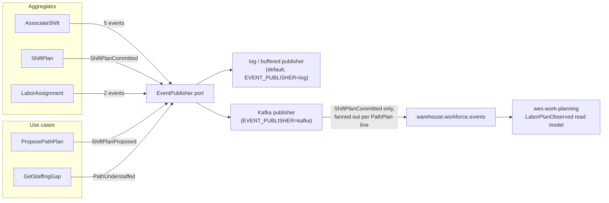

# Domain Events

Ten events, all past tense, all implementing `shared.DomainEvent`
(`EventName() string`, `OccurredAt() time.Time`). Their names are fixed
vocabulary — they appear verbatim in the Go code, in `apis/asyncapi.yaml`,
and throughout this documentation.

## The catalog

| Event | Raised by | When published | Consumed by |
| --- | --- | --- | --- |
| `ShiftPlanCommitted` | `ShiftPlan` | **Published to Kafka today**, on `warehouse.workforce.events`, fanned out one message per `PathPlan` line | `wes-work-planning`, into its `LaborPlanObserved` read model, keyed by `path_id` |
| `ShiftPlanProposed` | `ProposePathPlan` use case | In-process only — raised ahead of any commit, before a human decision exists | None (no sibling consumes it) |
| `AssociateShiftStarted` | `AssociateShift` | In-process only | None |
| `AssociateCertified` | `AssociateShift` | In-process only | None |
| `AssociateBreakStarted` | `AssociateShift` | In-process only | None |
| `AssociateBreakEnded` | `AssociateShift` | In-process only | None |
| `LaborAssigned` | `LaborAssignment` | In-process only — deliberately not published, see below | None |
| `LaborReassigned` | `LaborAssignment` | In-process only — deliberately not published, see below | None |
| `PathUnderstaffed` | `GetStaffingGap` use case | In-process only — surfaces through the `GetStaffingGap` response, not a topic | None (a human, reading the response) |
| `AssociateShiftEnded` | `AssociateShift` | In-process only | None |

**Only `ShiftPlanCommitted` leaves the process today.** Every other event is
raised, published through the `EventPublisher` port, and consumed
in-process by the log/buffered publisher.

## Why the catalog is broader than what is published

`apis/asyncapi.yaml` documents all ten events as the **complete reference
catalog** of this context's domain events, deliberately broader than what
leaves the process today. Each message in that spec states its publication
status explicitly, so a downstream team can see what is *available* to wire
next without guessing from the code.

## The fan-out that catches people out

A `ShiftPlan` has multiple `PathPlan` lines, and the Kafka adapter publishes
**one message per line**, not one per commit. A plan committed with three
path lines produces **three** messages on `warehouse.workforce.events`, each
carrying that single line's `path_id`, `planned_heads`, `planned_rate`, and
`planned_hours` alongside the plan's `building_id` and `shift_id`. This
matches how `wes-work-planning` keys its `LaborPlanObserved` read model — one
row per path. Consumers must expect N messages per commit and must not
assume a message carries the whole plan. The domain event itself carries
only `buildingId` and `shiftId` (the `ShiftPlan`'s identity); the adapter
loads the committed plan through `ShiftPlanRepo` to do the fan-out, keeping
it an integration concern rather than a domain one.

## Events raised but not consumed downstream — deliberately

`LaborAssigned` and `LaborReassigned` are individually meaningful on the
floor but are **not** published cross-service, and that is not an
oversight. Anything downstream that consumed them would be reconstructing a
per-associate location picture — precisely the picture this context refuses
to expose past the [path boundary](./business-context). If a real downstream
need appears, the right shape is a read-model endpoint, not an event stream
of individual moves.

`PathUnderstaffed` is likewise in-process today. It is a **flag, not a
decision**, and the platform's rebalancing authority is human, so it
currently surfaces through `GetStaffingGap`'s response rather than a topic.

## Where each event is constructed

Eight of the ten are recorded **inside an aggregate** and pulled out by the
application layer via `PullEvents()`. Two are constructed in the
application layer instead, for the same reason in both cases — neither
corresponds to a state change on an aggregate:

- `ShiftPlanProposed` is raised by the `ProposePathPlan` use case, which
  computes `ceil(charge ÷ plannedRate)` and persists nothing. There is no
  aggregate instance to record it on, because a proposal has no identity.
- `PathUnderstaffed` is raised by the `GetStaffingGap` use case, which
  compares a committed plan against a live count. It is derived from a
  read model, and read models are projections — recording it on `ShiftPlan`
  would put derived state on the write model.

## Event sourcing? No.

Aggregates record events and hand them to the application layer via
`PullEvents()`, which publishes them through the `EventPublisher` port.
State is persisted as state (`Rehydrate` reconstructs from rows without
raising events), not replayed from a log. Events are the **integration and
notification** mechanism here, not the storage mechanism.

See [Async API](./async-api) for the envelope, the `type` naming
convention, and the exact bytes on the wire for `ShiftPlanCommitted`.

## What this page does not cover: inbound events

This page catalogs only the events **this context raises**. Since ADR
0013 (`process-path-catalogue-validation`) and ADR 0019, this context is
also a live **consumer** of two sibling contexts' published events —
`process-path-management`'s `ProcessPathCreated`/`Updated`/`Deactivated`
(feeding the `kafkacatalog` local cache) and `labor-performance`'s
`TaskPerformanceRecorded` (feeding the `laborperformancecache` local
cache used by `ProposePathPlan`'s measured-rate enrichment, ADR 0012 /
ADR 0019). Since labor-performance ADR 0014 added an additive
`idle_seconds_before` to that same message, `laborperformancecache` also
derives a running idle share per `TaskType` from it (this context's own
ADR 0020) — the same consumer, the same topic, one more derived signal.
See [Bounded Context Canvas](./bounded-context-canvas)'s
Inbound Communication table for both.
