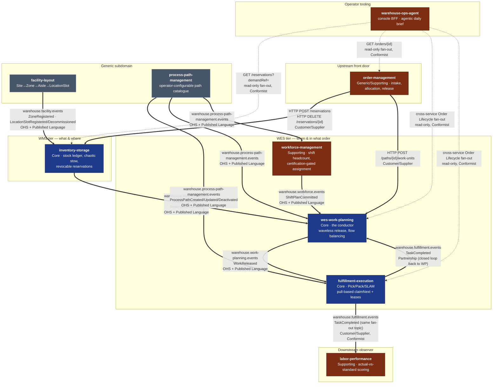

# Context Map

Following [ddd-crew's context-mapping](https://github.com/ddd-crew/context-mapping)
patterns, this page draws every real integration between the platform's nine
bounded contexts, labels each edge with its strategic relationship pattern
(Open-Host Service, Published Language, Customer/Supplier, Conformist,
Partnership), and — matching the honesty convention every context's own
docs already use — states plainly which integrations are **live, running
code** and which relationships are **deliberately absent**.

## The whole platform

**Bold edges are live** — a real publisher and a real consumer, verified
against each context's own `CLAUDE.md` and adapter code, or a real HTTP
client calling a real endpoint. **Dashed edges are live too, but read-only
or advisory** — `warehouse-ops-agent`'s cross-service fan-out reads, which
never write into another context.

Every integration on this map is now wired. The relationships that were
previously drawn as "strategically decided, no wire yet" —
`process-path-management` → the three catalogue consumers, and
`facility-layout` → `inventory-storage` — are live and verified in the
running cluster; see the table below and the **Deliberate
non-integrations** section for the edges that are still deliberately
absent.

## Relationship patterns, edge by edge

| Edge | Pattern | Direction |
| --- | --- | --- |
| `order-management` → `inventory-storage` | Customer/Supplier | OM is Customer; inventory-storage is Supplier/OHS |
| `order-management` → `wes-work-planning` | Customer/Supplier | OM is Customer; wes-work-planning is Supplier/OHS |
| `inventory-storage` → `wes-work-planning` | Open-Host Service + Published Language | inventory-storage is upstream OHS; wes-work-planning is downstream Conformist to the event shape |
| `workforce-management` → `wes-work-planning` | Open-Host Service + Published Language | workforce-management is upstream OHS; wes-work-planning is downstream Conformist |
| `wes-work-planning` → `fulfillment-execution` | Open-Host Service + Published Language | wes-work-planning is upstream OHS (`WorkReleased`) |
| `fulfillment-execution` → `wes-work-planning` | Partnership | Closes the loop (`TaskCompleted` back to the conductor) — the two evolve together as one control loop, not a one-way pipeline |
| `fulfillment-execution` → `labor-performance` | Customer/Supplier, Conformist | labor-performance is a pure Conformist downstream reader of the same `TaskCompleted` event, zero write access |
| `facility-layout` → `inventory-storage` | Open-Host Service + Published Language, Conformist downstream | **Live.** inventory-storage maintains a local read model of location classifications fed by `warehouse.facility.events`, replacing the per-stow synchronous call. Verified with facility-layout scaled to **zero replicas**: stows are still classified correctly from the cache. The old sync `GET /locations/{code}/classification` is retained as the configured rollback (`LOCATION_LOOKUP_MODE=http`), not deleted. See inventory-storage ADR 0013 / facility-layout ADR 0013 |
| `facility-layout` → WES tier | Open-Host Service (no consumer yet) | facility-layout is the OHS for physical-location facts. Its only wired consumer today is `inventory-storage` (above); no WES-tier context consumes it, because none has a use case for it yet — a deliberate non-integration, not an oversight |
| `process-path-management` → WES tier | Open-Host Service + Published Language, Conformist downstreams | **Live.** `fulfillment-execution`, `wes-work-planning` and `workforce-management` each replay `ProcessPathCreated/Updated/Deactivated` into a local catalogue cache and gate readiness on that replay. The predecessor static YAML (`warehouse-infra/config/process-paths/sortable-fc.yaml`) is frozen and SUPERSEDED, kept only as the rollback target. Verified live: a newly-defined path reached all three running consumers with **no restart**, and a deactivation propagated the same way. See process-path-management ADR 0002 |
| `warehouse-ops-agent` → `order-management`, `inventory-storage`, `wes-work-planning`, `fulfillment-execution` | Conformist (read-only fan-out) | The console BFF stitches one order's cross-service lifecycle; each stage degrades independently, never a write |

## What is deliberately absent

- **`workforce-management` ⇄ `fulfillment-execution`**: no integration, by
  deliberate design (`workforce-management`'s ADR-0002, "stop at the path
  boundary") — workforce headcount stays a planning-time input to
  `wes-work-planning`, never a runtime coupling to execution.
- **No shared database, ever.** Every edge above is either an HTTP call to a
  published REST contract or a Kafka event on a published topic. No context
  reads another's schema directly — matching the OpenWMS-derived
  "database-per-service" convention this platform's reference model calls
  out explicitly.
- **No Shared Kernel exists in this platform.** Every context is a separate
  Go module with zero shared domain types, even where two contexts reference
  the "same" identity (e.g. `PathId`) — each keeps its own local
  representation and never imports another context's package.

## Deliberate non-integrations

These edges do **not** exist, and their absence is a decision rather than
an omission. They are recorded because each one has been mistaken for a gap
at least once:

- **`inventory-storage` does not consume process-path events.** The
  process-path catalogue is consumed by exactly three contexts —
  `fulfillment-execution`, `wes-work-planning`, `workforce-management`.
  inventory-storage has no notion of a process path and needs none.
- **No WES-tier context consumes `warehouse.facility.events`.**
  `facility-layout` is an Open-Host Service and its full Published Language
  is available, but `wes-work-planning` and `fulfillment-execution` have no
  use case for physical-location facts today. The topic is published for
  whoever needs it, not because someone already does.
- **Nothing calls back into `process-path-management`.** It is the *source*
  of the process-path language and never a consumer of anyone else's;
  propagation is exclusively one-way over Kafka, never a synchronous
  callback.

## Known systemic gap: no outbox

Every write use case in this platform does `Repo.Save` **then**
`Publisher.Publish`, with no outbox and no compensation. A publish that
fails after the repository commit leaves that context's own state correct
and the event permanently unpublished — silently diverging from what every
downstream consumer will ever see.

This is not hypothetical: `process-path-management`'s Postgres store and
its Kafka topic were once found diverged **in both directions at once**,
with its REST listing looking perfectly healthy. The operational
consequence is that a context's own read API is *not* evidence of what its
consumers see; the topic has to be checked separately.

Closing it properly needs an outbox pattern or a transactional
save-and-publish, applied fleet-wide. It predates the integrations above,
which knowingly inherit it, and is tracked as its own scoped work.

## Per-context context maps

Every bounded context's own docs site carries a more detailed context map
scoped to that service, including exact request/response shapes and the
honest "not yet wired" callouts this page summarizes. See each context's
[Bounded Context Canvas](/contexts) for the link.
