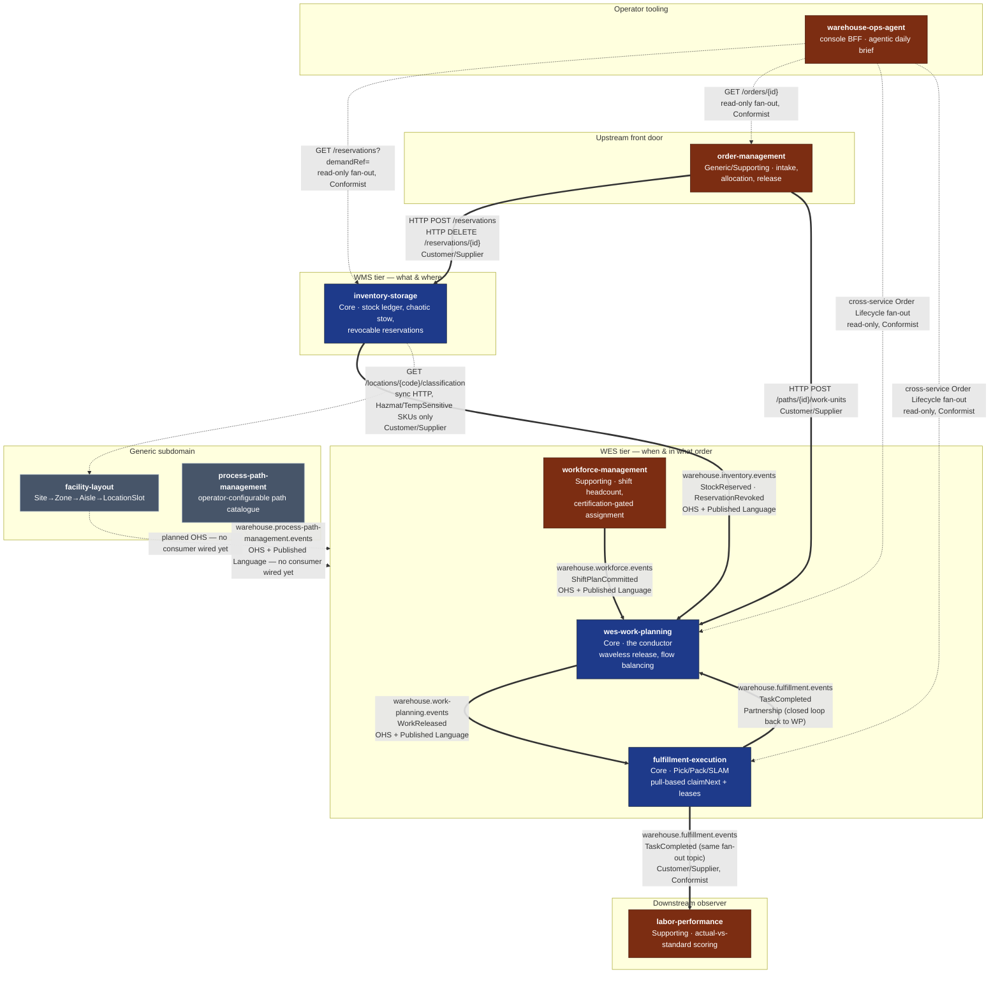

# Context Map

Following [ddd-crew's context-mapping](https://github.com/ddd-crew/context-mapping)
patterns, this page draws every real integration between the platform's nine
bounded contexts, labels each edge with its strategic relationship pattern
(Open-Host Service, Published Language, Customer/Supplier, Conformist,
Partnership), and — matching the honesty convention every context's own
docs already use — distinguishes **live, running code** from **strategically
decided but not yet wired**.

## The whole platform

**Bold edges are live** — a real publisher and a real consumer, verified
against each context's own `CLAUDE.md` and adapter code, or a real HTTP
client calling a real endpoint. **Dashed edges are strategically decided
relationships with no wire yet** — documented honestly as gaps, not implied
implementations, exactly as each source context's own docs states it.

## Relationship patterns, edge by edge

| Edge | Pattern | Direction |
| --- | --- | --- |
| `order-management` → `inventory-storage` | Customer/Supplier | OM is Customer; inventory-storage is Supplier/OHS |
| `order-management` → `wes-work-planning` | Customer/Supplier | OM is Customer; wes-work-planning is Supplier/OHS |
| `inventory-storage` → `wes-work-planning` | Open-Host Service + Published Language | inventory-storage is upstream OHS; wes-work-planning is downstream Conformist to the event shape |
| `workforce-management` → `wes-work-planning` | Open-Host Service + Published Language | workforce-management is upstream OHS; wes-work-planning is downstream Conformist |
| `wes-work-planning` → `fulfillment-execution` | Open-Host Service + Published Language | wes-work-planning is upstream OHS (`WorkReleased`) |
| `fulfillment-execution` → `wes-work-planning` | Partnership | Closes the loop (`TaskCompleted` back to the conductor) — the two evolve together as one control loop, not a one-way pipeline |
| `fulfillment-execution` → `labor-performance` | Customer/Supplier, Conformist | labor-performance is a pure Conformist downstream reader of the same `TaskCompleted` event, zero write access |
| `inventory-storage` → `facility-layout` | Customer/Supplier (partial, scoped) | inventory-storage calls `facility-layout` synchronously only for Hazmat/TemperatureSensitive SKU location classification |
| `facility-layout` → WES tier | Open-Host Service (planned) | facility-layout publishes no events yet consumed by anyone; strategically it is the OHS for physical-location facts |
| `process-path-management` → WES tier | Open-Host Service + Published Language (planned) | Publishes `ProcessPathCreated/Updated/Deactivated`; `fulfillment-execution`, `wes-work-planning`, `workforce-management` are intended Conformist consumers, not yet wired — all three still boot-load the predecessor static YAML file |
| `warehouse-ops-agent` → `order-management`, `inventory-storage`, `wes-work-planning`, `fulfillment-execution` | Conformist (read-only fan-out) | The console BFF stitches one order's cross-service lifecycle; each stage degrades independently, never a write |

## What is deliberately absent

- **`workforce-management` ⇄ `fulfillment-execution`**: no integration, by
  deliberate design (`workforce-management`'s ADR-0002, "stop at the path
  boundary") — workforce headcount stays a planning-time input to
  `wes-work-planning`, never a runtime coupling to execution.
- **No shared database, ever.** Every edge above is either an HTTP call to a
  published REST contract or a Kafka event on a published topic. No context
  reads another's schema directly — matching the OpenWMS-derived
  "database-per-service" convention this platform's reference model calls
  out explicitly.
- **No Shared Kernel exists in this platform.** Every context is a separate
  Go module with zero shared domain types, even where two contexts reference
  the "same" identity (e.g. `PathId`) — each keeps its own local
  representation and never imports another context's package.

## Per-context context maps

Every bounded context's own docs site carries a more detailed context map
scoped to that service, including exact request/response shapes and the
honest "not yet wired" callouts this page summarizes. See each context's
[Bounded Context Canvas](/contexts) for the link.
