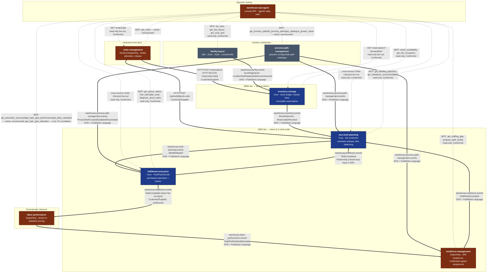

# Context Map

Following [ddd-crew's context-mapping](https://github.com/ddd-crew/context-mapping)
patterns, this page draws every real integration between the platform's nine
bounded contexts, labels each edge with its strategic relationship pattern
(Open-Host Service, Published Language, Customer/Supplier, Conformist,
Partnership), and — matching the honesty convention every context's own
docs already use — states plainly which integrations are **live, running
code** and which relationships are **deliberately absent**.

## The whole platform

**Bold edges are live** — a real publisher and a real consumer, verified
against each context's own `CLAUDE.md` and adapter code, or a real HTTP
client calling a real endpoint. **Dashed edges labeled `GET`/`cross-service
fan-out`** are `warehouse-ops-agent`'s read-only REST fan-out — live reads
that never write into another context. **Dashed edges labeled `MCP:`** are
a *different contract type*: `warehouse-ops-agent`'s outbound MCP
tool-call surface, reaching all eight backend bounded contexts (the ninth,
`warehouse-ops-agent` itself, is the Customer, not an Open Host Service).
Six of those eight (`inventory-storage`, `wes-work-planning`,
`fulfillment-execution`, `workforce-management`, `facility-layout`, and now
`labor-performance`) are **live and actually called** by the E1/E2/E3 use
cases (DailyBrief, FlowBalanceAdvisory). `labor-performance`'s
`get_task_type_utilization` tool graduated from wired-but-unconsumed to
live in PR #45 (ADR 0008) — its other three MCP tools are still unconsumed.
The remaining two (`order-management`, `process-path-management`) are
**wired but unconsumed** — real MCP clients exist in the composition root
(`internal/adapters/outbound/mcpclient/`), with real port interfaces and
full unit test coverage, but no existing use case calls them yet
(`warehouse-ops-agent` ADR 0007). This is a third, distinct state from
either "live and consumed" or "not yet wired" — the client exists and can
reach the upstream MCP server today, but nothing in this repo invokes it.

Every backend integration on this map that has a consumer is now wired.
The relationships that were previously drawn as "strategically decided,
no wire yet" — `process-path-management` → the three catalogue consumers,
`facility-layout` → `inventory-storage`, and `labor-performance` →
`workforce-management` — are live and verified in the running cluster.
`warehouse-ops-agent`'s outbound MCP surface to `labor-performance` is now
partially live too (see below). The remaining exception, stated precisely:
`warehouse-ops-agent`'s `order-management` and `process-path-management`
MCP clients are wired at the adapter level but not yet consumed by any use
case — see the **MCP surface** section below and the **Deliberate
non-integrations** section for edges that are still deliberately absent
altogether.

## Relationship patterns, edge by edge

| Edge | Pattern | Direction |
| --- | --- | --- |
| `order-management` → `inventory-storage` | Customer/Supplier | OM is Customer; inventory-storage is Supplier/OHS |
| `order-management` → `wes-work-planning` | Customer/Supplier | OM is Customer; wes-work-planning is Supplier/OHS |
| `inventory-storage` → `wes-work-planning` | Open-Host Service + Published Language | inventory-storage is upstream OHS; wes-work-planning is downstream Conformist to the event shape |
| `workforce-management` → `wes-work-planning` | Open-Host Service + Published Language | workforce-management is upstream OHS; wes-work-planning is downstream Conformist |
| `wes-work-planning` → `fulfillment-execution` | Open-Host Service + Published Language | wes-work-planning is upstream OHS (`WorkReleased`) |
| `fulfillment-execution` → `wes-work-planning` | Partnership | Closes the loop (`TaskCompleted` back to the conductor) — the two evolve together as one control loop, not a one-way pipeline |
| `fulfillment-execution` → `labor-performance` | Customer/Supplier, Conformist | labor-performance is a pure Conformist downstream reader of the same `TaskCompleted` event, zero write access |
| `labor-performance` → `workforce-management` | Open-Host Service + Published Language, Conformist downstream | **Live.** workforce-management maintains a local, in-memory running-mean cache of `TaskPerformanceRecorded` fed by labor-performance's `warehouse.labor-performance.events` topic, replacing `ProposePathPlan`'s per-request synchronous `GET /task-types/{taskType}/performance` call. Same event-fed-cache-replacing-sync-call pattern as the two edges above, mirroring workforce-management's own existing `kafkacatalog` consumer of process-path-management's events byte-for-byte (per-process-unique consumer group, `FirstOffset` replay, `Ready()`/`WaitReady()` gate). The old sync HTTP client is retained as the configured rollback (`LABOR_PERFORMANCE_MODE=http`; a third mode, `permissive`, also still exists as a no-op fail-open default). Selected via `LABOR_PERFORMANCE_MODE=kafka-cache`. **This is one event-fed cache now carrying two derived signals, not two integrations:** since labor-performance ADR 0014 added an additive, nullable `idle_seconds_before` to the same `TaskPerformanceRecorded` message, the SAME `laborperformancecache.Consumer` instance also keeps a running idle-share total per `TaskType` (sum+count, mirroring its existing running-mean strategy byte-for-byte) alongside the pre-existing measured-rate mean — no new topic, no new consumer group, no new Kafka read. `GetStaffingGap` surfaces the result as `observedIdlePct` (nil when unwired or unobserved), and `ProposePathPlan` trims its proposed heads (floored at 1) when the observed idle share exceeds `IDLE_SHARE_TRIM_THRESHOLD` (default 0.30), returning an auditable `trimReason`; it fails open (no trim) whenever idle data is unavailable. See labor-performance ADR 0013 / ADR 0014, workforce-management ADR 0019 / ADR 0020 |
| `facility-layout` → `inventory-storage` | Open-Host Service + Published Language, Conformist downstream | **Live.** inventory-storage maintains a local read model of location classifications fed by `warehouse.facility.events`, replacing the per-stow synchronous call. Verified with facility-layout scaled to **zero replicas**: stows are still classified correctly from the cache. The old sync `GET /locations/{code}/classification` is retained as the configured rollback (`LOCATION_LOOKUP_MODE=http`), not deleted. See inventory-storage ADR 0013 / facility-layout ADR 0013 |
| `facility-layout` → WES tier | Open-Host Service (no consumer yet) | facility-layout is the OHS for physical-location facts. Its only wired consumer today is `inventory-storage` (above); no WES-tier context consumes it, because none has a use case for it yet — a deliberate non-integration, not an oversight |
| `process-path-management` → WES tier | Open-Host Service + Published Language, Conformist downstreams | **Live.** `fulfillment-execution`, `wes-work-planning` and `workforce-management` each replay `ProcessPathCreated/Updated/Deactivated` into a local catalogue cache and gate readiness on that replay. The predecessor static YAML (`warehouse-infra/config/process-paths/sortable-fc.yaml`) is frozen and SUPERSEDED, kept only as the rollback target. Verified live: a newly-defined path reached all three running consumers with **no restart**, and a deactivation propagated the same way. See process-path-management ADR 0002 |
| `warehouse-ops-agent` → `order-management`, `inventory-storage`, `wes-work-planning`, `fulfillment-execution` | Conformist (read-only fan-out) | The console BFF stitches one order's cross-service lifecycle; each stage degrades independently, never a write |

## MCP surface: warehouse-ops-agent's outbound tool-call edges

`warehouse-ops-agent` is a Customer of all **eight** other backend bounded
contexts' published MCP Open Host Services — it is the ninth backend
context in the fleet's MCP count, and the only Customer, not an Open Host
Service, on this surface. This is a separate contract type from the REST
fan-out table above (MCP tool calls, not `GET` requests) and from the
Kafka edges on the diagram (synchronous request/response, not
publish/consume), so it gets its own table rather than blurring into
either:

| Upstream | MCP tools | Consumed by a use case today? |
| --- | --- | --- |
| `inventory-storage` | `check_availability`, `get_bin_occupancy` | **Yes** — E1/E2 correlation |
| `wes-work-planning` | `get_backlog_telemetry`, `get_rebalance_recommendation` | **Yes** — E1/E3 correlation |
| `fulfillment-execution` | `get_queue_status`, `find_claimable_work`, `diagnose_stuck_tasks` | **Yes** — E1/E3 correlation |
| `workforce-management` | `get_staffing_gap`, `propose_path_heads` | **Yes** — E1/E3 correlation |
| `facility-layout` | `list_sites`, `get_site_layout`, `get_zone_grid` | **Yes** — E3 daily-brief grouping |
| `order-management` | `get_order` | **No.** Client wired in the composition root (`internal/adapters/outbound/mcpclient/order_management.go`), full unit test coverage, but not called by `DailyBrief`, `FlowBalanceAdvisory`, or any other use case |
| `labor-performance` | `get_associate_scorecard`, `get_task_type_performance`, `get_labor_standard`, `get_task_type_utilization` | **Yes** — `get_task_type_utilization` is consumed by E1's `FlowBalanceAdvisory` since ADR 0008. The other three tools remain wired but unconsumed by any use case today |
| `process-path-management` | `get_process_path`, `list_process_paths`, `get_catalogue_growth_report` | **No.** Same wired-but-unconsumed state as above |

The last three MCP client families (`order-management`, `labor-performance`,
`process-path-management`) landed together in `warehouse-ops-agent` PR #44
(ADR 0007), mirroring the precedent already set by `InventoryStorageClient`:
wire the adapter and port as soon as the upstream MCP server exists,
independent of whether a use case needs it yet. `labor-performance`'s client
is the first of the three to graduate from that "wired but unconsumed" state
into "live and consumed": PR #45 (ADR 0008) added
`LaborPerformanceClient.GetTaskTypeUtilization`, calling the same
`get_task_type_utilization` MCP tool labor-performance shipped in its own
ADR 0014. `FlowBalanceAdvisory` now calls it (when a queue-depth reading and
a path→task-type binding both exist) and feeds the result into a small, pure
policy function, `CorrelateUtilization`, which sets a new, purely additive
`Decision.Utilization` field to one of three named outcomes — never changing
the existing `RecommendedAction`/`ProposedHeads`/`Rationale`:

- **`claim_flow_problem`** — queue depth HIGH + idle share HIGH: work is
  available but associates are measured idle, pointing at a
  fulfillment-execution claim/flow problem (stuck tasks, lease churn), not a
  staffing gap.
- **`starvation`** — queue depth LOW + idle share HIGH: idle associates with
  nothing available to claim. Surfaced as WES-facing advisory prose only —
  this agent has zero write capability and does not call any WES action tool
  to auto-trigger release pacing.
- **`staffing_gap_confirmed`** — queue depth HIGH + idle share LOW: the
  existing staffing-gap recommendation is now corroborated in prose by the
  observed utilization percentage.

Every other combination — including a missing binding, a nil client, an
unreachable call, or a `null` `utilizationPct` — degrades identically to a
`nil` `Decision.Utilization` with the pre-existing recommendation completely
unchanged (deterministic fallback). `order-management` and
`process-path-management`'s MCP clients remain wired but genuinely
unconsumed by any use case as of this PR.

## What is deliberately absent

- **`workforce-management` ⇄ `fulfillment-execution`**: no integration, by
  deliberate design (`workforce-management`'s ADR-0002, "stop at the path
  boundary") — workforce headcount stays a planning-time input to
  `wes-work-planning`, never a runtime coupling to execution.
- **No shared database, ever.** Every edge above is either an HTTP call to a
  published REST contract or a Kafka event on a published topic. No context
  reads another's schema directly — matching the OpenWMS-derived
  "database-per-service" convention this platform's reference model calls
  out explicitly.
- **No Shared Kernel exists in this platform.** Every context is a separate
  Go module with zero shared domain types, even where two contexts reference
  the "same" identity (e.g. `PathId`) — each keeps its own local
  representation and never imports another context's package.

## Deliberate non-integrations

These edges do **not** exist, and their absence is a decision rather than
an omission. They are recorded because each one has been mistaken for a gap
at least once:

- **`inventory-storage` does not consume process-path events.** The
  process-path catalogue is consumed by exactly three contexts —
  `fulfillment-execution`, `wes-work-planning`, `workforce-management`.
  inventory-storage has no notion of a process path and needs none.
- **No WES-tier context consumes `warehouse.facility.events`.**
  `facility-layout` is an Open-Host Service and its full Published Language
  is available, but `wes-work-planning` and `fulfillment-execution` have no
  use case for physical-location facts today. The topic is published for
  whoever needs it, not because someone already does.
- **Nothing calls back into `process-path-management`.** It is the *source*
  of the process-path language and never a consumer of anyone else's;
  propagation is exclusively one-way over Kafka, never a synchronous
  callback.

## Transactional outbox: fleet-wide rollout, one repo still open

This page previously stated "no outbox" as a uniform fleet-wide gap. That
is now out of date — the outbox pattern (commit the event's wire form to
an outbox table in the SAME transaction as the aggregate change, with an
in-process relay draining it to Kafka) has rolled out to **seven of the
eight** backend contexts with a Kafka publisher, each with its own ADR:

| Context | ADR |
| --- | --- |
| `process-path-management` | [ADR 0003](https://github.com/claudioed/process-path-management/blob/develop/docs/docs/adr/0003-transactional-outbox.md) — the fleet's reference implementation |
| `labor-performance` | [ADR 0010](https://github.com/claudioed/labor-performance/blob/develop/docs/docs/adr/0010-transactional-outbox.md) |
| `workforce-management` | [ADR 0016](https://github.com/claudioed/workforce-management/blob/develop/docs/docs/adr/0016-transactional-outbox.md) |
| `wes-work-planning` | [ADR 0014](https://github.com/claudioed/wes-work-planning/blob/develop/docs/docs/adr/0014-transactional-outbox.md) |
| `fulfillment-execution` | [ADR 0020](https://github.com/claudioed/fulfillment-execution/blob/develop/docs/docs/adr/0020-transactional-outbox.md) |
| `order-management` | Documented as an accepted, scoped-down gap in [ADR 0005](https://github.com/claudioed/order-management/blob/develop/docs/docs/adr/0005-choreographed-release-via-kafka.md) — no outbox table; a publish failure after the repository commit still fails the whole request today |
| `inventory-storage` | Documented as an accepted, scoped-down gap in [ADR 0004](https://github.com/claudioed/inventory-storage/blob/develop/docs/docs/adr/0004-kafka-integration-events.md) — same shape as order-management, no outbox table |

`facility-layout` is the one context still genuinely open: it has a
Postgres `EventPublisher` implementation that appends to an `events`
table (a *table*, not a wired outbox — nothing drains it to Kafka) and,
per its own ADR 0009, publishes live via a direct `outbound/kafka`
adapter instead, bypassing that unused table entirely. Its own docs state
the no-outbox `Save`-then-`Publish` gap applies to it plainly (see its
Bounded Context Canvas Open Questions).

The operational consequence for the five outbox contexts is real and
already proven: `process-path-management`'s Postgres store and its Kafka
topic were once found diverged in both directions at once, with its REST
listing looking perfectly healthy — exactly the failure mode the pattern
now closes for those five. For the two contexts that only documented the
gap (`order-management`, `inventory-storage`) and the one still using a
direct publish with an unused outbox table (`facility-layout`), the same
class of divergence remains possible today; each has explicitly recorded
it as a known, accepted risk rather than an oversight.

## Per-context context maps

Every bounded context's own docs site carries a more detailed context map
scoped to that service, including exact request/response shapes and the
honest "not yet wired" callouts this page summarizes. See each context's
[Bounded Context Canvas](/contexts) for the link.
