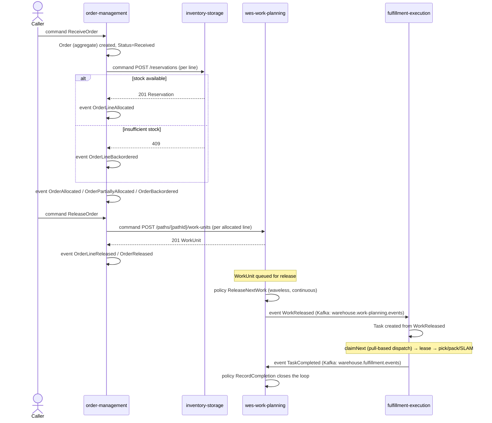
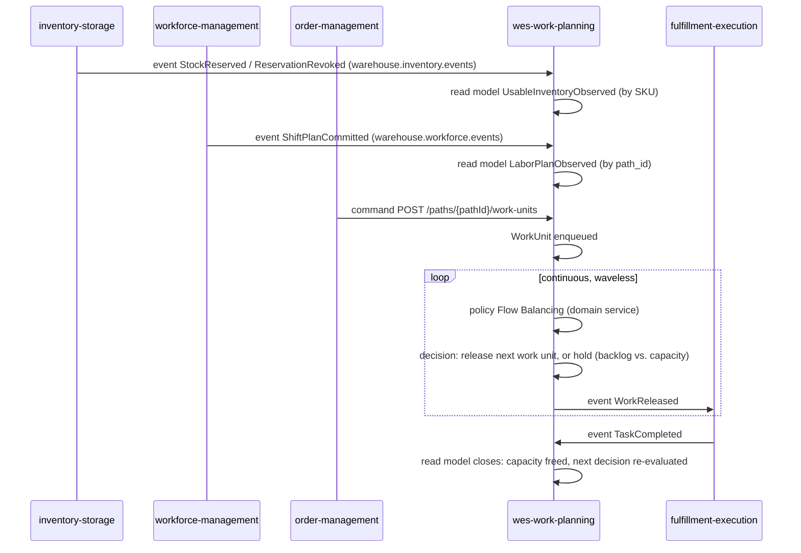
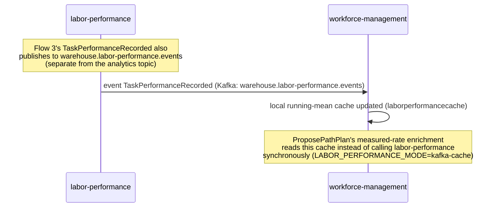
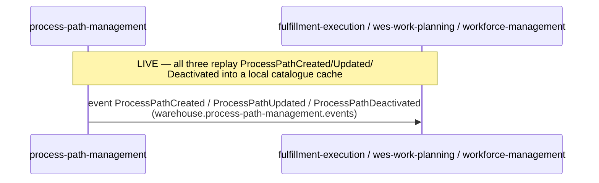
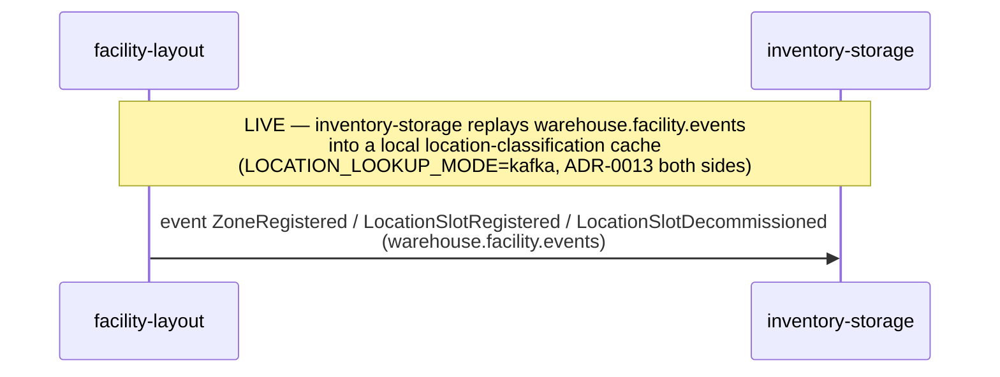

# Domain Message Flow Modelling

Following [ddd-crew's domain-message-flow-modelling](https://github.com/ddd-crew/domain-message-flow-modelling)
notation — actor → command → aggregate → event → policy → next command — this
page traces the platform's key business processes end to end, across bounded
context boundaries. Each flow only includes edges that are **actually wired**
(see [Context Map](./context-map) for the live/planned distinction).

## Flow 1 — Order intake to work release

The platform's primary order-to-work flow, spanning four contexts:



**Cross-context note:** `order-management`'s two outbound calls
(`inventory-storage`, `wes-work-planning`) are synchronous HTTP, not Kafka —
a deliberate Customer/Supplier boundary decision (see `order-management`
ADR-0002), not a hot-path anti-pattern, because allocation and release are
both within the caller's own request lifecycle. Everything downstream of
`WorkReleased` is Kafka-driven and asynchronous.

## Flow 2 — Continuous flow balancing (the conductor's own loop)

`wes-work-planning`'s core differentiator: three independent upstream facts
converge into one continuously-recomputed release decision.



This is the concrete referent for the reference model's `PathRecomputed`
concept: `wes-work-planning` never computes a release plan once — every new
fact (`StockReserved`, `ShiftPlanCommitted`, `TaskCompleted`) re-opens the
release decision for the affected path.

## Flow 3 — Performance measurement (pure downstream observer)

```mermaid
sequenceDiagram
    participant FE as fulfillment-execution
    participant LP as labor-performance

    FE->>LP: event TaskCompleted (Kafka: warehouse.fulfillment.events, shared fan-out topic)
    Note over LP: only event_type == "TaskCompleted" acted on;<br/>every other event type silently skipped
    LP->>LP: policy Score against engineered Standard (frozen at completion time)
    LP->>LP: read model AssociateScorecard updated
    Note over LP: standard is NEVER recomputed retroactively —<br/>ADR-0004
```

`labor-performance` never issues a command to any other context — it is a
pure Customer/Supplier Conformist, consistent with its Context Map's "zero
REST dependency on any other service."

## Flow 3a — Labor performance feeds back into workforce planning

`labor-performance`'s scoring (Flow 3 above) is no longer a dead end. Since
labor-performance ADR 0013 / workforce-management ADR 0019, the same
`TaskPerformanceRecorded` fact also reaches a second consumer over a
separate integration topic:



This is the fleet's third instance of the "event-fed local cache replacing
a synchronous call" pattern, after `process-path-management` → the three
catalogue consumers and `facility-layout` → `inventory-storage` — see
[Context Map](./context-map).

## Flow 4 — Process-path catalogue propagation (now live)



Documented here alongside the `facility-layout` flow below because both
are examples of the same OHS + Published Language pattern — and both are
now live.



The event-fed cache replaced the per-stow synchronous
`GET /locations/{code}/classification` call, which is retained as the
configured rollback (`LOCATION_LOOKUP_MODE=http`). The WES-tier contexts
(`wes-work-planning`, `fulfillment-execution`) deliberately do not consume
facility events — no use case needs them yet — see
[Context Map](./context-map).
